# 附录A RISC-V指令列表

*简约是一切真正优雅的要义。*

—— Coco Chanel，1923

>>>**Coco Chanel** (1883-1971)香奈儿时装品牌的创始人，她对昂贵的简约的追求塑造了20世纪的时尚。
>>>
>>> 

本附录列出了RV32/64I的所有指令、本书中涵盖的所有扩展（RVM、RVA、RVF、RVD、RVC和RVV）以及所有伪指令。每个条目都包括指令名称、操作数、寄存器传输级定义、指令格式类型、中文描述、压缩版本（如果存在），以及一张带有操作码的指令布局图。我们认为这些摘要对于您了解所有的指令已经足够，但如果您想了解更多细节，请参阅RISC-V官方规范\[Waterman and Asanovic 2017\]。

为了帮助读者在本附录中找到所需的指令，左侧（奇数）页面的标题包含该页顶部的第一条指令，右侧（偶数）页面的标题包含该页底部的最后一条指令。格式类似于字典的标题，有助于您搜索单词所在的页面。例如，下一个偶数页的标题是**AMOADD.W**，这是该页的第一条指令；下一个奇数页的标题是**AMOMINU.D**，这是该页的最后一条指令。如下是你能在这两页中找到的指令：amoadd.w、adoand.d、amoadn.w、amomax.d、amomax.w、amomaxu.d、amomaxu.w、amomin.d、amomin.w和amominu.d。

**add** rd, rs1, rs2 													x\[rd\] = x\[rs1\] + x\[rs2\]

加 *(Add)*。R-类型, RV32I 好 RV64I。

把寄存器x\[*rs2*\]加到寄存器x\[*rs1*\]上，结果写入x\[*rd*\]。忽略算术溢出。

*压缩形式*：**c.add** rd, rs2； **c.mv** rd, rs2

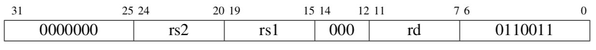

-----

**addi** rd, rs1, immediate 									x\[rd\] = x\[rs1\] + sext(immediate)

加立即数*(Add Immediate)*。I-类型，RV32I 和 RV64I。

把符号位扩展的立即数加到寄存器x\[*rs1*\]上，结果写入x\[*rd*\]。忽略算术溢出。

*压缩形式*：**c.li** rd, imm; **c.addi** rd, imm; **c.addi16sp** imm；**c.addi4spn** rd, imm

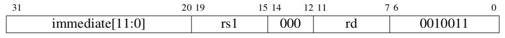

-----

**addiw** rd, rs1, immediate 							x\[rd\] = sext((x\[rs1\] + sext(immediate))\[31:0\])

加立即数字*(Add Word Immediate)*. I-类型，RV64I。

把符号位扩展的立即数加到x\[*rs1*\]，将结果截断为32位，把符号位扩展的结果写入x\[*rd*\]。忽略算术溢出。

*压缩形式*：**c.addiw** rd, imm

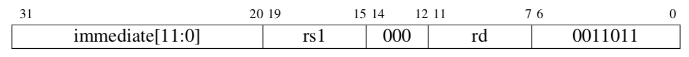

-----

**addw** rd, rs1, rs2												 x\[rd\] = sext((x\[rs1\] + x\[rs2\])\[31:0\])

加字*(Add Word)*。R-类型，RV64I。

把寄存器x\[*rs2*\]加到寄存器x\[*rs1*\]上，将结果截断为32位，把符号位扩展的结果写入x\[*rd*\]。忽略算术溢出。

*压缩形式*：**c.addw** rd, rs2

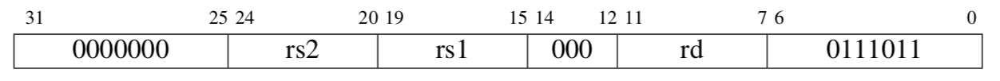

-----

**amoadd.d** rd, rs2, (rs1)								 x\[rd\] = AMO64(M\[x\[rs1\]\] + x\[rs2\])

原子加双字*(Atomic Memory Operation: Add Doubleword)*。R-type，RV64A。

进行如下的原子操作：将内存中地址为x\[*rs1*\]中的双字记为*t*，把这个双字变为*t*+x\[*rs2*\]，把x\[*rd*\]设为*t*。

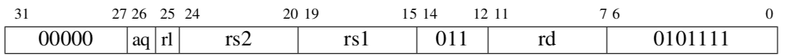

----

**amoadd.w** rd, rs2, (rs1) 								x\[rd\] = AMO32(M\[x\[rs1\]\] + x\[rs2\])

原子加字*(Atomic Memory Operation: Add Word)*。R-type，RV32A 和 RV64A。

进行如下的原子操作：将内存中地址为x\[*rs1*\]中的字记为*t*，把这个字变为*t*+x\[*rs2*\]，把x\[*rd*\]设为符号位扩展的*t*。

----

**amoand.d** rd, rs2, (rs1) 								x\[rd\] = AMO64(M\[x\[rs1\]\] & x\[rs2\])

原子双字与 *(Atomic Memory Operation: AND Doubleword)*。R-类型，RV64A。

进行如下的原子操作：将内存中地址为x\[*rs1*\]中的双字记为*t*，把这个双字变为t和x\[*rs2*\]位与的结果，把x\[*rd*\]设为*t*。

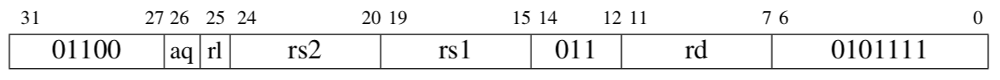

----

**amoand.w** rd, rs2, (rs1) 									x\[rd\] = AMO32(M\[x\[rs1\]\] & x\[rs2\])

原子字与 *(Atomic Memory Operation: AND Word)*。R-类型，RV32A 和 RV64A。

进行如下的原子操作：将内存中地址为x\[*rs1*\]中的字记为*t*，把这个字变为t和x\[*rs2*\]位与的结果，把x\[*rd*\]设为符号位扩展的*t*。

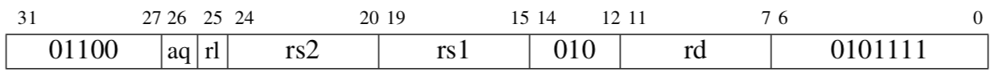

----

**amomax.d** rd, rs2, (rs1) 								x\[rd\] = AMO64(M\[x\[rs1\]\] MAX x\[rs2\])

原子最大双字*(Atomic Memory Operation: Maximum Doubleword)*。R-类型，RV64A。

进行如下的原子操作：将内存中地址为x\[*rs1*\]中的双字记为*t*，把这个双字变为t和x\[*rs2*\]中较大的一个（用二进制补码比较），把x\[*rd*\]设为*t*。

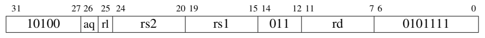

----

**amomax.w** rd, rs2, (rs1) 								x\[rd\] = AMO32(M\[x\[rs1\]\] MAX x\[rs2\])

原子最大字*(Atomic Memory Operation: Maximum Word)*。R-类型，RV32A 和 RV64A。

进行如下的原子操作：将内存中地址为x\[*rs1*\]中的字记为*t*，把这个字变为t和x\[*rs2*\]中较大的一个（用二进制补码比较），把x\[*rd*\]设为符号位扩展的*t*。

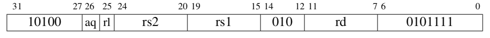

----

**amomaxu.d** rd, rs2, (rs1) 								x\[rd\] = AMO64(M\[x\[rs1\]\] MAXU x\[rs2\])

原子无符号最大双字*(Atomic Memory Operation: Maximum Doubleword, Unsigned)*。 R-类型，RV64A。

进行如下的原子操作：将内存中地址为x\[*rs1*\]中的双字记为*t*，把这个双字变为t和x\[*rs2*\]中较大的一个（用无符号比较），把x\[*rd*\]设为*t*。

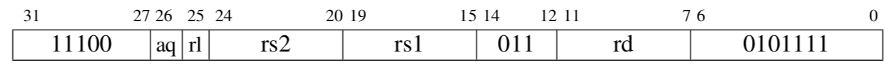

----

**amomaxu.w** rd, rs2, (rs1) 								x\[rd\] = AMO32(M\[x\[rs1\]\] MAXU x\[rs2\])

原子无符号最大字*(Atomic Memory Operation: Maximum Word, Unsigned)*。R-类型，RV32A 和 RV64A。

进行如下的原子操作：将内存中地址为x\[*rs1*\]中的字记为*t*，把这个字变为t和x\[*rs2*\]中较大的一个（用无符号比较），把x\[*rd*\]设为符号位扩展的*t*。

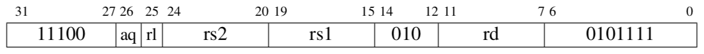

----

**amomin.d** rd, rs2, (rs1) 								x\[rd\] = AMO64(M\[x\[rs1\]\] MIN x\[rs2\])

原子最小双字*(Atomic Memory Operation: Minimum Doubleword)*。R-类型，RV64A。

进行如下的原子操作：将内存中地址为x\[*rs1*\]中的双字记为*t*，把这个双字变为t和x\[*rs2*\]中较小的一个（用二进制补码比较），把x\[*rd*\]设为*t*。

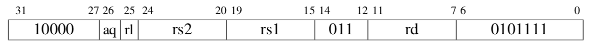

-----

**amomin.w** rd, rs2, (rs1) 									x\[rd\] = AMO32(M\[x\[rs1\]\] MIN x\[rs2\])

原子最小字*(Atomic Memory Operation: Minimum Word).* R-类型, RV32A 和 RV64A。

进行如下的原子操作：将内存中地址为x\[*rs1*\]中的字记为*t*，把这个字变为t和x\[*rs2*\]中较小的一个（用二进制补码比较），把x\[*rd*\]设为符号位扩展的*t*。

-----

**amominu.d** rd, rs2,(rs1) 									x\[rd\] = AMO64(M\[x\[rs1\]\] MINU x\[rs2\])

原子无符号最小双字*(Atomic Memory Operation: Minimum Doubleword, Unsigned).* R-类型, RV64A。

进行如下的原子操作：将内存中地址为x\[*rs1*\]中的双字记为*t*，把这个双字变为t和x\[*rs2*\]中较小的一个（用无符号比较），把x\[*rd*\]设为*t*。

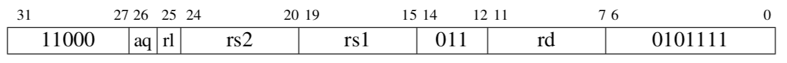

-----

**amominu.w** rd, rs2, (rs1) 									x\[rd\] = AMO32(M\[x\[rs1\]\] MINU x\[rs2\])

原子无符号最大字*(Atomic Memory Operation: Minimum Word, Unsigned).* R-类型, RV32A 和 RV64A。

进行如下的原子操作：将内存中地址为x\[*rs1*\]中的字记为*t*，把这个字变为t和x\[*rs2*\]中较小的一个（用无符号比较），把x\[*rd*\]设为符号位扩展的*t*。

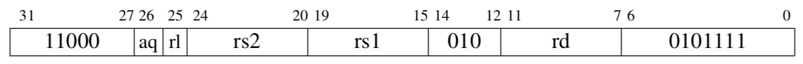

-----

**amoor.d** rd, rs2, (rs1) 											x\[rd\] = AMO64(M\[x\[rs1\]\] \| x\[rs2\])

原子双字或 *(Atomic Memory Operation: OR Doubleword)*. R-类型, RV64A。

进行如下的原子操作：将内存中地址为x\[*rs1*\]中的双字记为*t*，把这个双字变为t和x\[*rs2*\]位或的结果，把x\[*rd*\]设为*t*。

-----

**amoor.w** rd, rs2, (rs1) 										x\[rd\] = AMO32(M\[x\[rs1\]\] \| x\[rs2\])

原子字或 *(Atomic Memory Operation: OR Word)*. R-类型, RV32A 和 RV64A。

进行如下的原子操作：将内存中地址为x\[*rs1*\]中的字记为*t*，把这个字变为t和x\[*rs2*\]位或的结果，把x\[*rd*\]设为符号位扩展的*t*。

-----

**amoswap.d** rd, rs2, (rs1) 									x\[rd\] = AMO64(M\[x\[rs1\]\] SWAP x\[rs2\])

原子双字交换 *(Atomic Memory Operation: Swap Doubleword)*. R-类型, RV64A。

进行如下的原子操作：将内存中地址为x\[*rs1*\]中的双字记为*t*，把这个双字变为x\[*rs2*\]的值，把x\[*rd*\]设为*t*。

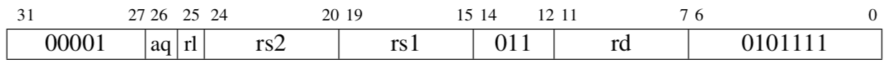

-----

**amoor.w **rd, rs2, (rs1) 									x\[rd\] = AMO32(M\[x\[rs1\]\] SWAP x\[rs2\])

原子字交换 *(Atomic Memory Operation: Swap Word)*. R-类型, RV32A 和 RV64A。

进行如下的原子操作：将内存中地址为x\[*rs1*\]中的字记为*t*，把这个字变为x\[*rs2*\]的值，把x\[*rd*\]设为符号位扩展的*t*。

-----

**amoxor.d** rd, rs2, (rs1) 										x\[rd\] = AMO64(M\[x\[rs1\]\] \^ x\[rs2\])

原子双字异或 *(Atomic Memory Operation: XOR Doubleword)*. R-类型, RV64A。

进行如下的原子操作：将内存中地址为x\[*rs1*\]中的双字记为*t*，把这个双字变为t和x\[*rs2*\]按位异或的结果，把x\[*rd*\]设为*t*。

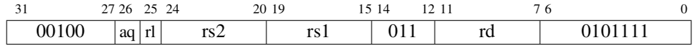

-----

**amoxor.w** rd, rs2, (rs1)									 x\[rd\] = AMO32(M\[x\[rs1\]\] \^ x\[rs2\])

原子字异或 *(Atomic Memory Operation: XOR Word)*. R-类型, RV32A 和 RV64A。

进行如下的原子操作：将内存中地址为x\[*rs1*\]中的字记为*t*，把这个字变为t和x\[*rs2*\]按位异或的结果，把x\[*rd*\]设为符号位扩展的*t*。

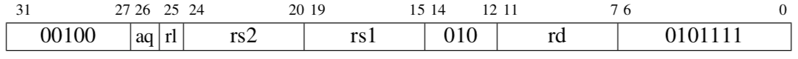

-----

**and** rd, rs1, rs2 														x\[rd\] = x\[rs1\] & x\[rs2\]

与 *(And)*. R-类型, RV32I 和 RV64I。

将寄存器x\[*rs1*\]和寄存器x\[*rs2*\]位与的结果写入x\[*rd*\]。

*压缩形式*：**c.and** rd, rs2

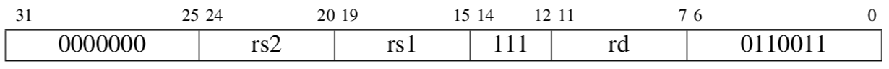

-----

**andi** rd, rs1, immediate 										x\[rd\] = x\[rs1\] & sext(immediate)

与立即数 *(And Immediate)*. I-类型, RV32I 和 RV64I。

把符号位扩展的立即数和寄存器x\[*rs1*\]上的值进行位与，结果写入x\[*rd*\]。

*压缩形式*：**c.andi** rd, imm

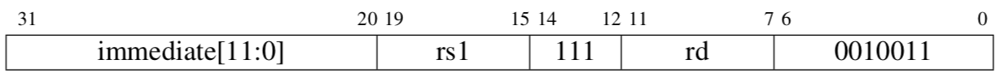

-----

**auipc** rd, immediate 								x\[rd\] = pc + sext(immediate\[31:12\] \<\< 12)

*PC*加立即数 *(Add Upper Immediate to PC)*. U-类型, RV32I 和 RV64I。

把符号位扩展的20位（左移12位）立即数加到*pc*上，结果写入x\[*rd*\]。

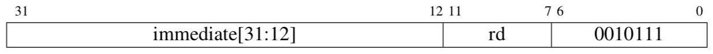

-----

**beq** rs1, rs2, offset										 if (rs1 == rs2) pc += sext(offset)

相等时分支 *(Branch if Equal)*. B-类型, RV32I 和 RV64I。

若寄存器x\[*rs1*\]和寄存器x\[*rs2*\]的值相等，把*pc*的值设为当前值加上符号位扩展的偏移*offset*。

*压缩形式*：**c.beqz** rs1, offset

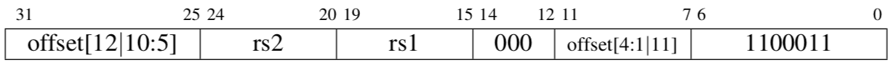

-----

**beqz** rs1, offset 												if (rs1 == 0) pc += sext(offset)

等于零时分支 *(Branch if Equal to Zero)*. 伪指令(Pesudoinstruction), RV32I 和 RV64I。

可视为**beq** rs1, x0, offset.

----

**bge** rs1, rs2, offset 										if (rs1 ≥~s~ rs2) pc += sext(offset)

大于等于时分支 *(Branch if Greater Than or Equal)*. B-类型, RV32I 和 RV64I。

若寄存器x\[*rs1*\]的值大于等于寄存器x\[*rs2*\]的值（均视为二进制补码），把*pc*的值设为当前值加上符号位扩展的偏移*offset*。

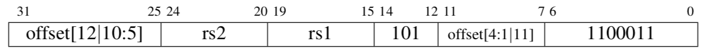

-----

**bgeu** rs1, rs2, offset 										if (rs1 ≥~u~ rs2) pc += sext(offset)

无符号大于等于时分支 *(Branch if Greater Than or Equal, Unsigned)*. B-类型, RV32I 和 RV64I。

若寄存器x\[*rs1*\]的值大于等于寄存器x\[*rs2*\]的值（均视为无符号数），把*pc*的值设为当前值加上符号位扩展的偏移*offset*。

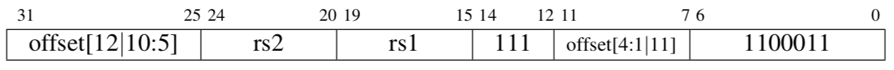

-----

**bgez** rs1, offset											 if (rs1 ≥~s~ 0) pc += sext(offset)

大于等于零时分支 *(Branch if Greater Than or Equal to Zero)*. 伪指令(Pesudoinstruction), RV32I 和 RV64I。

可视为**bge** rs1, x0, offset.

----

**bgt** rs1, rs2, offset 										if (rs1 \>~s~ rs2) pc += sext(offset)

大于时分支 *(Branch if Greater Than)*. 伪指令(Pesudoinstruction), RV32I 和 RV64I。

可视为**blt** rs2, rs1, offset.

----

**bgtu** rs1, rs2, offset 										if (rs1 \>~u~ rs2) pc += sext(offset)

无符号大于时分支 *(Branch if Greater Than, Unsigned)*. 伪指令(Pesudoinstruction), RV32I 和 RV64I。

可视为**bltu** rs2, rs1, offset.

----

**bgtz** rs1, offset 											if (rs2 \>~s~ 0) pc += sext(offset)

大于零时分支 *(Branch if Greater Than Zero)*. 伪指令(Pesudoinstruction), RV32I 和 RV64I。

可视为**blt** x0, rs2, offset.

----

**ble** rs1, rs2, offset 										if (rs1 ≤~s~ rs2) pc += sext(offset)

小于等于时分支 *(Branch if Less Than or Equal)*. 伪指令(Pesudoinstruction), RV32I 和 RV64I。

可视为**bge** rs2, rs1, offset.

----

**bleu** rs1, rs2, offset										 if (rs1 ≤~u~ rs2) pc += sext(offset)

小于等于时分支 *(Branch if Less Than or Equal, Unsigned)*. 伪指令(Pesudoinstruction), RV32I 和 RV64I。

可视为**bgeu** rs2, rs1, offset.

----

**blez** rs2, offset 												if (rs2 ≤~s~ 0) pc += sext(offset)

小于等于零时分支 *(Branch if Less Than or Equal to Zero)*. 伪指令(Pesudoinstruction), RV32I 和 RV64I。

可视为**bge** x0, rs2, offset.

----

**blt** rs1, rs2, offset 										if (rs1 \<~s~ rs2) pc += sext(offset)

小于时分支 *(Branch if Less Than)*. B-类型, RV32I 和 RV64I。

若寄存器x\[*rs1*\]的值小于寄存器x\[*rs2*\]的值（均视为二进制补码），把*pc*的值设为当前值加上符号位扩展的偏移*offset*。

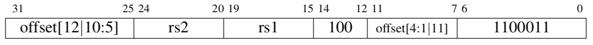

-----

**bltz** rs2, offset												 if (rs1 \<~s~ 0) pc += sext(offset)

小于零时分支 *(Branch if Less Than Zero)*. 伪指令(Pesudoinstruction), RV32I 和 RV64I。

可视为**blt** rs1, x0, offset.

----

**bltu** rs1, rs2, offset										 if (rs1 \<~u~ rs2) pc += sext(offset)

无符号小于时分支 *(Branch if Less Than, Unsigned)*. B-类型, RV32I 和 RV64I。

若寄存器x\[*rs1*\]的值小于寄存器x\[*rs2*\]的值（均视为无符号数），把*pc*的值设为当前值加上符号位扩展的偏移*offset*。

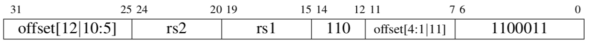

-----

**bne** rs1, rs2, offset 											if (rs1 ≠ rs2) pc += sext(offset)

不相等时分支 *(Branch if Not Equal)*. B-类型, RV32I 和 RV64I。

若寄存器x\[*rs1*\]和寄存器x\[*rs2*\]的值不相等，把*pc*的值设为当前值加上符号位扩展的偏移*offset*。

*压缩形式*：**c.bnez** rs1, offset

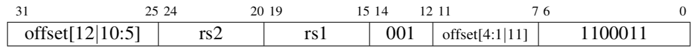

-----

**bnez** rs1, offset 												if (rs1 ≠ 0) pc += sext(offset)

不等于零时分支 *(Branch if Not Equal to Zero)*. 伪指令(Pesudoinstruction), RV32I 和 RV64I。

可视为**bne** rs1, x0, offset。

----

**c.add** rd, rs2 														x\[rd\] = x\[rd\] + x\[rs2\]

加 *(Add)*. RV32IC 和 RV64I。

扩展形式为**add** rd, rd, rs2. rd=x0或rs2=x0时非法。

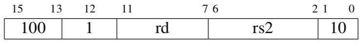

-----

**c.addi** rd, imm 													x\[rd\] = x\[rd\] + sext(imm)

加立即数 *(Add Immediate)*. RV32IC 和 RV64I。

扩展形式为**addi** rd, rd, imm。

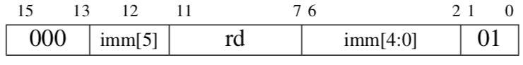

-----

**c.addi16sp**16sp imm 													x\[2\] = x\[2\] + sext(imm)

加16倍立即数到栈指针 *(Add Immediate, Scaled by 16, to Stack Pointer)*. RV32IC 和 RV64I。

扩展形式为**addi** x2, x2, imm. imm=0时非法。

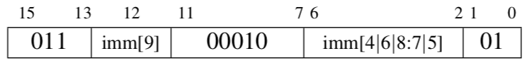

-----

**c.addi4spn** rd', uimm 												x\[8+rd'\] = x\[2\] + uimm

加4倍立即数到栈指针 *(Add Immediate, Scaled by 4, to Stack Pointer, Nondestructive)*. RV32IC 和 RV64I。

扩展形式为**addi** rd, x2, uimm, 其中rd=8+rd'. uimm=0时非法。

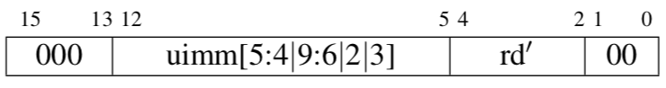

-----

**c.addiw** rd, imm 											x\[rd\] = sext((x\[rd\] + sext(imm))\[31:0\])

加立即数字 *(Add Word Immediate)*. RV64I。

扩展形式为**addiw** rd, rd, imm. rd=x0时非法。

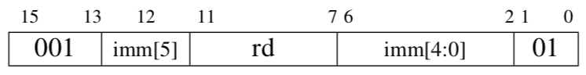

-----

**c.and** rd', rs2' 													x\[8+rd'\] = x\[8+rd'\] & x\[8+rs2'\]

与 *(AND)*. RV32IC 和 RV64I。

扩展形式为**and** rd, rd, rs2, 其中rd=8+rd', rs2=8+rs2'。

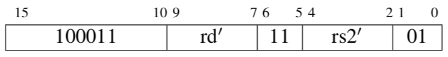

-----

**c.addw** rd', rs2' 										x\[8+rd'\] = sext((x\[8+rd'\] + x\[8+rs2'\])\[31:0\])

加字 *(Add Word)*. RV64I。

扩展形式为**addw** rd, rd, rs2, 其中rd=8+rd', rs2=8+rs2'。

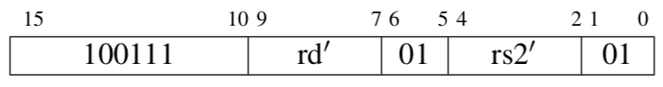

-----

**c.andi** rd', imm 													x\[8+rd'\] = x\[8+rd'\] & sext(imm)

与立即数 *(AND Immediate)*. RV32IC 和 RV64I。

扩展形式为**andi** rd, rd, imm, 其中rd=8+rd'。

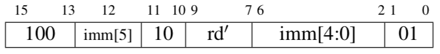

-----

**c.beqz** rs1', offset											 if (x\[8+rs1'\] == 0) pc += sext(offset)

等于零时分支 *(Branch if Equal to Zero)*. RV32IC 和 RV64I。

扩展形式为**beq** rs1, x0, offset, 其中rs1=8+rs1'。

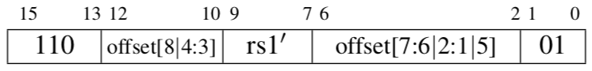

-----

**c.bnez** rs1', offset 											if (x\[8+rs1'\] ≠ 0) pc += sext(offset)

不等于零时分支 *(Branch if Not Equal to Zero)*. RV32IC 和 RV64I。

扩展形式为**bne** rs1, x0, offset, 其中rs1=8+rs1'。

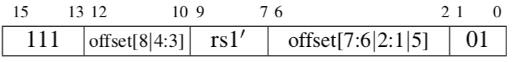

-----

**c.ebreak** 														RaiseException(Breakpoint)

环境断点 *(Environment Breakpoint)*. RV32IC 和 RV64I。

扩展形式为**ebreak**。

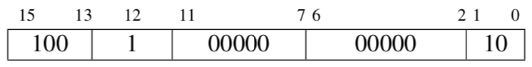

-----

**c.fld** rd', uimm(rs1')										 f\[8+rd'\] = M\[x\[8+rs1'\] + uimm\]\[63:0\]

浮点双字加载 *(Floating-point Load Doubleword)*. RV32DC 和 RV64D。

扩展形式为**fld** rd, uimm(rs1), 其中rd=8+rd', rs1=8+rs1'。

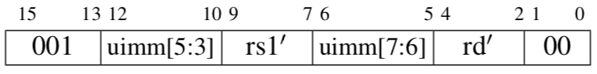

-----

**c.fldsp** rd, uimm(x2) 												f\[rd\] = M\[x\[2\] + uimm\]\[63:0\]

栈指针相关浮点双字加载 *(Floating-point Load Doubleword, Stack-Pointer Relative)*. RV32DC 和 RV64D。

扩展形式为**fld** rd, uimm(x2)。

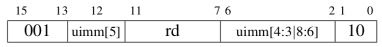

-----

**c.flw** rd', uimm(rs1') 										f\[8+rd'\] = M\[x\[8+rs1'\] + uimm\]\[31:0\]

浮点字加载 *(Floating-point Load Word)*. RV32FC。

扩展形式为**flw** rd, uimm(rs1), 其中rd=8+rd', rs1=8+rs1'。

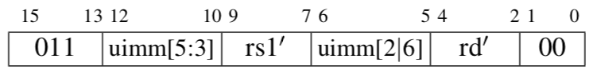

-----

**c.flwsp** rd, uimm(x2) 												f\[rd\] = M\[x\[2\] + uimm\]\[31:0\]

栈指针相关浮点字加载 *(Floating-point Load Word, Stack-Pointer Relative)*. RV32FC。

扩展形式为**flw** rd, uimm(x2)。

-----

**c.fsd** rs2', uimm(rs1') 										M\[x\[8+rs1'\] + uimm\]\[63:0\] = f\[8+rs2'\]

浮点双字存储 *(Floating-point Store Doubleword)*. RV32DC 和 RV64D。

扩展形式为**fsd** rs2, uimm(rs1), 其中rs2=8+rs2', rs1=8+rs1'。

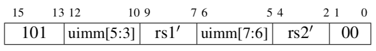

-----

**c.fsdsp** rs2, uimm(x2) 											M\[x\[2\] + uimm\]\[63:0\] = f\[rs2\]

栈指针相关浮点双字存储 *(Floating-point Store Doubleword, Stack-Pointer Relative)*. RV32DC 和 RV64D。

扩展形式为**fsd** rs2, uimm(x2)。

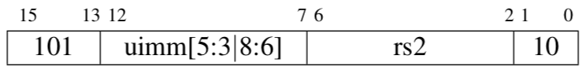

-----

**c.fsw** rs2', uimm(rs1') 										M\[x\[8+rs1'\] + uimm\]\[31:0\] = f\[8+rs2'\]

浮点字存储 *(Floating-point Store Word)*. RV32FC。

扩展形式为**fsw** rs2, uimm(rs1), 其中rs2=8+rs2', rs1=8+rs1'。

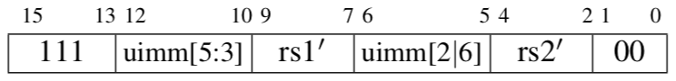

-----

**c.fswsp** rs2, uimm(x2) 										M\[x\[2\] + uimm\]\[31:0\] = f\[rs2\]

栈指针相关浮点字存储 *(Floating-point Store Word, Stack-Pointer Relative)*. RV32FC。

扩展形式为**fsw** rs2, uimm(x2)。

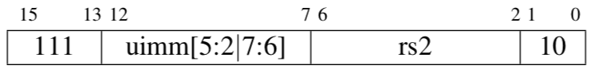

-----

**c.j** offset 															pc += sext(offset)

跳转 *(Jump)*. RV32IC 和 RV64I。

扩展形式为**jal** x0, offset。

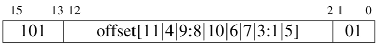

-----

**c.jal** offset 													x\[1\] = pc+2; pc += sext(offset)

链接跳转 *(Jump and Link)*. RV32IC。

扩展形式为**jal** x1, offset。

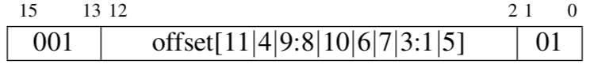

-----

**c.jalr** rs1 														t = pc+2; pc = x\[rs1\]; x\[1\] = t

寄存器链接跳转 *(Jump and Link Register)*. RV32IC 和 RV64I。

扩展形式为**jalr** x1, 0(rs1). 当rs1=x0时非法。

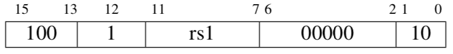

-----

**c.jr** rs1 																			pc = x\[rs1\]

寄存器跳转 *(Jump Register)*. RV32IC 和 RV64I。

扩展形式为**jalr** x0, 0(rs1). 当rs1=x0时非法。

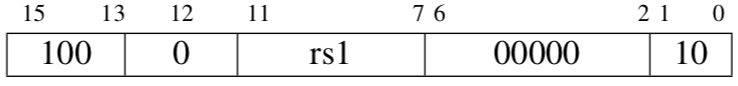

-----

**c.ld** rd', uimm(rs1') 										x\[8+rd'\] = M\[x\[8+rs1'\] + uimm\]\[63:0\]

双字加载 *(Load Doubleword)*. RV64I。

扩展形式为**ld** rd, uimm(rs1), 其中rd=8+rd', rs1=8+rs1'。

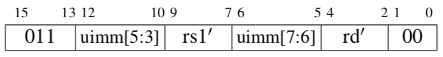

-----

**c.ldsp** rd, uimm(x2) 											x\[rd\] = M\[x\[2\] + uimm\]\[63:0\]

栈指针相关双字加载 *(Load Doubleword, Stack-Pointer Relative)*. RV64I。

扩展形式为**ld** rd, uimm(x2). rd=x0时非法。

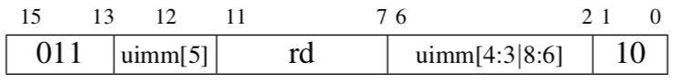

-----

**c.li** rd, imm 															x\[rd\] = sext(imm)

立即数加载 *(Load Immediate)*. RV32IC 和 RV64I。

扩展形式为**addi** rd, x0, imm。

-----

**c.lui** rd, imm 											x\[rd\] = sext(imm\[17:12\] \<\< 12)

高位立即数加载 *(Load Upper Immediate)*. RV32IC 和 RV64I。

扩展形式为**lui** rd, imm. 当rd=x2或imm=0时非法。

-----

**c.lw** rd', uimm(rs1') 							x\[8+rd'\] = sext(M\[x\[8+rs1'\] + uimm\]\[31:0\])

字加载 *(Load Word)*. RV32IC 和 RV64I。

扩展形式为**lw** rd, uimm(rs1), 其中rd=8+rd', rs1=8+rs1'。

-----

**c.lwsp** rd, uimm(x2)									 x\[rd\] = sext(M\[x\[2\] + uimm\]\[31:0\])

栈指针相关字加载 *(Load Word, Stack-Pointer Relative)*. RV32IC 和 RV64I。

扩展形式为**lw** rd, uimm(x2). rd=x0时非法。

-----

**c.mv** rd, rs2 															x\[rd\] = x\[rs2\]

移动 *(Move)*. RV32IC 和 RV64I。

扩展形式为**add** rd, x0, rs2. rs2=x0时非法。

-----

**c.or** rd', rs2' 												x\[8+rd'\] = x\[8+rd'\] \| x\[8+rs2'\]

或 *(OR)*. RV32IC 和 RV64I。

扩展形式为**or** rd, rd, rs2, 其中rd=8+rd', rs2=8+rs2'。

-----

**c.sd** rs2', uimm(rs1') 									M\[x\[8+rs1'\] + uimm\]\[63:0\] = x\[8+rs2'\]

双字存储*(Store Doubleword)*. RV64I。

扩展形式为**sd** rs2, uimm(rs1), 其中rs2=8+rs2', rs1=8+rs1'。

-----

**c.sdsp** rs2, uimm(x2) 										M\[x\[2\] + uimm\]\[63:0\] = x\[rs2\]

栈指针相关双字存储 *(Store Doubleword, Stack-Pointer Relative)*. RV64I。

扩展形式为**sd** rs2, uimm(x2)。

-----

**c.slli** rd, uimm 													x\[rd\] = x\[rd\] \<\< uimm

立即数逻辑左移 *(Shift Left Logical Immediate)*. RV32IC 和 RV64I。

扩展形式为**slli** rd, rd, uimm。

-----

**c.srai** rd', uimm 											x\[8+rd'\] = x\[8+rd'\] \>\>~s~ uimm

立即数算术右移 *(Shift Right Arithmetic Immediate)*. RV32IC 和 RV64I。

扩展形式为**srai** rd, rd, uimm, 其中rd=8+rd'。

-----

**c.srli** rd', uimm 											x\[8+rd'\] = x\[8+rd'\] \>\>~u~ uimm

立即数逻辑右移 *(Shift Right Logical Immediate)*. RV32IC 和 RV64I。

扩展形式为**srli** rd, rd, uimm, 其中rd=8+rd'.

-----

**c.sub** rd', rs2' 												x\[8+rd'\] = x\[8+rd'\] - x\[8+rs2'\]

减 *(Subtract)*. RV32IC 和 RV64I。

扩展形式为**sub** rd, rd, rs2. 其中rd=8+rd', rs2=8+rs2'。

-----

**c.subw** rd', rs2' 									x\[8+rd'\] = sext((x\[8+rd'\] - x\[8+rs2'\])\[31:0\])

减字 *(Subtract Word)*. RV64I。

扩展形式为**subw** rd, rd, rs2. 其中rd=8+rd', rs2=8+rs2'. .

-----

**c.sw** rs2', uimm(rs1') 									M\[x\[8+rs1'\] + uimm\]\[31:0\] = x\[8+rs2'\]

字存储 *(Store Word)*. RV32IC 和 RV64I。

扩展形式为**sw** rs2, uimm(rs1), 其中rs2=8+rs2', rs1=8+rs1'.

-----

**c.swsp** rs2, uimm(x2) 											M\[x\[2\] + uimm\]\[31:0\] = x\[rs2\]

栈指针相关字存储 *(Store Word, Stack-Pointer Relative)*. RV32IC 和 RV64I。

扩展形式为**sw** rs2, uimm(x2)。

-----

**c.xor** rd', rs2' 												x\[8+rd'\] = x\[8+rd'\] \^ x\[8+rs2'\]

异或 *(Exclusive-OR)*. RV32IC 和 RV64I。

扩展形式为**xor** rd, rd, rs2, 其中rd=8+rd', rs2=8+rs2'。

-----

**call** rd, symbol 													x\[rd\] = pc+8; pc = &symbol

调用 *(Call)*. 伪指令(Pesudoinstruction), RV32I 和 RV64I。

把下一条指令的地址（*pc*+8）写入x\[*rd*\]，然后把*pc*设为*symbol*。等同于**auipc** rd, offestHi, 再加上一条**jalr** rd, offsetLo(rd)。若省略了*rd*，默认为x1。

----

**csrr** rd, csr 																x\[rd\] = CSRs\[csr\]

读控制状态寄存器 *(Control and Status Register Read)*. 伪指令(Pesudoinstruction), RV32I 和 RV64I。

把控制状态寄存器*csr*的值写入x\[*rd*\]，等同于**csrrs** rd, csr, x0。

----

**csrc** csr, rs1 														CSRs\[csr\] &= \~x\[rs1\]

清除控制状态寄存器 *(Control and Status Register Clear)*. 伪指令(Pesudoinstruction), RV32I 和 RV64I。

对于x\[*rs1*\]中每一个为1的位，把控制状态寄存器*csr*的的对应位清零，等同于**csrrc** x0, csr, rs1。

----

**csrci** csr, zimm\[4:0\] 												CSRs\[csr\] &= \~zimm

立即数清除控制状态寄存器 *(Control and Status Register Clear Immediate)*. 伪指令(Pesudoinstruction), RV32I 和 RV64I。

对于五位的零扩展的立即数中每一个为1的位，把控制状态寄存器*csr*的的对应位清零，等同于**csrrci** x0, csr, zimm。

----

**csrrc** rd, csr, rs1 								t = CSRs\[csr\]; CSRs\[csr\] = t &\~x\[rs1\]; x\[rd\] = t

读后清除控制状态寄存器 *(Control and Status Register Read and Clear)*. I-类型, RV32I 和 RV64I。

记控制状态寄存器*csr*中的值为*t。*把*t*和寄存器x\[*rs1*\]按位与的结果写入*csr*，再把*t*写入x\[*rd*\]。

-----

**csrrci** rd, csr, zimm\[4:0\] 						t = CSRs\[csr\]; CSRs\[csr\] = t &\~zimm； x\[rd\] = t

立即数读后清除控制状态寄存器 *(Control and Status Register Read and Clear Immediate)*. I-类型, RV32I 和 RV64I。

记控制状态寄存器*csr*中的值为*t。*把*t*和五位的零扩展的立即数*zimm*按位与的结果写入*csr*，再把*t*写入x\[*rd*\]（*csr*寄存器的第5位及更高位不变）。

-----

**csrrs** rd, csr, rs1 									t = CSRs\[csr\]; CSRs\[csr\] = t \| x\[rs1\]; x\[rd\] = t

读后置位控制状态寄存器 *(Control and Status Register Read and Set)*. I-类型, RV32I 和 RV64I。

记控制状态寄存器*csr*中的值为*t。*把*t*和寄存器x\[*rs1*\]按位或的结果写入*csr*，再把*t*写入x\[*rd*\]。

-----

**csrrci** rd, csr, zimm\[4:0\] 							t = CSRs\[csr\]; CSRs\[csr\] = t \| zimm; x\[rd\] = t

立即数读后设置控制状态寄存器 *(Control and Status Register Read and Set Immediate)*. I-类型, RV32I 和 RV64I。

记控制状态寄存器*csr*中的值为*t。*把*t*和五位的零扩展的立即数*zimm*按位或的结果写入*csr*，再把*t*写入x\[*rd*\]（*csr*寄存器的第5位及更高位不变）。

-----

**csrrw** rd, csr, zimm\[4:0\] 								t = CSRs\[csr\]; CSRs\[csr\] = x\[rs1\]; x\[rd\] = t

读后写控制状态寄存器 *(Control and Status Register Read and Write)*. I-类型, RV32I 和 RV64I。

记控制状态寄存器*csr*中的值为*t。*把寄存器x\[*rs1*\]的值写入*csr*，再把*t*写入x\[*rd*\]。

-----

**csrrwi** rd, csr, zimm\[4:0\] 									x\[rd\] = CSRs\[csr\]; CSRs\[csr\] = zimm

立即数读后写控制状态寄存器 *(Control and Status Register Read and Write Immediate)*. I-类型, RV32I 和 RV64I。

把控制状态寄存器*csr*中的值拷贝到x\[*rd*\]中，再把五位的零扩展的立即数*zimm*的值写入*csr*。

-----

**csrc** csr, rs1 															CSRs\[csr\] \|= x\[rs1\]

置位控制状态寄存器 *(Control and Status Register Set)*. 伪指令(Pesudoinstruction), RV32I 和 RV64I。

对于x\[*rs1*\]中每一个为1的位，把控制状态寄存器*csr*的的对应位置位，等同于**csrrs** x0, csr, rs1.

----

**csrci** csr, zimm\[4:0\] 													CSRs\[csr\] \|= zimm

立即数置位控制状态寄存器 *(Control and Status Register Set Immediate)*. 伪指令(Pesudoinstruction), RV32I 和 RV64I。

对于五位的零扩展的立即数中每一个为1的位，把控制状态寄存器*csr*的的对应位清零，等同于**csrrsi** x0, csr, zimm.

----

**csrw** csr, rs1 														CSRs\[csr\] = x\[rs1\]

写控制状态寄存器 *(Control and Status Register Set)*. 伪指令(Pesudoinstruction), RV32I 和 RV64I。

对于x\[*rs1*\]中每一个为1的位，把控制状态寄存器*csr*的的对应位置位，等同于**csrrs**
x0, csr, rs1.

----

**csrwi** csr, zimm\[4:0\] 													CSRs\[csr\] = zimm

立即数写控制状态寄存器 *(Control and Status Register Write Immediate)*. 伪指令(Pesudoinstruction), RV32I 和 RV64I。

把五位的零扩展的立即数的值写入控制状态寄存器*csr*的，等同于**csrrwi** x0, csr, zimm。

----

**div** rd, rs1, rs2 													x\[rd\] = x\[rs1\] ÷~s~ x\[rs2\]

除法*(Divide)*. R-类型, RV32M 和 RV64M。

用寄存器x\[*rs1*\]的值除以寄存器x\[*rs2*\]的值，向零舍入，将这些数视为二进制补码，把商写入x\[*rd*\]。

-----

**divu** rd, rs1, rs2 													x\[rd\] = x\[rs1\] ÷~u~ x\[rs2\]

无符号除法*(Divide, Unsigned)*. R-类型, RV32M 和 RV64M。

用寄存器x\[*rs1*\]的值除以寄存器x\[*rs2*\]的值，向零舍入，将这些数视为无符号数，把商写入x\[*rd*\]。

-----

**divuw** rd, rs1, rs2 									x\[rd\] = sext(x\[rs1\]\[31:0\] ÷~u~ x\[rs2\]\[31:0\])

无符号字除法*(Divide Word, Unsigned)*. R-类型, RV64M。

用寄存器x\[*rs1*\]的低32位除以寄存器x\[*rs2*\]的低32位，向零舍入，将这些数视为无符号数，把经符号位扩展的32位商写入x\[*rd*\]。

-----

**divw** rd, rs1, rs2 										x\[rd\] = sext(x\[rs1\]\[31:0\] ÷~s~ x\[rs2\]\[31:0\])

字除法*(Divide Word)*. R-类型, RV64M。

用寄存器x\[*rs1*\]的低32位除以寄存器x\[*rs2*\]的低32位，向零舍入，将这些数视为二进制补码，把经符号位扩展的32位商写入x\[*rd*\]。

-----

**ebreak** 															RaiseException(Breakpoint)

环境断点 *(Environment Breakpoint)*. I-类型, RV32I 和 RV64I。

通过抛出断点异常的方式请求调试器。

-----

**ecall**	 													RaiseException(EnvironmentCall)

环境调用 *(Environment Call)*. I-类型, RV32I 和 RV64I。

通过引发环境调用异常来请求执行环境。

-----

**fabs.d** rd, rs1 																f\[rd\] = \|f\[rs1\]\|

浮点数绝对值 *(Floating-point Absolute Value)*. 伪指令(Pesudoinstruction), RV32D 和 RV64D。

把双精度浮点数f\[*rs1*\]的绝对值写入f\[*rd*\]。

等同于**fsgnjx.d** rd, rs1, rs1。

----

**fabs.s** rd, rs1																 f\[rd\] = \|f\[rs1\]\|

浮点数绝对值 *(Floating-point Absolute Value)*. 伪指令(Pesudoinstruction), RV32F 和 RV64F。

把单精度浮点数f\[*rs1*\]的绝对值写入f\[*rd*\]。

等同于**fsgnjx.s** rd, rs1, rs1。

----

**fadd.d** rd, rs1, rs2 														f \[rd\] = f \[rs1\] + f \[rs2\]

双精度浮点加*(Floating-point Add, Double-Precision)*. R-类型, RV32D 和 RV64D。

把寄存器f\[*rs1*\]和f\[*rs2*\]中的双精度浮点数相加，并将舍入后的和写入f\[*rd*\]。

-----

**fadd.s** rd, rs1, rs2														 f \[rd\] = f \[rs1\] + f \[rs2\]

单精度浮点加*(Floating-point Add, Single-Precision)*. R-类型, RV32F 和 RV64F。

把寄存器f\[*rs1*\]和f\[*rs2*\]中的单精度浮点数相加，并将舍入后的和写入f\[*rd*\]。

-----

**fclass.d** rd, rs1, rs2 														x\[rd\] = classify*~d~*(f\[rs1\])

双精度浮点分类*(Floating-point Classify, Double-Precision)*. R-类型, RV32D 和 RV64D。

把一个表示寄存器f\[*rs1*\]中双精度浮点数类别的掩码写入x\[*rd*\]中。关于如何解释写入x\[*rd*\]的值，请参阅指令**fclass.s**的介绍。

-----

**fclass.s** rd, rs1, rs2 														x\[rd\] = classify*~s~*(f\[rs1\])

单精度浮点分类*(Floating-point Classify, Single-Precision)*. R-类型, RV32F 和 RV64F。

把一个表示寄存器f\[*rs1*\]中单精度浮点数类别的掩码写入x\[*rd*\]中。x\[*rd*\]中有且仅有一位被置上，见下表。

  x*\[rd\]*位   含义
------------- -----------------------------------
  0             f \[*rs1*\]为$- \infty$。
  1             f \[*rs1*\]是负规格化数。
  2             f \[*rs1*\]是负的非规格化数。
  3             f \[*rs1*\]是-0。
  4             f \[*rs1*\]是+0。
  5             f \[*rs1*\]是正的非规格化数。
  6             f \[*rs1*\]是正的规格化数。
  7             f \[*rs1*\]为+$\infty$。
  8             f \[*rs1*\]是信号(signaling)NaN。
  9             f \[*rs1*\]是一个安静(quiet)NaN。

-----

**fcvt.d.l** rd, rs1, rs2 														f\[rd\] = f64~*s*64~(x\[rs1\])

长整型向双精度浮点转换*(Floating-point Convert to Double from Long)*. R-类型, RV64D。

把寄存器x\[*rs1*\]中的64位二进制补码表示的整数转化为双精度浮点数，再写入f\[*rd*\]中。

-----

**fcvt.d.lu** rd, rs1, rs2														 f\[rd\] = f64~*u*64~(x\[rs1\])

无符号长整型向双精度浮点转换*(Floating-point Convert to Double from Unsigned Long)*. R-类型, RV64D。

把寄存器x\[*rs1*\]中的64位无符号整数转化为双精度浮点数，再写入f\[*rd*\]中。

-----

**fcvt.d.s** rd, rs1, rs2 														f\[rd\] = f64~*f*32~(f\[rs1\])

单精度向双精度浮点转换*(Floating-point Convert to Double from Single)*. R-类型, RV32D 和 RV64D。

把寄存器f\[*rs1*\]中的单精度浮点数转化为双精度浮点数，再写入f\[*rd*\]中。

-----

**fcvt.d.w** rd, rs1, rs2 														f\[rd\] = f64~*s*32~(x\[rs1\])

字向双精度浮点转换*(Floating-point Convert to Double from Word)*. R-类型, RV32D 和 RV64D。

把寄存器x\[*rs1*\]中的32位二进制补码表示的整数转化为双精度浮点数，再写入f\[*rd*\]中。

-----

**fcvt.d.wu** rd, rs1, rs2														 f\[rd\] = f64~*u*32~(x\[rs1\])

无符号字向双精度浮点转换*(Floating-point Convert to Double from Unsigned Word)*. R-类型, RV32D 和 RV64D。

把寄存器x\[*rs1*\]中的32位无符号整数转化为双精度浮点数，再写入f\[*rd*\]中。

-----

**fcvt.l.d** rd, rs1, rs2 														x\[rd\] = s64~*f*64~(f\[rs1\])

双精度浮点向长整型转换*(Floating-point Convert to Long from Double)*. R-类型, RV64D。

把寄存器f\[*rs1*\]中的双精度浮点数转化为64位二进制补码表示的整数，再写入x\[*rd*\]中。

-----

**fcvt.l.s** rd, rs1, rs2 														x\[rd\] = s64~*f*32~(f\[rs1\])

单精度浮点向长整型转换*(Floating-point Convert to Long from Single)*. R-类型, RV64F。

把寄存器f\[*rs1*\]中的单精度浮点数转化为64位二进制补码表示的整数，再写入x\[*rd*\]中。

-----

**fcvt.lu.d** rd, rs1, rs2 														x\[rd\] = u64~*f*64~(f\[rs1\])

双精度浮点向无符号长整型转换*(Floating-point Convert to Unsigned Long from Double)*. R-类型, RV64D。

把寄存器f\[*rs1*\]中的双精度浮点数转化为64位无符号整数，再写入x\[*rd*\]中。

-----

**fcvt.lu.s** rd, rs1, rs2 														x\[rd\] = u64~*f*32~(f\[rs1\])

单精度浮点向无符号长整型转换*(Floating-point Convert to Unsigned Long from Single)*. R-类型, RV64F。

把寄存器f\[*rs1*\]中的单精度浮点数转化为64位二进制补码表示的整数，再写入x\[*rd*\]中。

-----

**fcvt.s.d** rd, rs1, rs2 														f\[rd\] = f32~*f*64~(f\[rs1\])

双精度向单精度浮点转换*(Floating-point Convert to Single from Double)*. R-类型, RV32D 和 RV64D。

把寄存器f\[*rs1*\]中的双精度浮点数转化为单精度浮点数，再写入f\[*rd*\]中。

-----

**fcvt.s.l** rd, rs1, rs2 														f\[rd\] = f32~*s*64~(x\[rs1\])

长整型向单精度浮点转换*(Floating-point Convert to Single from Long)*. R-类型, RV64F。

把寄存器x\[*rs1*\]中的64位二进制补码表示的整数转化为单精度浮点数，再写入f\[*rd*\]中。

-----

**fcvt.s.lu** rd, rs1, rs2 														f\[rd\] = f32~*u*64~(x\[rs1\])

无符号长整型向单精度浮点转换*(Floating-point Convert to Single from Unsigned Long)*. R-类型, RV64F。

把寄存器x\[*rs1*\]中的64位的无符号整数转化为单精度浮点数，再写入f\[*rd*\]中。

-----

**fcvt.s.w** rd, rs1, rs2 														f\[rd\] = f32~*s*32~(x\[rs1\])

字向单精度浮点转换*(Floating-point Convert to Single from Word)*. R-类型, RV32F 和 RV64F。

把寄存器x\[*rs1*\]中的32位二进制补码表示的整数转化为单精度浮点数，再写入f\[*rd*\]中。

-----

**fcvt.s.wu** rd, rs1, rs2														 f\[rd\] = f32~*u*32~(x\[rs1\])

无符号字向单精度浮点转换*(Floating-point Convert to Single from Unsigned Word)*. R-类型, RV32F 和 RV64F。

把寄存器x\[*rs1*\]中的32位无符号整数转化为单精度浮点数，再写入f\[*rd*\]中。

-----

**fcvt.w.d** rd, rs1, rs2													 x\[rd\] = sext(s32~*f*64~(f\[rs1\]))

双精度浮点向字转换*(Floating-point Convert to Word from Double)*. R-类型, RV32D 和 RV64D。

把寄存器f\[*rs1*\]中的双精度浮点数转化为32位二进制补码表示的整数，再写入x\[*rd*\]中。

-----

**fcvt.wu.d** rd, rs1, rs2 													x\[rd\] = sext(u32~*f*64~(f\[rs1\]))

双精度浮点向无符号字转换*(Floating-point Convert to Unsigned Word from Double)*. R-类型, RV32D 和 RV64D。

把寄存器f\[*rs1*\]中的双精度浮点数转化为32位无符号整数，再写入x\[*rd*\]中。

-----

**fcvt.w.s** rd, rs1, rs2													 x\[rd\] = sext(s32~*f*32~(f\[rs1\]))

单精度浮点向字转换*(Floating-point Convert to Word from Single)*. R-类型, RV32F 和 RV64F。

把寄存器f\[*rs1*\]中的单精度浮点数转化为32位二进制补码表示的整数，再写入x\[*rd*\]中。

-----

**fcvt.wu.s** rd, rs1, rs2 													x\[rd\] = sext(u32~*f*32~(f\[rs1\]))

单精度浮点向无符号字转换*(Floating-point Convert to Unsigned Word from Single)*. R-类型, RV32F 和 RV64F。

把寄存器f\[*rs1*\]中的单精度浮点数转化为32位无符号整数，再写入x\[*rd*\]中。

-----

**fdiv.d** rd, rs1, rs2 															f\[rd\] = f\[rs1\] ÷ f\[rs2\]

双精度浮点除法*(Floating-point Divide, Double-Precision)*. R-类型, RV32D 和 RV64D。

把寄存器f\[*rs1*\]和f\[*rs2*\]中的双精度浮点数相除，并将舍入后的商写入f\[*rd*\]。

-----

**fdiv.s** rd, rs1, rs2																 f\[rd\] = f\[rs1\] ÷ f\[rs2\]

单精度浮点除法*(Floating-point Divide, Single-Precision)*. R-类型, RV32F 和 RV64F。

把寄存器f\[*rs1*\]和f\[*rs2*\]中的单精度浮点数相除，并将舍入后的商写入f\[*rd*\]。

-----

**fence** pred, succ 																Fence(pred, succ)

同步内存和I/O*(Fence Memory and I/O)*. I-类型, RV32I 和 RV64I。

在后续指令中的内存和I/O访问对外部（例如其他线程）可见之前，使这条指令之前的内存及I/O访问对外部可见。比特中的第3,2,1和0位分别对应于设备输入，设备输出，内存读写。例如**fence**
r, rw，将前面读取与后面的读取和写入排序，使用*pred* = 0010和*succ* = 0011进行编码。如果省略了参数，则表示**fence** iorw, iorw，即对所有访存请求进行排序。

-----

**fence.i** 																		Fence(Store, Fetch)

同步指令流*(Fence Instruction Stream)*. I-类型, RV32I 和 RV64I。

使对内存指令区域的读写，对后续取指令可见。

-----

**feq.d** rd, rs1, rs2 																x\[rd\] = f\[rs1\] == f\[rs2\]

双精度浮点相等*(Floating-point Equals, Double-Precision)*. R-类型, RV32D 和 RV64D。

若寄存器f\[*rs1*\]和f\[*rs2*\]中的双精度浮点数相等，则在x\[*rd*\]中写入1，反之写0。

-----

**feq.s** rd, rs1, rs2 																x\[rd\] = f\[rs1\] == f\[rs2\]

单精度浮点相等*(Floating-point Equals, Single-Precision)*. R-类型, RV32F 和 RV64F。

若寄存器f\[*rs1*\]和f\[*rs2*\]中的单精度浮点数相等，则在x\[*rd*\]中写入1，反之写0。

-----

**fld** rd, offset(rs1)													 f\[rd\] = M\[x\[rs1\] + sext(offset)\]\[63:0\]

浮点加载双字*(Floating-point Load Doubleword)*. I-类型, RV32D 和 RV64D。

从内存地址x\[*rs1*\] + *sign-extend*(*offset*)中取双精度浮点数，并写入f\[*rd*\]。

*压缩形式*：**c.fldsp** rd, offset; **c.fld** rd, offset(rs1)

-----

**fle.d** rd, rs1, rs2 																x\[rd\] = f\[rs1\] ≤ f\[rs2\]

双精度浮点小于等于*(Floating-point Less Than or Equal, Double-Precision)*. R-类型, RV32D 和 RV64D。

若寄存器f\[*rs1*\]中的双精度浮点数小于等于f\[*rs2*\]中的双精度浮点数，则在x\[*rd*\]中写入1，反之写0。

-----

**fle.s** rd, rs1, rs2 																x\[rd\] = f\[rs1\] ≤ f\[rs2\]

单精度浮点小于等于*(Floating-point Less Than or Equal, Single-Precision)*. R-类型, RV32F 和 RV64F。

若寄存器f\[*rs1*\]中的单精度浮点数小于等于f\[*rs2*\]中的单精度浮点数，则在x\[*rd*\]中写入1，反之写0。

-----

**fle.d** rd, rs1, rs2 																x\[rd\] = f\[rs1\] \< f\[rs2\]

双精度浮点小于 *(Floating-point Less Than, Double-Precision)*. R-类型, RV32D 和 RV64D。

若寄存器f\[*rs1*\]中的双精度浮点数小于f\[*rs2*\]中的双精度浮点数，则在x\[*rd*\]中写入1，反之写0。

-----

**fle.s** rd, rs1, rs2 																x\[rd\] = f\[rs1\] \< f\[rs2\]

单精度浮点小于 *(Floating-point Less Than, Single-Precision)*. R-类型, RV32F 和 RV64F。

若寄存器f\[*rs1*\]中的单精度浮点数小于f\[*rs2*\]中的单精度浮点数，则在x\[*rd*\]中写入1，反之写0。

-----

**flw** rd, offset(rs1) 												f\[rd\] = M\[x\[rs1\] + sext(offset)\]\[31:0\]

浮点加载字*(Floating-point Load Word)*. I-类型, RV32F 和 RV64F。

从内存地址x\[*rs1*\] + *sign-extend*(*offset*)中取单精度浮点数，并写入f\[*rd*\]。

*压缩形式*：**c.flwsp** rd, offset; **c.flw** rd, offset(rs1)

-----

**fmadd.d** rd, rs1, rs2, rs3													 f\[rd\] = f\[rs1\]×f\[rs2\]+f\[rs3\]

双精度浮点乘加*(Floating-point Fused Multiply-Add, Double-Precision)*. R4-type, RV32D 和 RV64D。

把寄存器f\[*rs1*\]和f\[*rs2*\]中的双精度浮点数相乘，并将未舍入的积和寄存器f\[*rs3*\]中的双精度浮点数相加，将舍入后的双精度浮点数写入f\[*rd*\]。

-----

**fmadd.s** rd, rs1, rs2, rs3													 f\[rd\] = f\[rs1\]×f\[rs2\]+f\[rs3\]

单精度浮点乘加*(Floating-point Fused Multiply-Add, Single-Precision)*. R4-type, RV32F 和 RV64F。

把寄存器f\[*rs1*\]和f\[*rs2*\]中的单精度浮点数相乘，并将未舍入的积和寄存器f\[*rs3*\]中的单精度浮点数相加，将舍入后的单精度浮点数写入f\[*rd*\]。

-----

**fmax.d** rd, rs1, rs2 														f\[rd\] = max(f\[rs1\], f\[rs2\])

双精度浮点最大值*(Floating-point Maximum, Double-Precision)*. R-类型, RV32D 和 RV64D。

把寄存器f\[*rs1*\]和f\[*rs2*\]中的双精度浮点数中的较大值写入f\[*rd*\]中。

-----

**fmax.s** rd, rs1, rs2 														f\[rd\] = max(f\[rs1\], f\[rs2\])

单精度浮点最大值*(Floating-point Maximum, Single-Precision)*. R-类型, RV32F 和 RV64F。

把寄存器f\[*rs1*\]和f\[*rs2*\]中的单精度浮点数中的较大值写入f\[*rd*\]中。

-----

**fmin.d** rd, rs1, rs2 														f\[rd\] = min(f\[rs1\], f\[rs2\])

双精度浮点最小值*(Floating-point Minimum, Double-Precision)*. R-类型, RV32D 和 RV64D。

把寄存器f\[*rs1*\]和f\[*rs2*\]中的双精度浮点数中的较小值写入f\[*rd*\]中。

-----

**fmin.s** rd, rs1, rs2 														f\[rd\] = min(f\[rs1\], f\[rs2\])

单精度浮点最小值*(Floating-point Minimum, Single-Precision)*. R-类型, RV32F 和 RV64F。

把寄存器f\[*rs1*\]和f\[*rs2*\]中的单精度浮点数中的较小值写入f\[*rd*\]中。

-----

**fmsub.d** rd, rs1, rs2, rs3													 f\[rd\] = f\[rs1\]×f\[rs2\]-f\[rs3\]

双精度浮点乘减*(Floating-point Fused Multiply-Subtract, Double-Precision)*. R4-type, RV32D 和 RV64D。

把寄存器f\[*rs1*\]和f\[*rs2*\]中的双精度浮点数相乘，并将未舍入的积减去寄存器f\[*rs3*\]中的双精度浮点数，将舍入后的双精度浮点数写入f\[*rd*\]。

-----

**fmsub.s** rd, rs1, rs2, rs3													 f\[rd\] = f\[rs1\]×f\[rs2\]-f\[rs3\]

单精度浮点乘减*(Floating-point Fused Multiply-Subtarct, Single-Precision)*. R4-type, RV32F 和 RV64F。

把寄存器f\[*rs1*\]和f\[*rs2*\]中的单精度浮点数相乘，并将未舍入的积减去寄存器f\[*rs3*\]中的单精度浮点数，将舍入后的单精度浮点数写入f\[*rd*\]。

-----

**fmul.d** rd, rs1, rs2															 f\[rd\] = f\[rs1\] × f\[rs2\]

双精度浮点乘*(Floating-point Multiply, Double-Precision)*. R-类型, RV32D 和 RV64D。

把寄存器f\[*rs1*\]和f\[*rs2*\]中的双精度浮点数相乘，将舍入后的双精度结果写入f\[*rd*\]中。

-----

**fmul.s** rd, rs1, rs2 															f\[rd\] = f\[rs1\] × f\[rs2\]

单精度浮点乘*(Floating-point Multiply, Single-Precision)*. R-类型, RV32F 和 RV64F。

把寄存器f\[*rs1*\]和f\[*rs2*\]中的单精度浮点数相乘，将舍入后的单精度结果写入f\[*rd*\]中。

-----

**fmv.d** rd, rs1																		 f\[rd\] = f\[rs1\]

双精度浮点移动 *(Floating-point Move)*. 伪指令(Pesudoinstruction), RV32D 和 RV64D。

把寄存器f\[*rs1*\]中的双精度浮点数复制到f\[*rd*\]中，等同于**fsgnj.d** rd, rs1, rs1。

----

**fmv.d.x** rd, rs1, rs2 															f\[rd\] = x\[rs1\]\[63:0\]

双精度浮点移动*(Floating-point Move Doubleword from Integer)*. R-类型, RV64D。

把寄存器x\[*rs1*\]中的双精度浮点数复制到f\[*rd*\]中。

-----

**fmv.s** rd, rs1																		 f\[rd\] = f\[rs1\]

单精度浮点移动 *(Floating-point Move)*. 伪指令(Pesudoinstruction), RV32F 和 RV64F。

把寄存器f\[*rs1*\]中的单精度浮点数复制到f\[*rd*\]中，等同于**fsgnj.s** rd, rs1, rs1。

----

**fmv.d.x** rd, rs1, rs2															 f\[rd\] = x\[rs1\]\[31:0\]

单精度浮点移动*(Floating-point Move Word from Integer)*. R-类型, RV32F 和 RV64F。

把寄存器x\[*rs1*\]中的单精度浮点数复制到f\[*rd*\]中。

-----

**fmv.x.d** rd, rs1, rs2 															x\[rd\] = f\[rs1\]\[63:0\]

双精度浮点移动*(Floating-point Move Doubleword to Integer)*。R-类型, RV64D。

把寄存器f\[*rs1*\]中的双精度浮点数复制到x\[*rd*\]中。

-----

**fmv.x.w** rd, rs1, rs2 														x\[rd\] = sext(f\[rs1\]\[31:0\])

单精度浮点移动*(Floating-point Move Word to Integer)*. R-类型, RV32F 和 RV64F。

把寄存器f\[*rs1*\]中的单精度浮点数复制到x\[*rd*\]中，对于RV64F。将结果进行符号扩展。

-----

**fneg.d** rd, rs1 																		f\[rd\] = -f\[rs1\]

双精度浮点取反 *(Floating-point Negate)*. 伪指令(Pesudoinstruction), RV32D 和 RV64D。

把寄存器f\[*rs1*\]中的双精度浮点数取反后写入f\[*rd*\]中，等同于**fsgnjn.d** rd, rs1, rs1.

----

**fneg.s** rd, rs1 																		f\[rd\] = -f\[rs1\]

单精度浮点取反 *(Floating-point Negate)*. 伪指令(Pesudoinstruction), RV32F 和 RV64F。

把寄存器f\[*rs1*\]中的单精度浮点数取反后写入f\[*rd*\]中，等同于**fsgnjn.s** rd, rs1, rs1。

----

**fnmadd.d** rd, rs1, rs2, rs3													 f\[rd\] = f\[rs1\]×f\[rs2\]+f\[rs3\]

双精度浮点乘取反加*(Floating-point Fused Negative Multiply-Add, Double-Precision)*. R4-type, RV32D 和 RV64D。

把寄存器f\[*rs1*\]和f\[*rs2*\]中的双精度浮点数相乘，将结果取反，并将未舍入的积和寄存器f\[*rs3*\]中的双精度浮点数相加，将舍入后的双精度浮点数写入f\[*rd*\]。

-----

**fnmadd.s** rd, rs1, rs2, rs3													 f\[rd\] = -f\[rs1\]\_f\[rs2\]-f\[rs3\]

单精度浮点乘取反加*(Floating-point Fused Negative Multiply-Add, Single-Precision)*. R4-type, RV32F 和 RV64F。

把寄存器f\[*rs1*\]和f\[*rs2*\]中的单精度浮点数相乘，将结果取反，并将未舍入的积和寄存器f\[*rs3*\]中的单精度浮点数相加，将舍入后的单精度浮点数写入f\[*rd*\]。

-----

fnmsub.d rd, rs1, rs2, rs3 													f\[rd\] = -f\[rs1\]\_f\[rs2\]+f\[rs3\]

双精度浮点乘取反减*(Floating-point Fused Negative Multiply-Subtract, Double-Precision)*. R4-type, RV32D 和 RV64D。

把寄存器f\[*rs1*\]和f\[*rs2*\]中的双精度浮点数相乘，将结果取反，并将未舍入的积减去寄存器f\[*rs3*\]中的双精度浮点数，将舍入后的双精度浮点数写入f\[*rd*\]。

-----

**fnmsub.s** rd, rs1, rs2, rs3 													f\[rd\] = -f\[rs1\]×f\[rs2\]+f\[rs3\]

单精度浮点乘取反减*(Floating-point Fused Negative Multiply-Subtract, Single-Precision)*. R4-type, RV32F 和 RV64F。

把寄存器f\[*rs1*\]和f\[*rs2*\]中的单精度浮点数相乘，将结果取反，并将未舍入的积减去寄存器f\[*rs3*\]中的单精度浮点数，将舍入后的单精度浮点数写入f\[*rd*\]。

-----

**frcsr** rd 																		x\[rd\] = CSRs\[fcsr\]

浮点读控制状态寄存器 *(Floating-point Read Control and Status Register)*. 伪指令(Pseudoinstruction), RV32F 和 RV64F。

把浮点控制状态寄存器的值写入x\[*rd*\]，等同于**csrrs** rd, fcsr, x0。

----

**frflags** rd 																	x\[rd\] = CSRs\[fflags\]

浮点读异常标志 *(Floating-point Read Exception Flags)*. 伪指令(Pseudoinstruction), RV32F 和 RV64F。

把浮点异常标志的值写入x\[*rd*\]，等同于**csrrs** rd, fflags, x0。

----

**frrm** rd 																		x\[rd\] = CSRs\[frm\]

浮点读舍入模式 *(Floating-point Read Rounding Mode)*. 伪指令(Pseudoinstruction), RV32F 和 RV64F。

把浮点舍入模式的值写入x\[*rd*\]，等同于**csrrs** rd, frm, x0。

----

**fscsr** rd, rs1 												t = CSRs\[fcsr\]; CSRs\[fcsr\] = x\[rs1\]; x\[rd\] = t

浮点换出控制状态寄存器 *(Floating-point Swap Control and Status Register)*. 伪指令(Pseudoinstruction), RV32F 和 RV64F。

把寄存器x\[*rs1*\]的值写入浮点控制状态寄存器，并将浮点控制状态寄存器的原值写入x\[*rd*\]，等同于**csrrw** rd, fcsr, rs1。*rd*默认为x0。

----

**fsd** rs2, offset(rs1) 												M\[x\[rs1\] + sext(offset)\] = f\[rs2\]\[63:0\]

双精度浮点存储*(Floating-point Store Doubleword)*. S-type, RV32D 和 RV64D。

将寄存器f\[*rs2*\]中的双精度浮点数存入内存地址x\[*rs1*\] + *sign-extend*(*offset*)中。

*压缩形式*：**c.fsdsp** rs2, offset; **c.fsd** rs2, offset(rs1)

-----

**fsflags** rd, rs1										 t = CSRs\[fflags\]; CSRs\[fflags\] = x\[rs1\]; x\[rd\] = t

浮点换出异常标志 *(Floating-point Swap Exception Flags)*. 伪指令(Pseudoinstruction), RV32F 和 RV64F。

把寄存器x\[*rs1*\]的值写入浮点异常标志寄存器，并将浮点异常标志寄存器的原值写入x\[*rd*\]，等同于**csrrw** rd, fflags, rs1。*rd*默认为x0。

----

**fsgnj.d** rd, rs1, rs2												 f\[rd\] = {f\[rs2\]\[63\], f\[rs1\]\[62:0\]}

双精度浮点符号注入*(Floating-point Sign Inject, Double-Precision)*. R-类型, RV32D 和 RV64D。

用f\[*rs1*\]指数和有效数以及f\[*rs2*\]的符号的符号位，来构造一个新的双精度浮点数，并将其写入f\[*rd*\]。

-----

**fsgnj.s** rd, rs1, rs2 												f\[rd\] = {f\[rs2\]\[31\], f\[rs1\]\[30:0\]}

单精度浮点符号注入*(Floating-point Sign Inject, Single-Precision)*. R-类型, RV32F 和 RV64F。

用f\[*rs1*\]指数和有效数以及f\[*rs2*\]的符号的符号位，来构造一个新的单精度浮点数，并将其写入f\[*rd*\]。

-----

**fsgnjn.d** rd, rs1, rs2 												f\[rd\] = {\~f\[rs2\]\[63\], f\[rs1\]\[62:0\]}

双精度浮点符号取反注入*(Floating-point Sign Inject-Negate, Double-Precision)*. R-类型, RV32D 和 RV64D。

用f\[*rs1*\]指数和有效数以及f\[*rs2*\]的符号的符号位取反，来构造一个新的双精度浮点数，并将其写入f\[*rd*\]。

-----

**fsgnjn.s** rd, rs1, rs2 												f\[rd\] = {\~f\[rs2\]\[31\], f\[rs1\]\[30:0\]}

单精度浮点符号取反注入*(Floating-point Sign Inject-Negate, Single-Precision)*. R-类型, RV32F 和 RV64F。

用f\[*rs1*\]指数和有效数以及f\[*rs2*\]的符号的符号位取反，来构造一个新的单精度浮点数，并将其写入f\[*rd*\]。

-----

**fsgnjx.d** rd, rs1, rs2										 f\[rd\] = {f\[rs1\]\[63\] \^ f\[rs2\]\[63\], f\[rs1\]\[62:0\]}

双精度浮点符号异或注入*(Floating-point Sign Inject-XOR, Double-Precision)*. R-类型, RV32D 和 RV64D。

用f\[*rs1*\]指数和有效数以及f\[*rs1*\]和f\[*rs2*\]的符号的符号位异或，来构造一个新的双精度浮点数，并将其写入f\[*rd*\]。

-----

**fsgnjx.s** rd, rs1, rs2										 f\[rd\] = {f\[rs1\]\[31\] \^ f\[rs2\]\[31\], f\[rs1\]\[30:0\]}

单精度浮点符号异或注入*(Floating-point Sign Inject-XOR, Single-Precision)*. R-类型, RV32F 和 RV64F。

用f\[*rs1*\]指数和有效数以及f\[*rs1*\]和f\[*rs2*\]的符号的符号位异或，来构造一个新的单精度浮点数，并将其写入f\[*rd*\]。

-----

**fsqrt.d** rd, rs1, rs2																 f\[rd\] =$\sqrt{\ f\lbrack rs1\rbrack}$

双精度浮点平方根*(Floating-point Square Root, Double-Precision)*. R-类型, RV32D 和 RV64D。

将f\[*rs1*\]中的双精度浮点数的平方根舍入和写入f\[*rd*\]。

-----

**fsqrt.s** rd, rs1, rs2																 f\[rd\] =$\sqrt{\ f\lbrack rs1\rbrack}$

单精度浮点平方根*(Floating-point Square Root, Single-Precision)*. R-类型, RV32F 和 RV64F。

将f\[*rs1*\]中的单精度浮点数的平方根舍入和写入f\[*rd*\]。

-----

**fsrm** rd, rs1 												t = CSRs\[frm\]; CSRs\[frm\] = x\[rs1\]; x\[rd\] = t

浮点换出舍入模式 *(Floating-point Swap Rounding Mode)*. 伪指令(Pseudoinstruction), RV32F 和 RV64F。

把寄存器x\[*rs1*\]的值写入浮点舍入模式寄存器，并将浮点舍入模式寄存器的原值写入x\[*rd*\]，等同于**csrrw** rd, frm, rs1。*rd*默认为x0。

----

**fsub.d** rd, rs1, rs2 															f\[rd\] = f\[rs1\] - f\[rs2\]

双精度浮点减*(Floating-point Subtract, Double-Precision)*. R-类型, RV32D 和 RV64D。

把寄存器f\[*rs1*\]和f\[*rs2*\]中的双精度浮点数相减，并将舍入后的差写入f\[*rd*\]。

-----

**fsub.s** rd, rs1, rs2																 f\[rd\] = f\[rs1\] - f\[rs2\]

单精度浮点减*(Floating-point Subtract, Single-Precision)*. R-类型, RV32F 和 RV64F。

把寄存器f\[*rs1*\]和f\[*rs2*\]中的单精度浮点数相减，并将舍入后的差写入f\[*rd*\]。

-----

**fsw** rs2, offset(rs1) 											M\[x\[rs1\] + sext(offset)\] = f\[rs2\]\[31:0\]

单精度浮点存储*(Floating-point Store Word)*. S-type, RV32F 和 RV64F。

将寄存器f\[*rs2*\]中的单精度浮点数存入内存地址x\[*rs1*\] + *sign-extend*(*offset*)中。

*压缩形式*：**c.fswsp** rs2, offset; **c.fsw** rs2, offset(rs1)

-----

**j** offset 																		pc += sext(offset)

跳转 *(Jump)*. 伪指令(Pseudoinstruction), RV32I 和 RV64I。

把*pc*设置为当前值加上符号位扩展的*offset*，等同于**jal** x0, offset.

----

**jal** rd, offset														 x\[rd\] = pc+4; pc += sext(offset)

跳转并链接 *(Jump and Link)*. J-type, RV32I 和 RV64I。

把下一条指令的地址(*pc+4*)，然后把*pc*设置为当前值加上符号位扩展的*offset*。*rd*默认为x1。

*压缩形式*：**c.j** offset; **c.jal** offset

-----

**jalr** rd, offset(rs1)										 t =pc+4; pc=(x\[rs1\]+sext(offset))&\~1; x\[rd\]=t

跳转并寄存器链接 *(Jump and Link Register)*. I-类型, RV32I 和 RV64I。

把*pc*设置为x\[*rs1*\] + *sign-extend*(*offset*)，把计算出的地址的最低有效位设为0，并将原*pc+4*的值写入f\[*rd*\]。*rd*默认为x1。

*压缩形式*：**c.jr** rs1; **c.jalr** rs1

-----

**jr** rs1																			 pc = x\[rs1\]

寄存器跳转 *(Jump Register)*. 伪指令(Pseudoinstruction), RV32I 和 RV64I。

把*pc*设置为x\[*rs1*\]，等同于**jalr** x0, 0(rs1)。

----

**la** rd, symbol																	 x\[rd\] = &symbol

地址加载 *(Load Address)*. 伪指令(Pseudoinstruction), RV32I 和 RV64I。

将*symbol*的地址加载到x\[*rd*\]中。当编译位置无关的代码时，它会被扩展为对全局偏移量表(Global Offset Table)的加载。对于RV32I，等同于执行**auipc** rd, offsetHi，然后是**lw** rd， offsetLo(rd);对于RV64I。则等同于**auipc** rd，offsetHi和**ld** rd, offsetLo(rd)。如果offset过大，开始的算加载地址的指令会变成两条，先是**auipc** rd, offsetHi然后是**addi** rd, rd, offsetLo。

----

**lb** rd, offset(rs1) 											x\[rd\] = sext(M\[x\[rs1\] + sext(offset)\]\[7:0\])

字节加载 *(Load Byte)*. I-类型, RV32I 和 RV64I。

从地址x\[*rs1*\] + *sign-extend*(*offset*)读取一个字节，经符号位扩展后写入x\[*rd*\]。

-----

**lbu** rd, offset(rs1) 											x\[rd\] = M\[x\[rs1\] + sext(offset)\]\[7:0\]

无符号字节加载 *(Load Byte, Unsigned)*. I-类型, RV32I 和 RV64I。

从地址x\[*rs1*\] + *sign-extend*(*offset*)读取一个字节，经零扩展后写入x\[*rd*\]。

-----

**ld** rd, offset(rs1)												 x\[rd\] = M\[x\[rs1\] + sext(offset)\]\[63:0\]

双字加载 *(Load Doubleword)*. I-类型, RV32I 和 RV64I。

从地址x\[*rs1*\] + *sign-extend*(*offset*)读取八个字节，写入x\[*rd*\]。

*压缩形式*：**c.ldsp** rd, offset; **c.ld** rd, offset(rs1)

-----

**lh** rd, offset(rs1)											 x\[rd\] = sext(M\[x\[rs1\] + sext(offset)\]\[15:0\])

半字加载 *(Load Halfword)*. I-类型, RV32I 和 RV64I。

从地址x\[*rs1*\] + *sign-extend*(*offset*)读取两个字节，经符号位扩展后写入x\[*rd*\]。

-----

**lhu** rd, offset(rs1)												 x\[rd\] = M\[x\[rs1\] + sext(offset)\]\[15:0\]

无符号半字加载 *(Load Halfword, Unsigned)*. I-类型, RV32I 和 RV64I。

从地址x\[*rs1*\] + *sign-extend*(*offset*)读取两个字节，经零扩展后写入x\[*rd*\]。

-----

**li** rd, immediate																 x\[rd\] = immediate

立即数加载 *(Load Immediate)*. 伪指令(Pseudoinstruction), RV32I 和 RV64I。

使用尽可能少的指令将常量加载到x\[*rd*\]中。在RV32I中，它等同于执行**lui**和/或**addi**；对于RV64I。会扩展为这种指令序列**lui, addi, slli, addi, slli, addi ,slli, addi。**

----

**lla** rd, symbol																	 x\[rd\] = &symbol

本地地址加载 *(Load Local Address)*. 伪指令(Pseudoinstruction), RV32I 和 RV64I。

将*symbol*的地址加载到x\[*rd*\]中。等同于执行**auipc** rd, offsetHi，然后是**addi** rd, rd, offsetLo。

----

**lr.d** rd, (rs1)														 x\[rd\] = LoadReserved64(M\[x\[rs1\]\])

加载保留双字*(Load-Reserved Doubleword)*. R-类型, RV64A。

从内存中地址为x\[*rs1*\]中加载八个字节，写入x\[*rd*\]，并对这个内存双字注册保留。

-----

**lr.w** rd, (rs1)														 x\[rd\] = LoadReserved32(M\[x\[rs1\]\])

加载保留字*(Load-Reserved Word)*. R-类型, RV32A 和 RV64A。

从内存中地址为x\[*rs1*\]中加载四个字节，符号位扩展后写入x\[*rd*\]，并对这个内存字注册保留。

-----

**lw** rd, offset(rs1)											 x\[rd\] = sext(M\[x\[rs1\] + sext(offset)\]\[31:0\])

字加载 *(Load Word)*. I-类型, RV32I 和 RV64I。

从地址x\[*rs1*\] + *sign-extend*(*offset*)读取四个字节，写入x\[*rd*\]。对于RV64I。结果要进行符号位扩展。

*压缩形式*：**c.lwsp** rd, offset; **c.lw** rd, offset(rs1)

-----

**lwu** rd, offset(rs1)											 x\[rd\] = M\[x\[rs1\] + sext(offset)\]\[31:0\]

无符号字加载 *(Load Word, Unsigned)*. I-类型, RV64I。

从地址x\[*rs1*\] + *sign-extend*(*offset*)读取四个字节，零扩展后写入x\[*rd*\]。

-----

**lui** rd, immediate												 x\[rd\] = sext(immediate\[31:12\] \<\< 12)

高位立即数加载 *(Load Upper Immediate)*. U-type, RV32I 和 RV64I。

将符号位扩展的20位立即数*immediate*左移12位，并将低12位置零，写入x\[*rd*\]中。

*压缩形式*：**c.lui** rd, imm

-----

**mret**															 	ExceptionReturn(Machine)

机器模式异常返回*(Machine-mode Exception Return)*. R-类型, RV32I 和 RV64I。权架构。

从机器模式异常处理程序返回。将*pc*设置为CSRs\[mepc\], 将特权级设置成CSRs\[mstatus\].MPP,
CSRs\[mstatus\].MIE置成CSRs\[mstatus\].MPIE, 并且将CSRs\[mstatus\].MPIE为1;并且，如果支持用户模式，则将CSR \[mstatus\].MPP设置为0。

-----

**mul** rd, rs1, rs2														$x\left\lbrack \text{rd} \right\rbrack = x\lbrack rs1\rbrack \times x\lbrack rs2\rbrack$

乘*(Multiply)*. R-类型, RV32M 和 RV64M。

把寄存器x\[*rs2*\]乘到寄存器x\[*rs1*\]上，乘积写入x\[*rd*\]。忽略算术溢出。

-----

**mulh** rd, rs1, rs2											$x\left\lbrack \text{rd} \right\rbrack = \left( x\lbrack rs1{\rbrack\ }_{s} \times_{s}x\left\lbrack rs2 \right\rbrack \right) \gg_{s}\text{XLEN}$

高位乘*(Multiply High)*. R-类型, RV32M 和 RV64M。

把寄存器x\[*rs2*\]乘到寄存器x\[*rs1*\]上，都视为2的补码，将乘积的高位写入x\[*rd*\]。

-----

**mulhsu** rd, rs1, rs2										$x\left\lbrack \text{rd} \right\rbrack = \left( x\lbrack rs1{\rbrack\ }_{s} \times_{u}x\left\lbrack rs2 \right\rbrack \right) \gg_{s}\text{XLEN}$

高位有符号-无符号乘*(Multiply High Signed-Unsigned)*. R-类型, RV32M 和 RV64M。

把寄存器x\[*rs2*\]乘到寄存器x\[*rs1*\]上，x\[*rs1*\]为2的补码，x\[*rs2*\]为无符号数，将乘积的高位写入x\[*rd*\]。

-----

**mulhu** rd, rs1, rs2										$x\left\lbrack \text{rd} \right\rbrack = \left( x\lbrack rs1{\rbrack\ }_{u} \times_{u}x\left\lbrack rs2 \right\rbrack \right) \gg_{u}\text{XLEN}$

高位无符号乘*(Multiply High Unsigned)*. R-类型, RV32M 和 RV64M。

把寄存器x\[*rs2*\]乘到寄存器x\[*rs1*\]上，x\[*rs1*\]、x\[*rs2*\]均为无符号数，将乘积的高位写入x\[*rd*\]。

-----

**mulw** rd, rs1, rs2											$x\left\lbrack \text{rd} \right\rbrack = sext(\left( x\left\lbrack rs1 \right\rbrack \times x\left\lbrack rs2 \right\rbrack \right)\left\lbrack 31:0 \right\rbrack)$

乘字*(Multiply Word)*. R-类型, RV64M。only.

把寄存器x\[*rs2*\]乘到寄存器x\[*rs1*\]上，乘积截为32位，进行有符号扩展后写入x\[*rd*\]。忽略算术溢出。

-----

**mv** rd, rs1																	 $x\left\lbrack \text{rd} \right\rbrack = x\lbrack rs1\rbrack$

移动*(Move)*. 伪指令(Pseudoinstruction), RV32I 和 RV64I。

把寄存器x\[*rs1*\]复制到x\[*rd*\]中。实际被扩展为**addi** rd, rs1, 0

----

**neg** rd, rs2																	$x\left\lbrack \text{rd} \right\rbrack = - x\lbrack rs2\rbrack$

取反*(Negate)*. 伪指令(Pseudoinstruction), RV32I 和 RV64I。

把寄存器x\[*rs2*\]的二进制补码写入x\[*rd*\]。实际被扩展为**sub** rd, x0, rs2。

----

**negw** rd, rs2														$x\left\lbrack \text{rd} \right\rbrack = sext(\left( - x\left\lbrack rs2 \right\rbrack \right)\lbrack 31:0\rbrack)$

取非字*(Negate Word)*. 伪指令(Pseudoinstruction), RV64I。only.

计算寄存器x\[*rs2*\]对于2的补码，结果截为32位，进行符号扩展后写入x\[*rd*\]。实际被扩展为**subw** rd, x0, rs2。

----

**nop**																					 $\text{Nothing}$

无操作*(No operation)*. 伪指令(Pseudoinstruction), RV32I 和 RV64I。

将*pc*推进到下一条指令。实际被扩展为**addi** x0, x0, 0。

----

**not** rd, rs1																		$x\left\lbrack \text{rd} \right\rbrack = \sim x\lbrack rs1\rbrack$

取反*(NOT)*. 伪指令(Pseudoinstruction), RV32I 和 RV64I。

把寄存器x\[*rs1*\]对于1的补码（即按位取反的值）写入x\[*rd*\]。实际被扩展为**xori**
rd, rs1, -1。

----

**or** rd, rs1, rs2																$x\left\lbrack \text{rd} \right\rbrack = x\left\lbrack rs1 \right\rbrack\ |\ x\lbrack\text{rs}2\rbrack$

取或*(OR)*. R-类型, RV32I 和 RV64I。

把寄存器x\[*rs1*\]和寄存器x\[*rs2*\]按位取或，结果写入x\[*rd*\]。

*压缩形式*：**c.or** rd, rs2

-----

**ori** rd, rs1, immediate												$x\left\lbrack \text{rd} \right\rbrack = x\left\lbrack rs1 \right\rbrack\ |\ sext(immediate)$

立即数取或*(OR Immediate)*. R-类型, RV32I 和 RV64I。

把寄存器x\[*rs1*\]和有符号扩展的立即数*immediate*按位取或，结果写入x\[*rd*\]。

*压缩形式*：**c.or** rd, rs2

-----

**rdcycle** rd																	$x\left\lbrack \text{rd} \right\rbrack = CSRS\lbrack cycle\rbrack$

读周期计数器*(Read Cycle Counter)*. 伪指令(Pseudoinstruction), RV32I 和 RV64I。

把周期数写入x\[*rd*\]。实际被扩展为**csrrs** rd, cycle, x0。

----

**rdcycleh** rd																	$x\left\lbrack \text{rd} \right\rbrack = CSRs\lbrack cycleh\rbrack$

读周期计数器高位*(Read Cycle Counte High)*. 伪指令(Pseudoinstruction), RV32I only.

把周期数右移32位后写入x\[*rd*\]。实际被扩展为**csrrs** rd, cycleh, x0。

----

**rdinstret** rd																$x\left\lbrack \text{rd} \right\rbrack = CSRs\lbrack instret\rbrack$

读已完成指令计数器*(Read Instruction-Retired Counter)*. 伪指令(Pseudoinstruction), RV32I 和 RV64I。

把已完成指令数写入x\[*rd*\]。实际被扩展为**csrrs** rd, instret, x0。

----

**rdinstreth** rd															$x\left\lbrack \text{rd} \right\rbrack = CSRs\lbrack instreth\rbrack$

读已完成指令计数器高位*(Read Instruction-Retired Counter High)*. 伪指令(Pseudoinstruction), RV32I only.

把已完成指令数右移32位后写入x\[*rd*\]。实际被扩展为**csrrs** rd, instreth, x0。

----

**rdtime** rd																	$x\left\lbrack \text{rd} \right\rbrack = CSRs\lbrack time\rbrack$

读取时间*(Read Time)*. 伪指令(Pseudoinstruction), RV32I 和 RV64I。

把当前时间写入x\[*rd*\]，时间频率与平台相关。实际被扩展为**csrrs** rd, time, x0。

----

**rdtimeh** rd																	$x\left\lbrack \text{rd} \right\rbrack = CSRs\lbrack timeh\rbrack$

读取时间高位*(Read Time High)*. 伪指令(Pseudoinstruction), RV32I only.

把当前时间右移32位后写入x\[*rd*\]，时间频率与平台相关。实际被扩展为**csrrs** rd, timeh, x0。

----

**rem** rd, rs1, rs2															$x\left\lbrack \text{rd} \right\rbrack = x\left\lbrack rs1 \right\rbrack\ \%_{s}\ x\lbrack rs2\rbrack$

求余数*(Remainder)*. R-类型, RV32M 和 RV64M。

x\[*rs1*\]除以x\[*rs2*\]，向0舍入，都视为2的补码，余数写入x\[*rd*\]。

-----

**remu** rd, rs1, rs2															$x\left\lbrack \text{rd} \right\rbrack = x\left\lbrack rs1 \right\rbrack\ \%_{u}\ x\lbrack rs2\rbrack$

求无符号数的余数*(Remainder, Unsigned)*. R-类型, RV32M 和 RV64M。

x\[*rs1*\]除以x\[*rs2*\]，向0舍入，都视为无符号数，余数写入x\[*rd*\]。

-----

**remuw** rd, rs1, rs2									$x\left\lbrack \text{rd} \right\rbrack = sext(x\left\lbrack rs1 \right\rbrack\lbrack 31:0\rbrack\ \%_{u}\ x\lbrack rs2\rbrack\lbrack 31:0\rbrack)$

求无符号数的余数字*(Remainder Word, Unsigned)*. R-类型, RV64M。only.

x\[*rs1*\]的低32位除以x\[*rs2*\]的低32位，向0舍入，都视为无符号数，将余数的有符号扩展写入x\[*rd*\]。

-----

**remw** rd, rs1, rs2											$x\left\lbrack \text{rd} \right\rbrack = sext(x\left\lbrack rs1 \right\rbrack\lbrack 31:0\rbrack\ \%_{s}\ x\lbrack rs2\rbrack\lbrack 31:0\rbrack)$

求余数字*(Remainder Word)*. R-类型, RV64M。only.

x\[*rs1*\]的低32位除以x\[*rs2*\]的低32位，向0舍入，都视为2的补码，将余数的有符号扩展写入x\[*rd*\]。

-----

**ret**																					 $pc = x\left\lbrack 1 \right\rbrack$

返回*(Return)*. 伪指令(Pseudoinstruction), RV32I 和 RV64I。

从子过程返回。实际被扩展为**jalr** x0, 0(x1)。

----

**sb** rs2, offset(rs1)											$M\lbrack x\left\lbrack rs1 \right\rbrack + sext(offset) = x\left\lbrack rs2 \right\rbrack\lbrack 7:0\rbrack\ $

存字节*(Store Byte)*. S-type, RV32I 和 RV64I。

将x\[*rs2*\]的低位字节存入内存地址x\[*rs1*\]+*sign-extend(offset)*。

-----

**sc.d** rd, rs2, (rs1)										$x\left\lbrack \text{rd} \right\rbrack = StoreConditonal64(M\lbrack x\left\lbrack rs1 \right\rbrack,\ x\left\lbrack rs2 \right\rbrack)$

条件存入双字*(Store-Conditional Doubleword)*. R-类型, RV64A。only.

如果内存地址x\[*rs1*\]上存在加载保留，将x\[*rs2*\]寄存器中的8字节数存入该地址。如果存入成功，向寄存器x\[*rd*\]中存入0，否则存入一个非0的错误码。

-----

**sc.w** rd, rs2, (rs1)										$x\left\lbrack \text{rd} \right\rbrack = StoreConditonal32(M\lbrack x\left\lbrack rs1 \right\rbrack,\ x\left\lbrack rs2 \right\rbrack)$

条件存入字*(Store-Conditional Word)*. R-类型, RV32A 和 RV64A。

内存地址x\[*rs1*\]上存在加载保留，将x\[*rs2*\]寄存器中的4字节数存入该地址。如果存入成功，向寄存器x\[*rd*\]中存入0，否则存入一个非0的错误码。

-----

**sd** rs2, offset(rs1)											$M\lbrack x\left\lbrack rs1 \right\rbrack + sext(offset) = x\left\lbrack rs2 \right\rbrack\lbrack 63:0\rbrack$

存双字*(Store Doubleword)*. S-type, RV64I。only.

将x\[*rs2*\]中的8字节存入内存地址x\[*rs1*\]+*sign-extend(offset)*。

*压缩形式*：**c.sdsp** rs2, offset; **c.sd** rs2, offset(rs1)

-----

**seqz** rd, rs1																$x\left\lbrack \text{rd} \right\rbrack = (x\left\lbrack rs1 \right\rbrack = = 0)$

等于0则置位*(Set if Equal to Zero)*. 伪指令(Pseudoinstruction), RV32I 和 RV64I。

如果x\[*rs1*\]等于0，向x\[*rd*\]写入1，否则写入0。实际被扩展为**sltiu** rd, rs1, 1。

----

**sext.w** rd, rs1														$x\left\lbrack \text{rd} \right\rbrack = sext(x\lbrack rs1\rbrack\lbrack 31:0\rbrack)$

有符号字扩展*(Sign-extend Word)*. 伪指令(Pseudoinstruction), RV64I。only.

读入x\[*rs1*\]的低32位，有符号扩展，结果写入x\[*rd*\]。实际被扩展为**addiw**
rd, rs1, 0。

----

**sfence.vma** rs1, rs2											 $Fence(Store,\ \ AddressTranslation)$

虚拟内存屏障*(Fence Virtual Memory)*. R-类型, RV32I 和 RV64I。权指令。

根据后续的虚拟地址翻译对之前的页表存入进行排序。当*rs2*=0时，所有地址空间的翻译都会受到影响；否则，仅对x\[*rs2*\]标识的地址空间的翻译进行排序。当*rs1*=0时，对所选地址空间中的所有虚拟地址的翻译进行排序；否则，仅对其中包含虚拟地址x\[*rs1*\]的页面地址翻译进行排序。

-----

**sgtz** rd, rs2																	$x\left\lbrack \text{rd} \right\rbrack = {(x\left\lbrack rs1 \right\rbrack >}_{s}0)$

大于0则置位*(Set if Greater Than Zero)*. 伪指令(Pseudoinstruction), RV32I 和 RV64I。

如果x\[*rs2*\]大于0，向x\[*rd*\]写入1，否则写入0。实际被扩展为**slt** rd, x0, rs2。

----

**sh** rs2, offset(rs1)											$M\lbrack x\left\lbrack rs1 \right\rbrack + sext(offset) = x\left\lbrack rs2 \right\rbrack\lbrack 15:0\rbrack$

存半字*(Store Halfword)*. S-type, RV32I 和 RV64I。

将x\[*rs2*\]的低位2个字节存入内存地址x\[*rs1*\]+*sign-extend(offset)*。

-----

**sw** rs2, offset(rs1)										$M\lbrack x\left\lbrack rs1 \right\rbrack + sext(offset) = x\left\lbrack rs2 \right\rbrack\lbrack 31:0\rbrack$

存字*(Store Word)*. S-type, RV32I 和 RV64I。

将x\[*rs2*\]的低位4个字节存入内存地址x\[*rs1*\]+*sign-extend(offset)*。

*压缩形式*：**c.swsp** rs2, offset; **c.sw** rs2, offset(rs1)

-----

**sll** rd, rs1, rs2															$x\left\lbrack \text{rd} \right\rbrack = x\left\lbrack rs1 \right\rbrack \ll x\lbrack rs2\rbrack$

逻辑左移*(Shift Left Logical)*. R-类型, RV32I 和 RV64I。

把寄存器x\[*rs1*\]左移x\[*rs2*\]位，空出的位置填入0，结果写入x\[*rd*\]。x\[*rs2*\]的低5位（如果是RV64I。是低6位）代表移动位数，其高位则被忽略。

-----

**slli** rd, rs1, shamt															$x\left\lbrack \text{rd} \right\rbrack = x\left\lbrack rs1 \right\rbrack \ll shamt$

立即数逻辑左移*(Shift Left Logical Immediate)*. I-类型, RV32I 和 RV64I。

把寄存器x\[*rs1*\]左移*shamt*位，空出的位置填入0，结果写入x\[*rd*\]。对于RV32I，仅当*shamt*\[5\]=0时，指令才是有效的。

*压缩形式*：**c.slli** rd, shamt

-----

**slliw** rd, rs1, shamt										$x\left\lbrack \text{rd} \right\rbrack = sext(\left( x\left\lbrack rs1 \right\rbrack \ll shamt \right)\lbrack 31:0\rbrack)$

立即数逻辑左移字*(Shift Left Logical Word Immediate)*. I-类型, RV64I。only。

把寄存器x\[*rs1*\]左移*shamt*位，空出的位置填入0，结果截为32位，进行有符号扩展后写入x\[*rd*\]。仅当*shamt*\[5\]=0时，指令才是有效的。

-----

**sllw** rd, rs1, rs2										$x\left\lbrack \text{rd} \right\rbrack = sext(\left( x\left\lbrack rs1 \right\rbrack \ll x\lbrack rs2\rbrack\lbrack 4:0\rbrack \right)\lbrack 31:0\rbrack)$

逻辑左移字*(Shift Left Logical Word)*. R-类型, RV64I。only.

把寄存器x\[*rs1*\]的低32位左移x\[*rs2*\]位，空出的位置填入0，结果进行有符号扩展后写入x\[*rd*\]。x\[*rs2*\]的低5位代表移动位数，其高位则被忽略。

-----

**slt** rd, rs1, rs2															$x\left\lbrack \text{rd} \right\rbrack = {(x\left\lbrack rs1 \right\rbrack <}_{s}x\lbrack rs2\rbrack)$

小于则置位*(Set if Less Than)*. R-类型, RV32I 和 RV64I。

比较x\[*rs1*\]和x\[*rs2*\]中的数，如果x\[*rs1*\]更小，向x\[*rd*\]写入1，否则写入0。

-----

**slti** rd, rs1, immediate										$x\left\lbrack \text{rd} \right\rbrack = {(x\left\lbrack rs1 \right\rbrack <}_{s}sext(immediate))$

小于立即数则置位*(Set if Less Than Immediate)*. I-类型, RV32I 和 RV64I。

比较x\[*rs1*\]和有符号扩展的*immediate*，如果x\[*rs1*\]更小，向x\[*rd*\]写入1，否则写入0。

-----

**sltiu** rd, rs1, immediate										$x\left\lbrack \text{rd} \right\rbrack = {(x\left\lbrack rs1 \right\rbrack <}_{u}sext(immediate))$

无符号小于立即数则置位*(Set if Less Than Immediate, Unsigned)*. I-类型，RV32I 和 RV64I。

比较x\[*rs1*\]和有符号扩展的*immediate*，比较时视为无符号数。如果x\[*rs1*\]更小，向x\[*rd*\]写入1，否则写入0。

-----

**sltu** rd, rs1, rs2															$x\left\lbrack \text{rd} \right\rbrack = {(x\left\lbrack rs1 \right\rbrack <}_{u}x\lbrack rs2\rbrack)$

无符号小于则置位*(Set if Less Than, Unsigned)*. R-类型, RV32I 和 RV64I。

比较x\[*rs1*\]和x\[*rs2*\]，比较时视为无符号数。如果x\[*rs1*\]更小，向x\[*rd*\]写入1，否则写入0。

-----

**sltz** rd, rs1																	$x\left\lbrack \text{rd} \right\rbrack = {(x\left\lbrack rs1 \right\rbrack <}_{s}0)$

小于0则置位*(Set if Less Than to Zero)*. 伪指令(Pseudoinstruction)，RV32I 和 RV64I。

如果x\[*rs1*\]小于0，向x\[*rd*\]写入1，否则写入0。实际扩展为**slt** rd, rs1, x0。

----

**snez** rd, rs2																	$x\left\lbrack \text{rd} \right\rbrack = x\lbrack rs2\rbrack \neq 0)$

不等于0则置位*(Set if Not Equal to Zero)*. 伪指令(Pseudoinstruction), RV32I 和 RV64I。

如果x\[*rs1*\]不等于0，向x\[*rd*\]写入1，否则写入0。实际扩展为**sltu** rd, x0, rs2。

----

**sra** rd, rs1, rs2															$x\left\lbrack \text{rd} \right\rbrack = {(x\left\lbrack rs1 \right\rbrack \gg}_{s}x\lbrack rs2\rbrack)$

算术右移*(Shift Right Arithmetic)*. R-类型, RV32I 和 RV64I。

把寄存器x\[*rs1*\]右移x\[*rs2*\]位，空位用x\[*rs1*\]的最高位填充，结果写入x\[*rd*\]。x\[*rs2*\]的低5位（如果是RV64I。是低6位）为移动位数，高位则被忽略。

-----

**srai** rd, rs1, shamt													$x\left\lbrack \text{rd} \right\rbrack = {(x\left\lbrack rs1 \right\rbrack \gg}_{s}shamt)$

立即数算术右移*(Shift Right Arithmetic Immediate)*. I-类型, RV32I 和 RV64I。

把寄存器x\[*rs1*\]右移*shamt*位，空位用x\[*rs1*\]的最高位填充，结果写入x\[*rd*\]。对于RV32I，仅当*shamt*\[5\]=0时指令有效。

*压缩形式*：**c.srai** rd, shamt

-----

**sraiw** rd, rs1, shamt											$x\left\lbrack \text{rd} \right\rbrack = {sext(x\left\lbrack rs1 \right\rbrack\lbrack 31:0\rbrack \gg}_{s}shamt)$

立即数算术右移字*(Shift Right Arithmetic Word Immediate)*. I-类型, RV64I。only.

把寄存器x\[*rs1*\]的低32位右移*shamt*位，空位用x\[*rs1*\]\[31\]填充，结果进行有符号扩展后写入x\[*rd*\]。仅当*shamt*\[5\]=0时指令有效。

*压缩形式*：**c.srai** rd, shamt

-----

**sraw** rd, rs1, rs2											$x\left\lbrack \text{rd} \right\rbrack = {sext(x\left\lbrack rs1 \right\rbrack\lbrack 31:0\rbrack \gg}_{s}x\left\lbrack rs2 \right\rbrack\lbrack 4:0\rbrack)$

算术右移字*(Shift Right Arithmetic Word)*. R-类型, RV64I。only.

把寄存器x\[*rs1*\]的低32位右移x\[*rs2*\]位，空位用x\[*rs1*\]\[31\]填充，结果进行有符号扩展后写入x\[*rd*\]。x\[*rs2*\]的低5位为移动位数，高位则被忽略。

-----

**sret** 																$ExceptionReturn(Supervisor)$

管理员模式例外返回*(Supervisor-mode Exception Return)*. R-类型, RV32I 和 RV64I。权指令。

从管理员模式的例外处理程序中返回，设置*pc*为CSRs\[spec\]，权限模式为CSRs\[sstatus\].SPP，CSRs\[sstatus\].SIE为CSRs\[sstatus\].SPIE，CSRs\[sstatus\].SPIE为1，CSRs\[sstatus\].spp为0。

-----

**srl** rd, rs1, rs2															$x\left\lbrack \text{rd} \right\rbrack = {(x\left\lbrack rs1 \right\rbrack \gg}_{u}x\lbrack rs2\rbrack)$

逻辑右移*(Shift Right Logical)*. R-类型, RV32I 和 RV64I。

把寄存器x\[*rs1*\]右移x\[*rs2*\]位，空出的位置填入0，结果写入x\[*rd*\]。x\[*rs2*\]的低5位（如果是RV64I。是低6位）代表移动位数，其高位则被忽略。

-----

**srli** rd, rs1, shamt														$x\left\lbrack \text{rd} \right\rbrack = {(x\left\lbrack rs1 \right\rbrack \gg}_{u}shamt)$

立即数逻辑右移*(Shift Right Logical Immediate)*. I-类型, RV32I 和 RV64I。

把寄存器x\[*rs1*\]右移*shamt*位，空出的位置填入0，结果写入x\[*rd*\]。对于RV32I，仅当*shamt*\[5\]=0时，指令才是有效的。

*压缩形式*：**c.srli** rd, shamt

-----

**srliw** rd, rs1, shamt											$x\left\lbrack \text{rd} \right\rbrack = {sext(x\left\lbrack rs1 \right\rbrack\lbrack 31:0\rbrack \gg}_{u}shamt)$

立即数逻辑右移字*(Shift Right Logical Word Immediate)*. I-类型, RV64I。only.

把寄存器x\[*rs1*\]右移*shamt*位，空出的位置填入0，结果截为32位，进行有符号扩展后写入x\[*rd*\]。仅当*shamt*\[5\]=0时，指令才是有效的。

-----

**srlw** rd, rs1, rs2											$x\left\lbrack \text{rd} \right\rbrack = {sext(x\left\lbrack rs1 \right\rbrack\lbrack 31:0\rbrack \gg}_{u}x\left\lbrack rs2 \right\rbrack\lbrack 4:0\rbrack)$

逻辑右移字*(Shift Right Logical Word)*. R-类型, RV64I。only.

把寄存器x\[*rs1*\]的低32位右移x\[*rs2*\]位，空出的位置填入0，结果进行有符号扩展后写入x\[*rd*\]。x\[*rs2*\]的低5位代表移动位数，其高位则被忽略。

-----

**sub** rd, rs1, rs2															$x\left\lbrack \text{rd} \right\rbrack = x\left\lbrack rs1 \right\rbrack - x\left\lbrack rs2 \right\rbrack$

减*(Substract)*. R-类型, RV32I 和 RV64I。

x\[*rs1*\]减去x\[*rs2*\]，结果写入x\[*rd*\]。忽略算术溢出。

*压缩形式*：**c.sub** rd, rs2

-----

**subw** rd, rs1, rs2												$x\left\lbrack \text{rd} \right\rbrack = sext\left( (x\left\lbrack rs1 \right\rbrack - x\left\lbrack rs2 \right\rbrack \right)\lbrack 31:0\rbrack)$

减去字*(Substract Word)*. R-类型, RV64I。only.

x\[*rs1*\]减去x\[*rs2*\]，结果截为32位，有符号扩展后写入x\[*rd*\]。忽略算术溢出。

*压缩形式*：**c.subw** rd, rs2

-----

**tail** symbol $pc = \& symbol;\ clobber\ x\lbrack 6\rbrack$

尾调用*(Tail call)*. 伪指令(Pseudoinstuction), RV32I 和 RV64I。

设置*pc*为*symbol*，同时覆写x\[6\]。实际扩展为**auipc** x6, offsetHi和**jalr** x0, offsetLo(x6)。

----

**wfi**       															 while (noInterruptPending) idle

等待中断*(Wait for Interrupt)*. R-类型, RV32I 和 RV64I。权指令。

如果没有待处理的中断，则使处理器处于空闲状态。

-----

**xor** rd, rs1, rs2 														$x\left\lbrack \text{rd} \right\rbrack = x\left\lbrack rs1 \right\rbrack\ \ \hat{}\ \ x\left\lbrack rs2 \right\rbrack$

异或*(Exclusive-OR)*. R-类型, RV32I 和 RV64I。

x\[*rs1*\]和x\[*rs2*\]按位异或，结果写入x\[*rd*\]。

*压缩形式*：**c.xor** rd, rs2

----

**xori** rd, rs1, immediate										$x\left\lbrack \text{rd} \right\rbrack = x\left\lbrack rs1 \right\rbrack\ \ \hat{}\ \ sext(immediate)$

立即数异或*(Exclusive-OR Immediate)*. I-类型, RV32I 和 RV64I。

x\[*rs1*\]和有符号扩展的*immediate*按位异或，结果写入x\[*rd*\]。

*压缩形式*：**c.xor** rd, rs2

  

------------------- ----- ----- ---- ---------
