# 10. RV32/64特权架构

*简洁性是可靠性的前提。*

<div align=right>—— Edsger W. Dijkstra<div>

>>>**Edsger W. Dijkstra**(1930-2002）因开发编程语言的基础性贡献而获得1972年图灵奖。
>>>

## 10.1 导言

到目前为止，本书主要关注RISC-V对通用计算的支持：我们引入的所有指令都在用户模式（应用程序的代码在此模式下运行）下可用。本章介绍两种新的权限模式：运行最可信的代码的机器模式（machine mode），以及为Linux，FreeBSD和Windows等操作系统提供支持的监管者模式（supervisor mode）。这两种新模式都比用和模式有着更高的权限，这也是本章标题的来源。有更多权限的模式通常可以使用权限较低的模式的所用功能，并且它们还有一些低权限模式下不可用的额外功能，例如处理中断和执行I/O的功能。处理器通常大部分时间都运行在权限最低的模式下，处理中断和异常时会将控制权移交到更高权限的模式。

嵌入式系统运行时（runtime）和操作系统用这些新模式的功能来响应外部事件，如网络数据包的到达；支持多任务处理和任务间保护；抽象和虚拟化硬件功能等。鉴于这些主题的广度，为此而编撰的全面的程序员指南会是另外一本完整的书。但我们的这一章节旨在强调RISC-V这部分功能的亮点。对嵌入式系统运行时和操作系统不感兴趣的程序员可以跳过或略读本章。

> > >

图10.1是RISC-V特权指令的图形表示，图10.2列出了这些指令的操作码。显然，特权架构添加的指令非常少。作为替代，几个新的控制状态寄存器（CSR）显示了附加的功能。

本章将RV32和RV64特权架构一并介绍。一些概念仅在整数寄存器的大小上有所不同，因此为了描述简洁，我们引入术语XLEN来指代整数寄存器的宽度（以位为单位）。对于RV32，XLEN为32；对RV64，XLEN则是64。

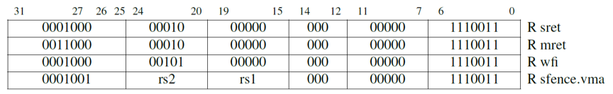

<center>图10.1：RISC-V特权指令的指令图示。</center>

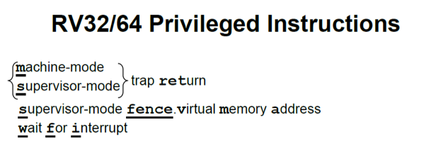

<center>图10.2：RISC-V特权指令的指令布局、操作码、指令类型和名称。（来自[Waterman and Asanovic 2017]中的表6.1。）</center>

## 10.2 简单嵌入式系统的机器模式

机器模式（缩写为M模式，M-mode）是RISC-V中*hart*（hardware thread，硬件线程）可以执行的最高权限模式。在M模式下运行的hart对内存，I/O和一些对于启动和配置系统来说必要的底层功能有着完全的使用权。因此它是唯一所有标准RISC-V处理器都必须实现的权限模式。实际上简单的RISC-V微控制器仅支持M模式。这类系统是本节的重点。

>>>**Hart是硬件线程(hardware thread)的缩略形式**。 我们用该术语将它们与大多数程序员熟悉的软件线程区分开来。软件线程在harts上进行分时复用。大多数处理器核都只有一个hart。

>>>

机器模式最重要的特性是拦截和处理异常（不寻常的运行时事件）的能力。RISC-V将异常分为两类。一类是同步异常，这类异常在指令执行期间产生，如访问了无效的存储器地址或执行了具有无效操作码的指令时。另一类是中断，它是与指令流异步的外部事件，比如鼠标的单击。RISC-V中实现精确例外：保证异常之前的所有指令都完整地执行了，而后续的指令都没有开始执行（或等同于没有执行）。图10.3列出了触发标准例外的原因。

>>>**C扩展不会发生非对齐的指令地址异常**，因为它永远不可能跳转到奇数地址：分支和JAL的立即数总是偶数，JALR屏蔽其有效地址的最低有效位。 如果没有C扩展，跳转到被4除余2的地址时会发生此异常。

在M模式运行期间可能发生的同步例外有五种：

-   访问错误异常当物理内存的地址不支持访问类型时发生（例如尝试写入ROM）。

-   断点异常 在执行ebreak指令，或者地址或数据与调试触发器匹配时发生。

-   环境调用异常 在执行ecall指令时发生。

-   非法指令异常 在译码阶段发现无效操作码时发生。

-   非对齐地址异常在有效地址不能被访问大小整除时发生，例如地址为0x12的amoadd.w。

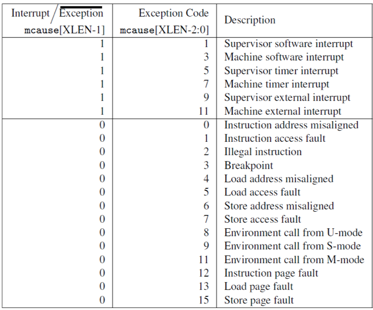

<center>图10.3：RISC-V异常和中断的原因。中断时mcause的最高有效位置1，同步异常时置0，且低有效位标识了中断或异常的具体原因。只有在实现了监管者模式时才能处理监管者模式中断和页面错误异常（参见第10.5节）。（来自[Waterman and Asanovic 2017]中的表3.6。）</center>

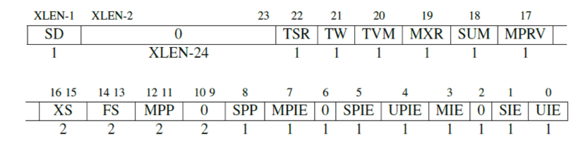

<center>图10.4：mstatus控制状态寄存器。在仅有机器模式且没有F和V扩展的简单处理中，有效的域只有全局中断使能、MIE和MPIE（它在异常发生后保存MIE的旧值）。RV32的XLEN时32，RV64是40。（来自[Waterman and Asanovic 2017]中的表3.6；有关其他域的说明请参见该文档的第3.1节。）</center>

如果你还记得第二章声明允许非对齐的load和store，你可能会问为什么图10.3中还会有非对齐的load和store地址异常。原因有两个，首先，第六章的原子内存操作需要自然对齐的地址；其次，一些实现者选择省略对于非对齐的常规load和store的硬件支持，因为它是一个难以实现的不常用特性。没有这种硬件的处理器依赖于异常处理程序，用一系列较小的对齐load和store来模拟软件中非对齐的load和store。应用程序代码并没有变得更好：虽然速度很慢，非对齐访存操作仍按预期进行，而硬件仍然很简单。或者，在更高性能的处理器中可以硬件实现非对齐的load和store。这种实现上的灵活性归功于RISC-V允许非对齐load和store与常规load和store共用操作码。这遵照了第一章将架构和具体实现隔离开的准则。

有三种标准的中断源：软件、时钟和外部来源。软件中断通过向内存映射寄存器中存数来触发，并通常用于由一个hart中断另一个hart（在其他架构中称为处理器间中断机制）。当hart的时间比较器（一个名为mtimecmp的内存映射寄存器）大于实时计数器mtime时，会触发时钟中断。外部中断由平台级中断控制器（大多数外部设备连接到这个中断控制器）引发。不同的硬件平台具有不同的内存映射并且需要中断控制器的不同特性，因此用于发出和消除这些中断的机制因平台而异。所有RISC-V系统的共同问题是如何处理异常和屏蔽中断，这是下一节的主题。

## 10.3 机器模式下的异常处理

八个控制状态寄存器（CSR）是机器模式下异常处理的必要部分：

-   mtvec（Machine Trap Vector）它保存发生异常时处理器需要跳转到的地址。
-   mepc（Machine Exception PC）它指向发生异常的指令。
-   mcause（Machine Exception Cause）它指示发生异常的种类。
-   mie（Machine Interrupt Enable）它指出处理器目前能处理和必须忽略的中断。
-   mip（Machine Interrupt Pending）它列出目前正准备处理的中断。
-   mtval（Machine Trap Value）它保存了陷入（trap）的附加信息：地址例外中出错的地址、发生非法指令例外的指令本身，对于其他异常，它的值为0。
-   mscratch（Machine Scratch）它暂时存放一个字大小的数据。
-   mstatus（Machine Status）它保存全局中断使能，以及许多其他的状态，如图10.4所示。

处理器在M模式下运行时，只有在全局中断使能位mstatus.MIE置1时才会产生中断。此外，每个中断在控制状态寄存器mie中都有自己的使能位。这些位在mie中的位置对应于图10.3中的中断代码。例如，mie[7]对应于M模式中的时钟中断。控制状态寄存器mip具有相同的布局，并且它指示当前待处理的中断。将所有三个控制状态寄存器合在一起考虑，如果mstatus.MIE = 1，mie[7] = 1，且mip[7] = 1，则可以处理机器的时钟中断。

|编码|名字|简写|
|-|-|-|
|00|用户（User）|U|
|01|监管者（Supervisor）|S|
|11|机器（Machine）|M|

<center>图10.5：RISC-V的权限模式和它们的编码</center>

> >> **RISC-V还支持向量中断**，其中处理器跳转到各类中断各自对应的地址，而不是一个统一的入口点。这种寻址消除了读取和解码mcause的需要，加快了中断处理速度。将mtvec
> >> [0]设置为1可启用此功能; 然后根据中断原因x将PC设置为（mtval-1 + 4x），而不是通常的mtval。

当一个hart发生异常时，硬件自动经历如下的状态转换：

-   异常指令的PC被保存在mepc中，PC被设置为mtvec。（对于同步异常，mepc指向导致异常的指令；对于中断，它指向中断处理后应该恢复执行的位置。）

-   根据异常来源设置mcause（如图10.3所示），并将mtval设置为出错的地址或者其它适用于特定异常的信息字。

-   把控制状态寄存器mstatus中的MIE位置零以禁用中断，并把先前的MIE值保留到MPIE中。

-   发生异常之前的权限模式保留在mstatus的MPP域中，再把权限模式更改为M。图10.5显示了MPP域的编码（如果处理器仅实现M模式，则有效地跳过这个步骤）。

为避免覆盖整数寄存器中的内容，中断处理程序先在最开始用mscratch和整数寄存器（例如a0）中的值交换。通常，软件会让mscratch包含指向附加临时内存空间的指针，处理程序用该指针来保存其主体中将会用到的整数寄存器。在主体执行之后，中断程序会恢复它保存到内存中的寄存器，然后再次使用mscratch和a0交换，将两个寄存器恢复到它们在发生异常之前的值。最后，处理程序用mret指令（M模式特有的指令）返回。mret将PC设置为mepc，通过将mstatus的MPIE域复制到MIE来恢复之前的中断使能设置，并将权限模式设置为mstatus的MPP域中的值。这基本是前一段中描述的逆操作。

图10.6展示了遵循此模式的基本时钟中断处理程序的RISC-V汇编代码。它只对时间比较器执行了递增操作，然后继续执行之前的任务。更实际的时钟中断处理程序可能会调用调度程序，从而在任务之间切换。它是非抢占的，因此在处理程序的过程中中断会被禁用。不考虑这些限制条件的话，它就是一个只有一页的RISC-V中断处理程序的完整示例！

>>>

有时需要在处理异常的过程中转到处理更高优先级的中断。唉，mepc，mcause，mtval和mstatus这些控制寄存器只有一个副本，处理第二个中断的时候如果软件不进行一些帮助的话，这些寄存器中的旧值会被破坏，导致数据丢失。可抢占的中断处理程序可以在启用中断之前把这些寄存器保存到内存中的栈，然后在退出之前，禁用中断并从栈中恢复寄存器。

>>>

除了上面介绍的mret指令之外，M模式还提供了另外一条指令：wfi（Wait For Interrupt）。wfi通知处理器目前没有任何有用的工作，所有它应该进入低功耗模式，直到任何使能有效的中断等待处理，即 $$(mie \& mip) \neq 0$$。RISC-V处理器以多种方式实现该指令，包括到中断待处理之前都停止时钟。有的时候只把这条指令当作nop来执行。因此，wfi通常在循环内使用。

>>**补充说明：wfi不论全局中断使能有效与否都有用**
>>如果在全局中断使能有效（mstatus.MIE = 1）时执行wfi，然后有一个使能有效的中断等待执行，则处理器跳转到异常处理程序。另一方面，如果在全局禁用中断时执行wfi，接着一个使能有效的中断等待执行，那么处理器继续执行wfi之后的代码。这些代码通常会检查控制状态寄存器mip，以决定下一步该做什么。与跳转到异常处理程序相比，这个策略可以减少中断延迟，因为不需要保存和恢复整数寄存器。

## 10.4 嵌入式系统中的用户模式和进程隔离

虽然机器模式对于简单的嵌入式系统已经足够，但它仅适用于那些整个代码库都可信的情况，因为M模式可以自由地访问硬件平台。更常见的情况是，不能信任所有的应用程序代码，因为不能事先得知这一点，或者它太大，难以证明正确性。因此，RISC-V提供了保护系统免受不可信的代码危害的机制，并且为不受信任的进程提供隔离保护。

> > > 

必须禁止不可信的代码执行特权指令（如mret）和访问特权控制状态寄存器（如mstatus），因为这将允许程序控制系统。这样的限制很容易实现，只要加入一种额外的权限模式：用户模式（U模式）。这种模式拒绝使用这些功能，并在尝试执行M模式指令或访问CSR的时候产生非法指令异常。其它时候，U模式和M模式的表现十分相似。通过将mstatus.MPP设置为U（如图10.5所示，编码为0），然后执行mret指令，软件可以从M模式进入U模式。如果在U模式下发生异常，则把控制移交给M模式。

这些不可信的代码还必须被限制只能访问自己那部分内存。实现了M和U模式的处理器具有一个叫做物理内存保护（PMP，Physical Memory Protection）的功能，允许M模式指定U模式可以访问的内存地址。PMP包括几个地址寄存器（通常为8到16个）和相应的配置寄存器。这些配置寄存器可以授予或拒绝读、写和执行权限。当处于U模式的处理器尝试取指或执行load或store操作时，将地址和所有的PMP地址寄存器比较。如果地址大于等于PMP地址i，但小于PMP地址i+1，则PMP i+1的配置寄存器决定该访问是否可以继续，如果不能将会引发访问异常。

```assembly
# save registers
csrrw a0, mscratch, a0  # save a0; set a0 = &temp storage
sw a1, 0(a0)			# save a1
sw a2, 4(a0)			# save a2
sw a3, 8(a0)			# save a3
sw a4, 12(a0)			# save a4

# decode interrupt cause
csrr a1, mcause			# read exception cause
bgez a1, exception 		# branch if not an interrupt
andi a1, a1, 0x3f 		# isolate interrupt cause
li	 a2, 7				# a2 = timer interrupt cause
bne  a1, a2, otherInt	# branch if not a timer interrupt

# handle timer interrupt by incrementing time comparator
la a1, mtimecmp			# a1 = &time comparator
lw a2, 0(a1)			# load lower 32 bits of comparator
lw a3, 4(a1)			# load upper 32 bits of comparator
addi a4, a2, 1000		# increment lower bits by 1000 cycles
sltu a2, a4, a2			# generate carry-out
add a3, a3, a2			# increment upper bits
sw a3, 4(a1)			# store upper 32 bits
sw a4, 0(a1)			# store lower 32 bits

# restore registers and return
lw a4, 12(a0)			# restore a4
lw a3, 4(a0)			# restore a3
lw a2, 4(a0)			# restore a2
lw a1, 0(a0)			# restore a1
csrrw a0, mscratch, a0  # restore a0; mscratch = &temp storage
mret                    # return from handler
```

<center>图10.6；简单的RISC-V时钟中断处理程序代码。代码中假定了全局中断已通过置位mstatus.MIE启用；时钟中断已通过置位mie[7]启用；mtvec CSR已设置为此处理程序的入口地址；而且mscratch CSR已经设置为有16个字节用于保存寄存器的临时空间的地址。第一部分保存了五个寄存器，把a0保存在mscratch中，a1到a4保存在内存中。然后它检查mcause来读取异常的类别：如果mcause < 0则是中断，反之则是同步异常。如果是中断，就检查mcause的低位是否等于7，如果是，就是M模式的时钟中断。如果确定是时钟中断，就给时间比较器加上1000个时钟周期，于是下一个时钟中断会发生在大约1000个时钟周期之后。最后一段恢复了a0到a4和mscratch，然后用mret指令返回。</center>

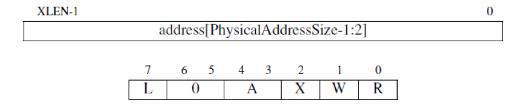

<center>图10.7：PMP地址和配置寄存器。地址寄存器右移两位，如果物理地址位宽小于XLEN-2，则高位为0。R、W和X域分别对应读、写和执行权限。A域设置是否启用此PMP，L域锁定了PMP和对应的地址寄存器。</center>

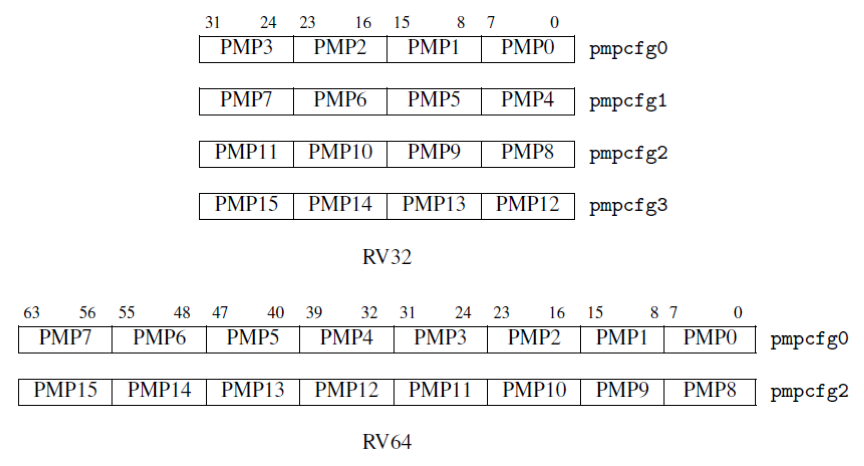

<center>图10.8：pmpcfg CSR中PMP配置的布局。对于RV32（上半部分），16个配置寄存器被分配到4个CSR中。对于RV64（下半部分），它们则分配到了两个偶数编号的CSR中。</center>

图10.7显示了PMP地址寄存器和配置寄存器的布局。两者都是CSR，地址寄存器名为pmpaddr0到pmpaddrN，其中N+1是实现的PMP个数。地址寄存器右移两位，因为PMP以四字节为单位。配置寄存器密集地填充在CSR中以加速上下文切换，如图10.8所示。PMP的配置由R、W和X位组成，他们分别对于load，store和fetch操作，还有另一个域A，当它为0时禁用此PMP，当它为1时启用。PMP配置还支持其他模式，还可以加锁，\[Waterman and Asanovic 2017\]中描述了这些功能。

## 10.5 现代操作系统的监管者模式

上一节中描述的PMP方案对嵌入式系统的实现很有吸引力，因为它以相对较低的成本提供了内存保护，但它的一些缺点限制了它在通用计算中的使用。由于PMP仅支持固定数量的内存区域，因此无法对它进行扩展从而适应复杂的应用程序。而且由于这些区域必须在物理存储中连续，因此系统可能产生存储碎片化的问题。另外，PMP不能有效地支持对辅存的分页。

>>>**存储碎片化**发生在内存可用的时候，但不包括足够大的连续块的情况。

更复杂的RISC-V处理器用和几乎所有通用架构相同的方式处理这些问题：使用基于页面的虚拟内存。这个功能构成了监管者模式（S模式）的核心，这是一种可选的权限模式，旨在支持现代类Unix操作系统，如Linux，FreeBSD和Windows。S模式比U模式权限更高，但比M模式低。与U模式一样，S模式下运行的软件不能使用M模式的CSR和指令，并且受到PMP的限制。本届介绍S模式的中断和异常，下一节将详细介绍S模式下的虚拟内存系统。

默认情况下，发生所有异常（不论在什么权限模式下）的时候，控制权都会被移交到M模式的异常处理程序。但是Unix系统中的大多数例外都应该进行S模式下的系统调用。M模式的异常处理程序可以将异常重新导向S模式，但这些额外的操作会减慢大多数异常的处理速度。因此，RISC-V提供了一种异常委托机制。通过该机制可以选择性地将中断和同步异常交给S模式处理，而完全绕过M模式。

>>>**为什么不无条件地将中断委托给S模式？**一个原因是虚拟化：如果M模式想要虚拟一个S模式的设备，其中断应该转到M模式，而不是S模式。

mideleg（Machine Interrupt Delegation，机器中断委托）CSR控制将哪些中断委托给S模式。与mip和mie一样，mideleg中的每个位对应于图10.3中相同的异常。例如，mideleg\[5\]对应于S模式的时钟中断，如果把它置位，S模式的时钟中断将会移交S模式的异常处理程序，而不是M模式的异常处理程序。

委托给S模式的任何中断都可以被S模式的软件屏蔽。sie（Supervisor Interrupt Enable，监管者中断使能）和sip（Supervisor Interrupt Pending，监管者中断待处理）CSR是S模式的控制状态寄存器，他们是mie和mip的子集。它们有着和M模式下相同的布局，但在sie和sip中只有与由mideleg委托的中断对应的位才能读写。那些没有被委派的中断对应的位始终为零。

>>>**S模式不直接控制时钟中断和软件中断**，而是使用ecall指令请求M模式设置定时器或代表它发送处理器间中断。该软件约定是监管者二进制接口(Supervisor Binary Interface)的一部分。

M模式还可以通过medeleg CSR将同步异常委托给S模式。该机制类似于刚才提到的中断委托，但medeleg中的位对应的不再是中断，而是图10.3中的同步异常编码。例如，置上medeleg\[15\]便会把store page fault（store过程中出现的缺页）委托给S模式。

请注意，无论委派设置是怎样的，发生异常时控制权都不会移交给权限更低的模式。在M模式下发生的异常总是在M模式下处理。在S模式下发生的异常，根据具体的委派设置，可能由M模式或S模式处理，但永远不会由U模式处理。

> > > 

S模式有几个异常处理CSR：sepc、stvec、scause、sscratch、stval和sstatus，它们执行与10.2中描述的M模式CSR相同的功能。图10.9显示了sstatus寄存器的布局。监管者异常返回指令sret与mret的行为相同，但它作用于S模式的异常处理CSR，而不是M模式的CSR。

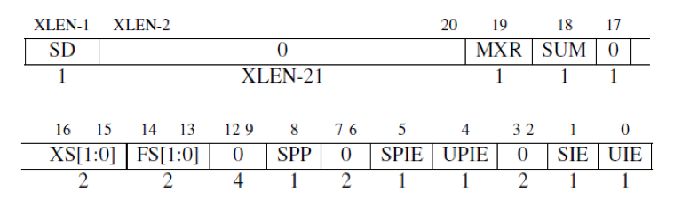

<center>图10.9：sstatus CSR。sstatus是mstatus（图10.4）的一个子集，因此它们的布局类似。SIE和SPIE中分别保存了当前的和异常发生之前的中断使能，类似于mstatus中的MIE和MPIE。RV32的XLEN为32，RV64为40。（来自[Waterman and Asanovic 2017]中的图4.2；有关其他域的说明请参见该文档的第4.1节。）</center>

S模式处理例外的行为已和M模式非常相似。如果hart接受了异常并且把它委派给了S模式，则硬件会原子地经历几个类似的状态转换，其中用到了S模式而不是M模式的CSR：

-   发生例外的指令的PC被存入sepc，且PC被设置为stvec。

-   scause按图10.3根据异常类型设置，stval被设置成出错的地址或者其它特定异常的信息字。

-   把sstatus CSR中的SIE置零，屏蔽中断，且SIE之前的值被保存在SPIE中。

-   发生例外时的权限模式被保存在sstatus的SPP域，然后设置当前模式为S模式。

## 10.6 基于页面的虚拟内存

S模式提供了一种传统的虚拟内存系统，它将内存划分为固定大小的页来进行地址转换和对内存内容的保护。启用分页的时候，大多数地址（包括load和store的有效地址和PC中的地址）都是虚拟地址。要访问物理内存，它们必须被转换为真正的物理地址，这通过遍历一种称为页表的高基数树实现。页表中的叶节点指示虚地址是否已经被映射到了真正的物理页面，如果是，则指示了哪些权限模式和通过哪种类型的访问可以操作这个页。

>>>从IBM 360模型67开始，**4 KiB大小的页面已经流行了五十年**。Atlas是第一台带分页的计算机，有3 KiB大小的页（字长6个字节）。 我们发现，在计算机性能和内存容量呈指数增长半个世纪后，页面大小基本保持不变，这一点值得注意。

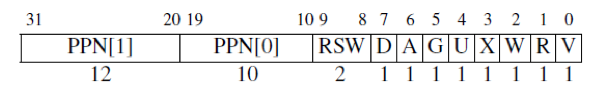

<center>图10.10：一个RV32 Sv32页表项（PTE）。</center>

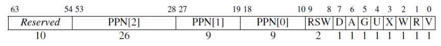

<center>图10.11：一个RV64 Sv39页表项（PTE）。</center>

访问未被映射的页或访问权限不足会导致页错误例外（page fault exception）。

RISC-V的分页方案以SvX的模式命名,其中X是以位为单位的虚拟地址的长度。RV32的分页方案Sv32支持4GiB的虚址空间，这些空间被划分为$$2^{10}$$个4 MiB大小的巨页。每个巨页被进一步划分为$$2^{10}$$个4 KiB大小的基页（分页的基本单位）。因此，Sv32的页表是基数为$$2^{10}$$的两级树结构。页表中每个项的大小是四个字节，因此页表本身的大小是4 KiB。页表的大小和每个页的大小完全相同，这样的设计简化了操作系统的内存分配。

图10.10显示了Sv32页表项（page-table entry，PTE）的布局，从左到右分别包含如下所述的域：

-   V位决定了该页表项的其余部分是否有效（V = 1时有效）。若V = 0，则任何遍历到此页表项的虚址转换操作都会导致页错误。

-   R、W和X位分别表示此页是否可以读取、写入和执行。如果这三个位都是0，那么这个页表项是指向下一级页表的指针，否则它是页表树的一个叶节点。

-   U位表示该页是否是用户页面。若U = 0，则U模式不能访问此页面，但S模式可以。若U = 1，则U模式下能访问这个页面，而S模式不能。

-   G位表示这个映射是否对所有虚址空间有效，硬件可以用这个信息来提高地址转换的性能。这一位通常只用于属于操作系统的页面。

-   A位表示自从上次A位被清除以来，该页面是否被访问过。

-   D位表示自从上次清除D位以来页面是否被弄脏（例如被写入）。

-   RSW域留给操作系统使用，它会被硬件忽略。

-   PPN域包含物理页号，这是物理地址的一部分。若这个页表项是一个叶节点，那么PPN是转换后物理地址的一部分。否则PPN给出下一节页表的地址。（图10.10将PPN划分为两个子域，以简化地址转换算法的描述。）

>>>**操作系统依赖于A位和D位来决定将哪些页面交换到辅存**。定期清除A位有助于OS判断哪些页面是最近最少使用的。 置上D位表示换出该页面的成本更高，因为它必须写回辅存。

RV64支持多种分页方案，但我们只介绍最受欢迎的一种，Sv39。Sv39使用和Sv32相同的4 KiB大的基页。页表项的大小变成8个字节，所以它们可以容纳更大的物理地址。为了保证页表大小和页面大小一致，树的基数相应地降到2^9^，树也变为三层。Sv39的512 GiB地址空间划分为$$2^9$$个1 GiB大小的吉页。每个吉页被进一步划分为$$2^9$$个巨页。在Sv39中这些巨页大小为2 MiB，比Sv32中略小。每个巨页再进一步分为$$2^9$$个4 KiB大小的基页。

>>>**其他RV64分页方案只是向页表添加更多级别**。Sv48与Sv39几乎相同，但其虚拟地址空间大29倍，页表更深一层。

图10.11显示了Sv39页表项的布局。它和Sv32完全相同，只是PPN字段被扩展到了44位，以支持56位的物理地址，或者说$$2^{26}$$ GiB大小的物理地址空间。

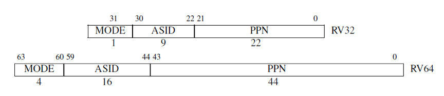

<center>图10.12：satp CSR。来自[Waterman and Asanovic 2017]中的图4.11和4.12。</center>

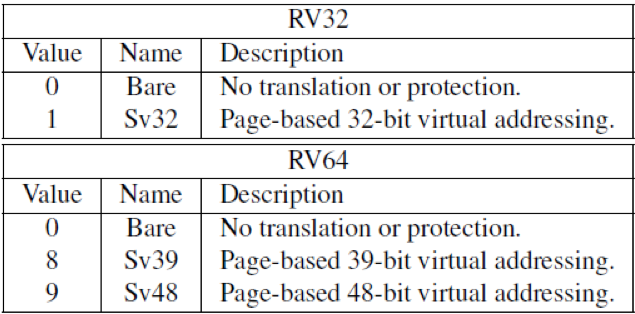

<center>图10.13：satp CSR中MODE域的编码。来自[Waterman and Asanovic 2017]中的表4.3。</center>

>>**补充说明：未被使用的地址位**
>>由于Sv39的虚拟地址比RV64整数寄存器要短，可能你想知道剩下的35位是什么。Sv39要求地址位63-39是第38位的副本。因此有效的虚拟地址是0000_0000_0000_0000$$_{hex}$$-0000_003f_ffff_ffff$$_{hex}$$和ffff_ffc0_0000_0000$$_{hex}$$-ffff_ffff_ffff_ffff$$_{hex}$$。这两个区间之间间隔的大小是两个区间长度大小的225倍，看上去似乎浪费了64位寄存器可以表达范围的99.999997%。为什么不充分地利用这额外的25位空间呢？答案是，随着程序的增长，它们可能会需要大于512 GiB的虚址空间。而架构师希望再不破坏向后兼容性的前提下增加地址空间。如果我们允许程序在高25位中存储额外的数据，那么以后就不可能把这些位回收从而存储更大的地址。像这样允许在未使用的地址位中存储数据的严重错误，在计算机的历史中已经重复出现了多次。

一个叫satp（Supervisor Address Translation and Protection，监管者地址转换和保护）的S模式控制状态寄存器控制了分页系统。如图10.12所示，satp有三个域。MODE域可以开启分页并选择页表级数，图10.13展示了它的编码。ASID（Address SpaceIdentifier，地址空间标识符）域是可选的，它可以用来降低上下文切换的开销。最后，PPN字段保存了根页表的物理地址，它以4 KiB的页面大小为单位。通常M模式的程序在第一次进入S模式之前会把零写入satp以禁用分页，然后S模式的程序在初始化页表以后会再次进行satp寄存器的写操作。

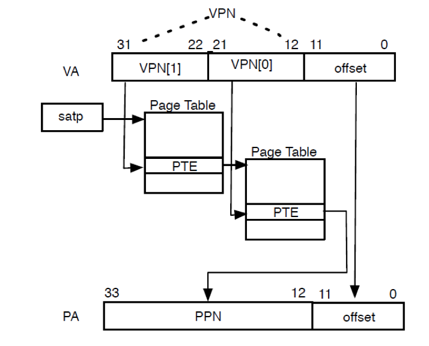

<center>图10.14：Sv32中地址转换过程的图示。</center>

当在satp寄存器中启用了分页时，S模式和U模式中的虚拟地址会以从根部遍历页表的方式转换为物理地址。图10.14描述了这个过程：

1. satp.PPN给出了一级页表的基址，VA\[31:22\]给出了一级页号，因此处理器会读取位于地址$(satp.PPN \times 4096 + VA\lbrack 31:22\rbrack \times 4)$的页表项。

2. 该PTE包含二级页表的基址，VA\[21:12\]给出了二级页号，因此处理器读取位于地址$(PTE.PPN \times 4096 + VA\lbrack 21:12\rbrack \times 4)$的叶节点页表项。

3. 叶节点页表项的PPN字段和页内偏移（原始虚址的最低12个有效位）组成了最终结果：物理地址就是$(\text{Leaf}PTE.PPN \times 4096 + VA\left\lbrack 11:0 \right\rbrack)$

随后处理器会进行物理内存的访问。Sv39的转换过程几乎和Sv32相同，区别在于其具有较大的PTE和更多级页表。本章末尾的图10.19给出了页表遍历算法的完整描述，详细说明了例外条件和超页面转换的特殊情况。

>>> 

除了一点以外，我们几乎讲完了RISC-V分页系统的所有内容。如果所有取指，load和store操作都导致多次页表访问，那么分页会大大地降低性能！所有现代的处理器都用地址转换缓存（通常称为*TLB*，全称为Translation Lookaside Buffer）来减少这种开销。为了降低这个缓存本身的开销，大多数处理器不会让它时刻与页表保持一致。这意味着如果操作系统修改了页表，那么这个缓存会变得陈旧而不可用。S模式添加了另一条指令来解决这个问题。这条sfence.vma会通知处理器，软件可能已经修改了页表，于是处理器可以相应地刷新转换缓存。它需要两个可选的参数，这样可以缩小缓存刷新的范围。一个位于rs1，它指示了页表哪个虚址对应的转换被修改了；另一个位于rs2，它给出了被修改页表的进程的地址空间标识符（ASID）。如果两者都是x0，便会刷新整个转换缓存。

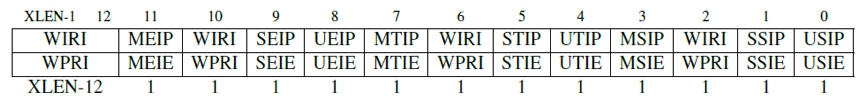

<center>图10.15：机器中断寄存器。它们是宽为XLEN位的读/写寄存器，用于保存待处理的中断（mip）和中断使能位（mie）CSR。只有与mip中的位对应的低权限软件中断（USIP，SSIP）、时钟中断（UTIP，STIP）和外部中断（UEIP，SEIP）的位才能通过该CSR的地址写入；其余的位是只读的。</center>

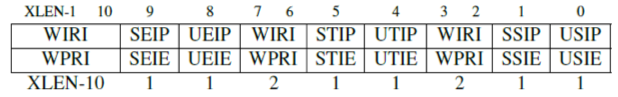

<center>图10.16：监管者中断寄存器。它们是宽为XLEN位的读/写寄存器，用于保存待处理的中断（sip）和中断使能位（sie）CSR。</center>

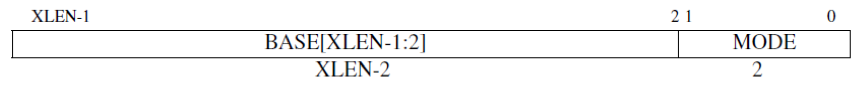

<center>图10.17：机器和监管者自陷向量（trap-vector）基地址寄存器（mtvec和stvec）CSR。他们是位宽为XLEN的读/写寄存器，用于保存自陷向量的配置，包括向量基址（BASE）和向量模式（MODE）。BASE域中的值必须按4字节对齐。MODE = 0表示所有异常都把PC设置为BASE。MODE = 1会在一部中断时将PC设置为$$ (BASE + (4 \times cause ))$$。</center>

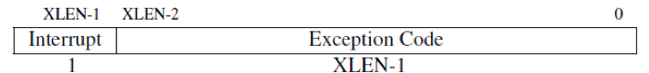

<center>图10.18：机器和监管者cause（mcause和scause）CSR。当处理自陷时，CSR中被写入一个指示导致自陷的事件的代码。如果自陷由中断引起，则置上中断位。"异常代码"字段包含指示最后一个异常的代码。[Waterman and Asanovic 2017]中的表3.6中包含自陷的来源到自陷代码的映射。</center>

>>**补充说明： 多处理器中的地址转换缓存一致性**
>>sfence.vma仅影响执行当前指令的hart的地址转换硬件。当hart更改了另一个hart正在使用的页表时，前一个hart必须用处理器间中断来通知后一个hart，他应该执行sfence.vma指令。这个过程通常被称为TLB击落。

## 10.7 结束语

> >*研究表明，最优秀的设计师会设计出更快、更小、更简单的结构，而且设计过程也更轻松。伟大的结构和一般的结构之间差了一个数量级。*

> > <div align=right>—— Fred Brooks,Jr.,1986<div>

> > Brooks是图灵奖获得者，还是IBM System/360系列计算机的架构师（这些计算机说明了将架构和实现区分开来的重要性）。这个1964年诞生的架构的继承者至今仍在销售。

>>>

>>>

RISC-V特权架构的模块化特性满足了各种系统的需求。十分精简的机器模式以低成本的特征支持裸机嵌入式应用。附加的用户模式和物理内存保护功能共同支持了更复杂的嵌入式系统中的多任务处理。最后，监管者模式和基于页面的虚拟内存提供了运行现代操作系统所必需的灵活性。

## 10.8 扩展阅读

A. Waterman and K. Asanovi´c, editors. *The RISC-V Instruction Set Manual Volume II: Privileged Architecture Version 1.10*. May 2017. URL https://riscv.org/specifications/privileged-isa/.

## 注

[^1]http://parlab.eecs.berkeley.edu

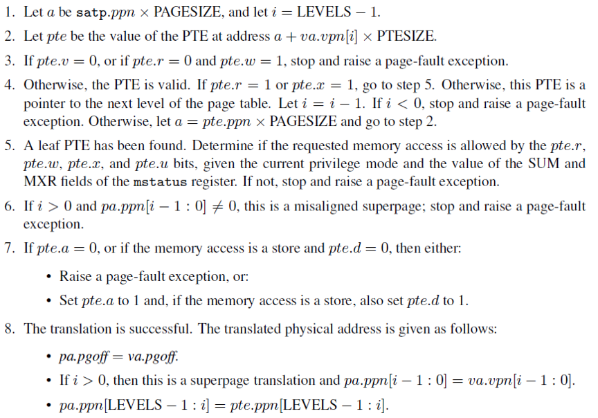

<center>图10.19：虚址到物理地址转换的完整算法。va是输入的虚拟地址，pa是输出的物理地址。PAGESIZE是常数$$2^{12}$$。在Sv32中，LEVELS = 2且PTESIZE = 4；而在Sv39中，LEVELS = 3且PTESIZE = 8。来自[Waterman and Asanovic 2017]中的第4.3.2节。</center>