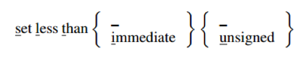
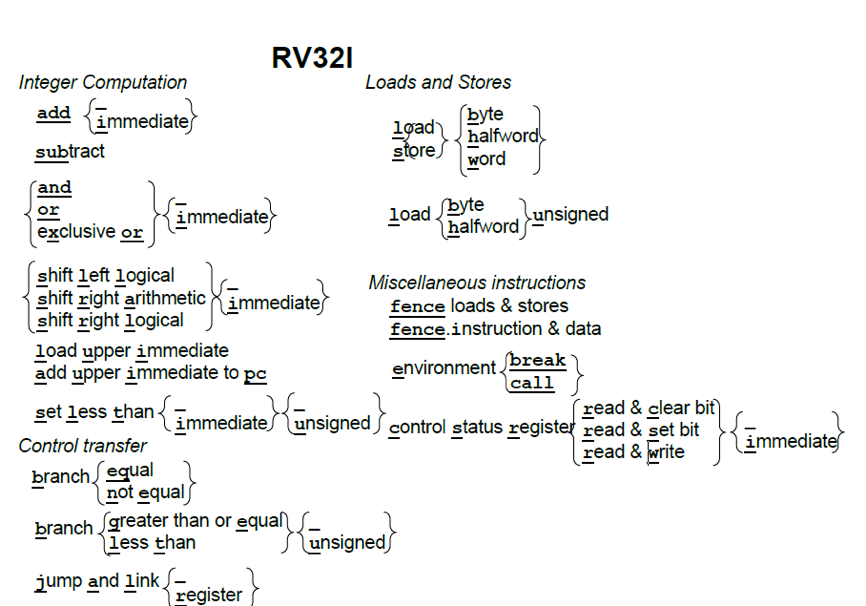
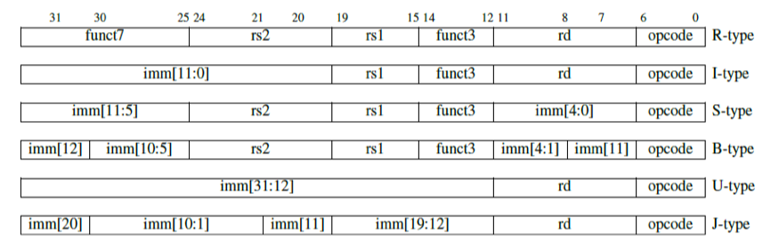
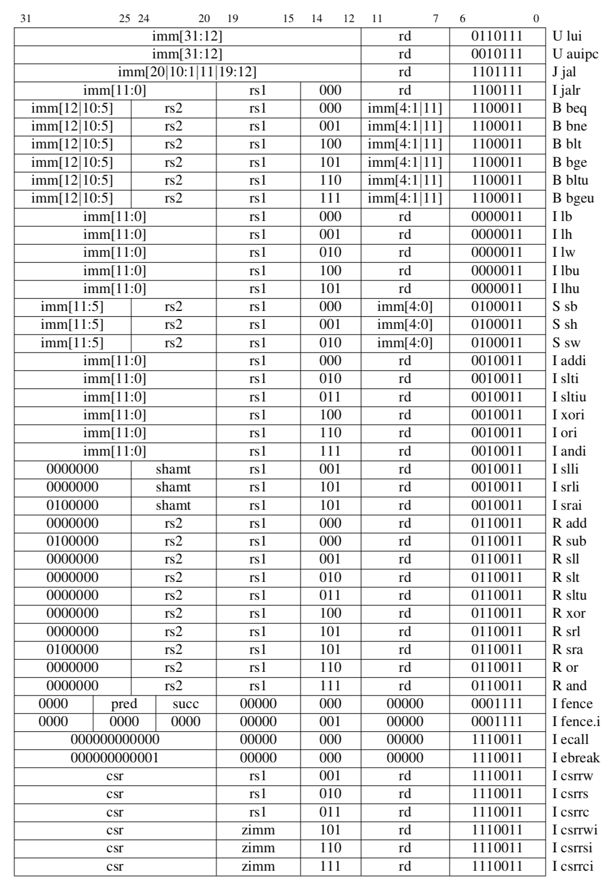
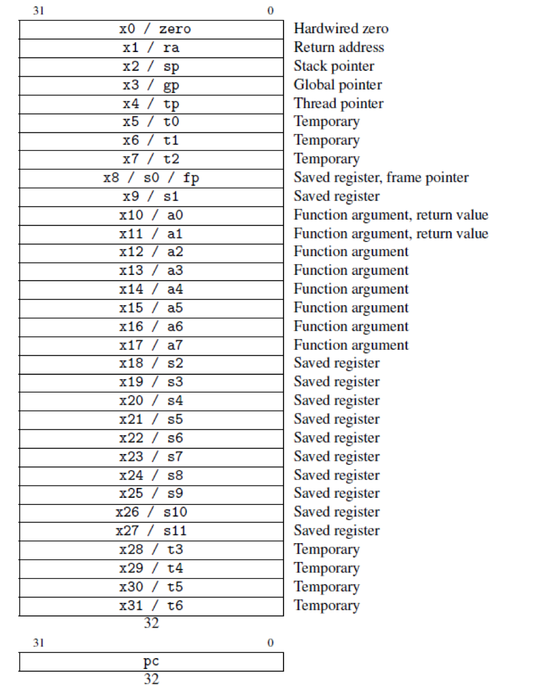

# 2. RV32I：RISC-V基础整数指令集

*......提升计算性能并且让用户能切实享受到性能提升的唯一方法是同时设计编译器和计算机。这样软件用不到的特性将不会被实现在硬件上......*

<div align=right>—— Frances Elizabeth "Fran" Allen, 1981<div>

>>>>>>
>>>**Frances Elizabeth "Fran" Allen**(1932 -- )被授予图灵奖主要是因为她在优化编译器方面的工作。图灵奖是计算机科学的最高奖项。

## 2.1 导言



图2.1是RV32I基础指令集的一页图形表示。对于每幅图，将有下划线的字母从左到右连接起来，即可组成完整的RV32I指令集。对于每一个图，集合标志{}内列举了指令的所有变体，变体用加下划线的字母或下划线字符\_表示。特别的，下划线字符\_表示对于此指令变体不需用字符表示。例如，下图表示了这四个RV32I指令：slt，slti，sltu，sltiu:

我们使用这些图（下面几章的第一个图），旨在对本章的指令给出一个进行快速、深入的概述。

## 2.2 RV32I指令格式

>>>
>>>
>>>
>>>立即数的符号扩展甚至有助于逻辑指令。例如，x＆0xfffffff0在RISC-V中只需要一条andi指令，但在MIPS-32中需要两条指令（addiu用于加载常量，然后是and），因为MIPS零扩展逻辑立即数。ARM-32需要添加一个额外的指令bic，它执行rx＆immediate以补偿零扩展的立即数。

图2.2显示了六种基本指令格式，分别是：用于寄存器-寄存器操作的R类型指令，用于短立即数和访存load操作的I型指令，用于访存store操作的S型指令，用于条件跳转操作的B类型指令，用于长立即数的U型指令和用于无条件跳转的J型指令。图2.3使用图2.2的指令格式列出了图2.1中出现的所有RV32I指令的操作码。

即使是指令格式也能从一些方面说明RISC-V更简洁的ISA设计能提高提高性能功耗比。首先，指令只有六种格式，并且所有的指令都是32位长，这简化了指令解码。ARM-32，还有更典型的x86-32都有许多不同的指令格式，使得解码部件在低端实现中偏昂贵，在中高端处理器设计中容易带来性能挑战。第二，RISC-V指令提供三个寄存器操作数，而不是像x86-32一样，让源操作数和目的操作数共享一个字段。当一个操作天然就需要有三个不同的操作数，但是ISA只提供了两个操作数时，编译器或者汇编程序程序员就需要多使用一条move（搬运）指令，来保存目的寄存器的值。第三，在RISC-V中对于所有指令，要读写的寄存器的标识符总是在同一位置，意味着在解码指令之前，就可以先开始访问寄存器。在许多其他的ISA中，某些指令字段在部分指令中被重用作为源目的地，在其他指令中又被作为目的操作数（例如，ARM-32和MIPS-32）。因此，为了取出正确的指令字段，我们需要时序本就可能紧张的解码路径上添加额外的解码逻辑，使得解码路径的时序更为紧张。第四，这些格式的立即数字段总是符号扩展，符号位总是在指令中最高位。这意味着可能成为关键路径的立即数符号扩展，可以在指令解码之前进行。



<center>图2.1：RV32I指令图示。把带下划线的字母从左到右连接就组成了RV32I指令。花括号{}表示集合中垂直方向上的每个项目都是指令的不同变体。集合中的下划线\_意味着不包含这个字母的也是一个指令名称。例如，左上角附近的符号表示以下六个指令：and，or，xor，andi，ori，xori。</center>



<center>图2.2：RISC-V指令格式。我们用生成的立即数值中的位置（而不是通常的指令立即数域中的位置）(imm\[*x*\])标记每个立即数子域。第十章解释了控制状态寄存器指令使用I型格式的稍微不同的做法。（本图基于Waterman和Asanovi\'c 2017的图2.2）。 </center>



<center>图2.3：RV32I带有指令布局，操作码，格式类型和名称的操作码映射。（此图基于[Waterman and Asanovi\'c 2017]的表19.2。）</center>

>> **补充说明：B类型和J类型指令**
>> 如下所述，分支指令（B类型）的立即数字段在S类型的基础上旋转了1位。跳转指令（J类型）的直接字段在U类型的基础上旋转了12位。因此,RISC-V实际上只有四种基本格式，但我们可以保守地认为它有六种格式。

>>>
>>>
>>>
>>>RISC-V实现对可选扩展使用相同的操作码，例如RV32M，RV32F等。针对特定处理器的非标准扩展只能使用RISC-V中的保留操作码空间。

为了帮助程序员，所有位全部是0是非法的RV32I指令。因此，试图跳转到被清零的内存区域的错误跳转将会立即触发异常，这可以帮助调试。类似地，所有位全部是1的指令也是非法指令，它将捕获其他常见的错误，诸如未编程的非易失性内存设备、断开连接的内存总线或者坏掉的内存芯片。

为了给ISA扩展留出足够的空间，最基础的RV32I指令集只使用了32位指令字中的编码空间的不到八分之一。架构师们也仔细挑选了RV32I操作码，使拥有共同数据通路的指令的操作码位有尽可能多的位的值是一样的，这简化了控制逻辑。最后,当我们看到，B和J格式的分支和跳转地址必须向左移动1位以将地址乘以2，从而给予分支和跳转指令更大的跳转范围。RISC-V将立即数中的位从自然排布进行了一些移位轮换，将指令信号的扇出和立即数多路复用的成本降低了近两倍，这也简化了低端实现中的数据通路逻辑。

**有什么不同之处？**在这一章和后面的章节的结束部分，我们将描述RISC-V与其他指令集的不同之处。这种对比通常是描述相比于其他指令集，RISC-V少了什么。省略什么特性和包括什么特性一样，都能体现架构师的精心设计。

ARM-32 指令集12位的立即字段不仅仅是一个常量，而是一个函数的输入，此函数根据12位立即数的输入来产生一个常量：8位被零扩展到全宽度，然后被循环右移。右移的位数是12位立即数中剩余4位的值乘2。设计者希望在12位中编码更多有用的常数来减少执行指令的数量。在大多数指令格式中，ARM-32也将十分宝贵的四位编码空间拿出来专门用于条件执行。这些条件执行指令不仅使用频率低而且增加了乱序处理器的复杂性。

>>>

> >**补充说明：乱序执行处理器**
> >这是一种高速的、流水化的处理器。它们一有机会就执行指令，而不是在按照程序顺序。这种处理器的一个关键特性是寄存器重命名，把程序中的寄存器名称映射到大量的内部物理寄存器。条件执行的问题是不管条件是否成立，都必须给这些指令中的寄存器分配相应的物理寄存器。但内部物理寄存器的可用性是影响乱序处理器的关键性能资源。

## 2.3 RV32I寄存器

>>>

图2.4列出了RV32I寄存器以及由RISC-V应用程序二进制接口（ABI）所定义的寄存器名称。在我们的示例代码中，我们将使用ABI名称，使它们更容易阅读。为了满足汇编语言程序员和编译器编写者，RV32I有31寄存器加上一个值恒为0的x0寄存器。与之相比，ARM-32只有16个寄存器，x86-32甚至只有8
个寄存器。

>>>
>>>目前除最便宜的处理器以外的所有处理器都使用**流水线**来获得良好的性能。与工业装配线一样，它们通过一次执行多条指令来获得更高的吞吐量。为了实现这一目标，处理器可以预测分支结果，这个操作的准确度可以超过90％。若进行了错误预测，指令会重新执行。早期的微处理器有一个5级流水线，这意味着5条指令并行执行。最近的处理器有10多个流水级。

**有什么不同之处？**为常量0单独分配一个寄存器是RISC-V ISA能如此简单的一个很大的因素。第3章的第36页的图3给出了许多ARM-32和x86-32的原生指令操作，这两个指令集中没有零寄存器。我们可以用RV32I指令完成功能相同的操作，只需使用零寄存器作为操作数。

程序计数器（PC）是ARM-32的16个寄存器之一，这意味着任何改变寄存器的指令都有可能导致分支跳转。PC作为一个寄存器使硬件分支预测变得复杂，因为在典型的ISA中，仅10%-20%的指令为分支指令，而在ARM-32中，任何指令都有可能是分支指令。而分支预测的准确性对于良好的流水线性能至关重要。另外将PC作为一个寄存器也意味着可用的通用寄存器少了一个。

## 2.4 RV32I整数计算

附录A给出了所有RISC-V指令的细节信息，包括格式和操作码。在本节以及接下来的章节的类似小节中，我们将给出ISA的一些概述。这能够让有基础的汇编语言程序员了解RISC-V，同时也顺便说明RISC-V的特性如何满足第一章中阐述的七个ISA指标。

简单的算术指令（add, sub）、逻辑指令（and, or, xor），以及图2.1中的移位指令（sll, srl, sra）和其他ISA差不多。他们从寄存器读取两个32位的值，并将32位结果写入目标寄存器。RV32I还提供了这些指令的立即数版本。和ARM-32不同，立即数总是进行符号扩展，这样子如果需要，我们可以用立即数表示负数，正因为如此，我们并不需要一个立即数版本的sub。

>>>

程序可以根据比较结果生成布尔值。为应对这种使用场景下，RV32I提供一个当小于时置位的指令。如果第一个操作数小于第二个操作数，它将目标寄存器设置为1，否则为0。不出所料，对这个指令，有一个有符号版本（slt）和无符号版本（sltu），分别用于处理有符号和无符号整数比较。相应的，上述两条指令也有立即数版本的（slti，sltiu）。正如我们将要看到的，虽然RV32I分支指令可以检查两个寄存器之间的所有关系，但一些条件表达式涉及多对寄存器之间的关系。对于这些表达式，编译器或汇编语言程序员可以将slt以及与或异或等逻辑指令组合使用来解决更复杂的条件表达式。

>>>

图2.1剩下的两条整数计算指令主要用于构造大的常量数值和链接。加载立即数到高位（lui）将20位常量加载到寄存器的高20位。接着便可以使用标准的立即指令来创建32位常量。这样子，仅使用2条32位RV32I指令，便可构造一个32位常量。向PC高位加上立即数（auipc）让我们仅用两条指令，便可以基于当前PC以任意偏移量转移控制流或者访问数据。将auipc中的20位立即数与jalr（参见下面）中12位立即数的组合，我们可以将执行流转移到任何32位PC相对地址。而auipc加上普通加载或存储指令中的12位立即数偏移量，使我们可以访问任何32位PC相对地址的数据。

>>>

**有什么不同之处？**首先，RISC-V中没有字节或半字宽度的整数计算操作。操作始终是以完整的寄存器宽度。内存访问需要的能量比算术运算高几个数量级。因此低宽度的数据访问可以节省大量的能量，但低宽度的运算不会。ARM-32具有一个不寻常的功能，对于大多数算术逻辑运算中的一个操作数，你可以选择对它进行移位。尽管这些指令的使用频率很低，但它使数据路径和数据通路更加复杂。与此相对的是，RV32I提供了单独的移位指令。

>>>

RV32I也不包含乘法和除法，它们包含在可选的RV32M扩展中（参见第4章）。与ARM-32和x86-32不同，即使处理器没有添加乘除法扩展，完整的RISC-V软件栈也可以运行，这可以缩小嵌入式芯片的面积。MIPS-32汇编程序可能用一系列移位以及加法指令来替换乘法，以提高性能，这可能会使程序员看到处理器执行了汇编程序中没有的指令，进而造成混淆。RV32I可以忽略了这些特性：循环移位指令和整数算术溢出检测，这两个特性都可以用若干条RV32I指令来实现（参见第2.6节）。



<center>图2.4：RV32I的寄存器。第3章解释了RISC-V调用约定，各种指针（sp，gp，tp，fp），保存寄存器（s0-s11）和临时寄存器（t0-t6）背后的基本原理（基于[Watermanand Asanovi\'c 2017]的图2.1和表20.1）。</center>

>>**补充说明：“位操作”指令**
>>RISC-V基金会正在考虑把rotate之类的位操作指令作为可选指令扩展RV32B的一部分（见第11章）。

> >**补充说明：利用 $$xor$$ 指令进行的花式操作**
> >您可以在不使用中间寄存器的情况下交换两个值！此代码交换$$x1$$和$$x2$$的值。我们将证明留给读者。提示：异或操作是交换的 $$ (a \oplus b) = (b \oplus a)$$，结合的$$( (a \oplus b)  \oplus c = a \oplus (b  \oplus c))$$ ，是它自己的逆操作$$(a \oplus a = 0)$$，并且有一个单位元$$(a \oplus 0 = a)$$。
> >
> >xor x1,x1,x2 # x1’ == x1^x2, x2’ == x2
> >
> >xor x2,x1,x2 # x1’ == x1^x2, x2’ == x1’^x2 == x1^x2^x2 == x1
> >
> >xor x1,x1,x2 # x1” == x1’^x2’ == x1^x2^x1 == x1^x1^x2 == x2, x2’ == x1
> >
> >不论这个操作多么奇妙，RISC-V充足的寄存器使得编译器通常可以找到一个临时寄存器，因此很少使用这个异或的交换操作。

## 2.5 RV32I的加载和存储

除了提供32位字（lw，sw）的加载和存储外，图2.1中说明，RV32I支持加载有符号和无符号字节和半字（lb，lbu，lh，lhu）和存储字节和半字（sb，sh）。有符号字节和半字符号扩展为32位再写入目的寄存器。即使是自然数据类型更窄，低位宽数据也是被扩展后再处理，这使得后续的整数计算指令能正确处理所有的32位。在文本和无符号整数中常用的无符号字节和半字，在写入目标寄存器之前都被无符号扩展到32位。

>>>

加载和存储的支持的唯一寻址模式是符号扩展12位立即数到基地址寄存器，这在x86-32中被称为位偏移寻址模式\[Irvine 2014\]。

**有什么不同之处？**RV32I省略了ARM-32和x86-32的复杂寻址模式。另外，ARM-32提供的寻址模式并非适用于所有数据类型，但RV32I寻址不会歧视任何数据类型。RISC-V可以模仿某些x86寻址模式。例如，将立即数字段设置为0即与x86中的寄存器间接寻址效果相同。与x86-32不同，RISC-V没有特殊的堆栈指令。将31个寄存器中的某一个作为堆栈指针（见图2.4），标准寻址模式使用起来和压栈（push）和出栈（pop）类似，并且不增加ISA的复杂性。与MIPS-32不同，RISC-V不支持延迟加载（*delayed load*）。与延迟分支的设计相似，为了更好的适应五级流水线，MIPS-32重新定义了load指令的语义，load上来的数据在load指令两个指令后才可用。但是对于后来出现的更长的流水线，延迟加载带来的收益逐渐消失，因此RISC-V不支持延迟加载。

>>
>>

虽然ARM-32和MIPS-32要求存储在内存中的数据，要按照数据的自然大小进行边界对齐，但是RISC-V没有这个要求。移植旧的代码有时需要未对齐的访问。对于不对齐访问，一种选择是在基础ISA中禁止不对齐访问，然后提供一些单独的指令用于不对齐访问，例如MIPS-32中的Load Word Left和Load Word Right。然而，这会使寄存器访问变得复杂，因为lwl 并且lwr需要对寄存器进行部分写，而不是简单地对寄存器进行完整的写。支持不对齐访问的，另一种方法就是让普通的加载和存储指令支持不对齐访问，这简化了整体设计。

>> **补充说明：字节序问题**
>>RISC-V 选择了小尾端字节序，因为它在商业上占主导地位：所有 x86-32 系统，Apple iOS，谷歌Android 操作系统和微软 Windows for ARM 都是低字节优先序。由于字节顺序仅在同时以按字访问和按字节访问同一份数据时才会有影响，字节序只会影响很少一部分的程序员。

## 2.6 RV32I条件分支

RV32I可以比较两个寄存器并根据比较结果上进行分支跳转。比较可以是：相等（beq），不相等（bne），大于等于（bge），或小于（blt）。最后两种比较有符号比较，RV32I也提供相应的无符号版本比较的：bgeu和bltu。剩下的两个比较关系（大于和小于等于）可以通过简单地交换两个操作数，即可完成比较。因为$$x<y$$ 表示 $$y>x$$ 且 $$x \geq y$$ 表示 $$y \leq x$$。

>>>bltu允许使用单个指令检查有符号数组的边界，因为任何负索引都将比任何非负边界更大！
>>>

由于RISC-V指令长度必须是两个字节的倍数 —— 关于可选的双字节指令，请参考第七章 —— 分支指令的寻址方式是12位的立即数乘以2，符号扩展它，然后将得到值加到PC上作为分支的跳转地址。PC相对寻址可用于位置无关的代码，简化了链接器和加载器的工作（第3章）。

> > > 

**有什么不同之处？**如上所述，RISC-V去掉了MIPS-32，Oracle SPARC等指令集中被广为诟病的延迟分支特性等。对于条件分支，它还没有像ARM-32和x86-32那样使用条件码。条件码的存在使得大多数指令都需要隐式设置一些额外状态，这使乱序执行的依赖计算复杂化。最后，它省略了x86-32中的循环指令：loop，loope，loopz，loopne，loopnz。

>>**补充说明：不使用条件码实现大位宽数据的加法**
>>在RV32I中是通过sltu计算进位来实现的：
```
	add  a0,a2,a4  # 加低32 位: a0 = a2 + a4
	sltu  a2,a0,a2  # 若 (a2+a4) < a2 那么a2’ = 1，否则a2’ = 0
	add  a5,a3,a5  # 加高32位: a5 = a3 + a5
	add  a1,a2,a5  # 加上低32位的进位
```
>>**补充说明：获取PC**
>>当前的PC可以通过将auipc的U立即数字段设置为0来获得。对于x86-32，要想读取PC，你需要先进行函数调用，（这样子可以将PC推入堆栈）;然后被调用的函数可以从堆栈中读取刚被压栈的PC，最后将PC值返回给调用者（需要再弹出堆栈）。因此，获取当前的PC至少需要1个store，2个load和2个跳转！

>>**补充说明：软件检查溢出**
大部分（但不是所有）程序都忽略整数算术溢出，因此RISC-V依赖于软件溢出检查。检查无符号加法的溢出只需要在指令后添加一个额外的分支指令：addu t0，t1，t2; bltu t0，t1，overflow。
对于带符号的加法，如果已知一个操作数的符号，则溢出检查只需要在加法后添加一条分支指令：addi t0，t1，+ imm; blt t0，t1，overflow。
这覆盖了常见的加立即数的情况。对于一般的带符号加法，我们需要在加法指令后添加三个附加指令，当且仅当一个操作数为负数时，结果才能小于另一个操作数，否则就是溢出。
```
add t0, t1, t2
slti t3, t2, 0        # t3 = (t2<0)
slt t4, t0, t1        # t4 = (t1+t2<t1)
bne t3, t4, overflow  # 若 (t2<0) && (t1+t2>=t1)
					  # || (t2>=0) && (t1+t2<t1)则为溢出
```

## 2.7 RV32I无条件跳转

> > >

图2.1中的跳转并链接指令（jal）具有双重功能。若将下一条指令PC

+ 4的地址保存到目标寄存器中，通常是返回地址寄存器ra（见图2.4），便可以用它来实现过程调用。如果使用零寄存器（x0）替换ra作为目标寄存器，则可以实现无条件跳转，因为x0不能更改。像分支一样，jal将其20位分支地址乘以2，进行符号扩展后再添加到PC上，便得到了跳转地址。

跳转和链接指令的寄存器版本（jalr）同样是多用途的。它可以调用地址是动态计算出来的函数，或者也可以实现调用返回（只需ra作为源寄存器，零寄存器（x0）作为目的寄存器）。Switch和case语句的地址跳转，也可以使用jalr指令，目的寄存器设为x0。

>>> **寄存器窗口**通过使用多于32个寄存器来加速函数调用。新函数将在调用时获得32个寄存器的新集合或窗口。为了传递参数，窗口重叠，这意味着一些寄存器位于两个相邻的窗口中。

**有什么不同之处？**RV32I避开了错综复杂的程序调用指令，例如x86-32的进入和离开指令，或Intel Itanium，Oracle SPARC和Cadence Tensilica中的寄存器窗口。

## 2.8 RV32I杂项

图2.1中的控制状态寄存器指令(csrrc、csrrs、csrrw、csrrci、csrrsi、csrrwi)，使我们可以轻松地访问一些程序性能计数器。对于这些64位计数器，我们一次可以读取32位。这些计数器包括了系统时间，时钟周期以及执行的指令数目。

在RISC-V指令集中，ecall指令用于向运行时环境发出请求，例如系统调用。调试器使用ebreak指令将控制转移到调试环境。

fence指令对外部可见的访存请求，如设备I/O和内存访问等进行串行化。外部可见指对处理器的其他核心、线程，外部设备或协处理器可见。fence.i指令同步指令和数据流。在执行fence.i指令之前，对于同一个硬件线程，RISC-V不保证用存储指令写到内存指令区的数据可以被取指令取到。

第10章介绍RISC-V系统指令。

```c
				void insertion_sort(long a[], size_t n)
                {
                    for (size_t i = 1, j; i < n; i++) {
                      	long x = a[i];
                      	for (j = i; j > 0 && a[j-1] > x; j--) {
                        	a[j] = a[j-1];
                    }
					a[j] = x; }
				}
```

<center>图 2.5：C语言版的插入排序。虽然看起来简单, 插入排序比复杂的排序算法有许多优势：对于小数据集来说，内存使用效率高、速度快，同时还有适应性强、稳定、能在线处理的特点。GCC编译器生成了以下四个数字的代码。我们设置优化标志以减少代码大小，因为这产生了最容易理解的代码。</center>

|ISA|ARM-32|ARM Thumb-2|MIPS-32|microMIPS|X86-32|RV32I|RV32I+RVC|
|-|-|-|-|-|-|-|-|
|指令数|19|18|24|24|20|19|19|
|字节数|76|46|96|56|45|76|52|

<center>图 2.6：插入排序在不同指令集下生成的指令数目以及指令大小。第7章会介绍ARM Thumb-2, microMIPS以及RV32C指令集。</center>

>>>

**有什么不同之处？**RISC-V使用内存映射I/O而不是像x86-32一样，使用in，ins，insb，insw和out，out，outsb等指令来进行I/O。为支持字符串处理，RISC-V实现了字节存取，而不是像x86-32那样实现了rep，movs，coms，scas，lods等16条特殊的字符串处理指令。

## 2.9 使用插入排序比较RV32I，ARM-32，MIPS-32和x86-32指令集

我们已经介绍了RISC-V基本指令集，并说明了与ARM-32，MIPS-32和x86-32相比，它做了哪些取舍。我们现在通过真实程序来进行一场直接的较量。图2.5显示了我们的基准测试------用C实现的插入排序。图2.6是一个表，它总结了在编译到不同ISA后，插入排序的指令数和字节数。

> >> **在本章和后续章节中，我们将代码示例移到章节文本结尾之后**，以便保持内容的流畅。

图2.8至2.11显示了插入排序编译生成的RV32I，ARM-32，MIPS-32和x86-32的汇编代码。尽管强调简单性，RISC-V版本使用相同数目或更少的指令，并且不同架构的代码大小非常接近。在此示例中，RISC-V的比较、执行分支指令和ARM-32和x86-32中花式繁多的寻址模式以及入栈出栈指令一样，能够节省大量指令。

## 2.10 结束语

*那些不记得过去的人，注定要重复过去。*
<div align=right>—— George Santayana, 1905<div>

> >所有RISC-V指令的谱系记录在[Chen \& Patterson 2016]中。

图2.7使用第1章中的七个ISA设计指标来组织前面提到的一些过去的指令集中学习到的经验教训，并说明了这些经验教训对RV32I设计的积极影响。我们并不是说RISC-V是第一个拥有这些积极结果的ISA。事实上，RV32I从RISC-I，它的曾祖父母\[Patterson 2017\]那里，继承了如下这些特性：

- 32位字节可寻址的地址空间
- 所有指令均为32位长
- 31个寄存器，全部32位宽，寄存器0硬连线为零
- 所有操作都在寄存器之间（没有寄存器到内存的操作）
- 加载/存储字加上有符号和无符号加载/存储字节和半字
- 所有算术，逻辑和移位指令都有立即数版本的指令
- 立即数总是符号扩展
- 仅提供一种数据寻址模式（寄存器+立即数）和PC相对分支
- 无乘法或除法指令
- 一条指令，用于将大立即数加载到寄存器的高位，这样加载32位常量到寄存器只需要两条指令

>>> 
>>> **Lindy效应**[Lin 2017]观察到技术或想法的未来预期寿命与其年龄成正比。它经受住了时间的考验，所以它过去存活的时间越长，它在未来的生存时间就越长。如果这个假设成立，RISC架构可能在很长一段时间都会是一个好的设计。

RISC-V的出现比过去的ISA晚了四分之一到三分之一个世纪后开始，这使它的设计者得以实践Santayana的建议，即借用之前指令集中好的设计，但不重复它们不好的瑕疵 ---- 包括RISC-I指令集中的瑕疵。另外RISC-V基金会将通过可选的指令集扩展的方式缓慢扩展着指令集，以避免出现困扰过去的成功指令集的疯狂的增量发展。

>>**补充说明：RV32I是否与众不同？**
>>早期的微处理器有单独的浮点运算芯片，所以那些浮点运算指令是可选的。摩尔定律使得我们很快就将所有功能（包括浮点运算）都实现了在同一块芯片上，而且模块化在指令集中逐渐消失。在更简单的处理器中只实现完整的指令集的子集，并利用软件异常来模拟未实现的指令，如同数十年前的在IBM 360的44型号和Digital Equipment microVAX。RV32I的不同之处在于完整的软件堆栈只需要RV32I中的基本指令，因此，对于RV32G中未实现的指令，RV32I处理器无需通过软件异常来进行模拟。在这方面，最接近RISC-V的ISA可能是Tensilica Xtensa，它是专为嵌入式应用设计的。它的指令集包含有80条基础指令。并且它的指令集旨在被用户根据自己的需求扩展一些加速指令，以加速其应用程序。与Tensilica Xtensa相比，RV32I具有更简单的基础ISA，具有64位地址版本，并且对超级计算机和微控制器都提供了针对性的指令集扩展。

## 2.11 扩展阅读

Lindy effect, 2017. URL https://en.wikipedia.org/wiki/Lindy\_effect.

T. Chen and D. A. Patterson. RISC-V genealogy. Technical Report UCB/EECS-2016-6, EECS Department, University of California, Berkeley, Jan 2016. URL http://www2.eecs.berkeley.edu/Pubs/TechRpts/2016/EECS-2016-6.html.

W. Hohl and C. Hinds. *ARM Assembly Language: Fundamentals and Techniques*. CRC Press, 2016.

K. R. Irvine. *Assembly language for x86 processors*. Prentice Hall, 2014.

D. Patterson. How close is RISC-V to RISC-I?, 2017.

A. Waterman and K. Asanovi´c, editors. *The RISC-V Instruction Set Manual, Volume I: User-Level ISA, Version 2.2*. May 2017. URL https://riscv.org/specifications/.

## 注

[^1] http://parlab.eecs.berkeley.edu

|                      |                                                              | 过去的错误                                                   |                                                              | RV32I(2011)吸取的经验教训                                    |
| -------------------- | ------------------------------------------------------------ | ------------------------------------------------------------ | ------------------------------------------------------------ | ------------------------------------------------------------ |
|                      | ARM-32(1986)                                                 | MIPS-32(1986)                                                | x86-32(1978)                                                 |                                                              |
| 成本                 | 必须支持整数乘除法                                           | 必须支持整数乘除法                                           | 8位以及16位操作、必须支持整数乘除法                          | 无8位、16位操作、可选的整数乘除法支持(RV32M)                 |
| 简洁性               | 无零寄存器、条件指令执行、复杂的寻址模式、栈操作指令（push/pop）、算术/逻辑指令中存在移位 | 立即数支持零扩展及符号扩展、一些算术指令会造成溢出异常       | 无零寄存器、复杂的过程调用指令(enter/leave)、栈指令(push/pop)、复杂寻址模式、循环指令 | 寄存器x0专门用于存放常数0、立即数只进行符号扩展、一种数据寻址模式、没有条件执行、没有复杂的函数调用指令以及栈指令、算术指令不抛异常、使用单独的移位指令来处理移位操作 |
| 性能                 | 分支指令使用条件码、在不同格式的指令中，源和目的寄存器的位置不同、加载多个计算得到的立即数、PC是一个通用寄存器 | 在不同格式的指令中，源和目的寄存器的位置不同                 | 分支指令使用条件码、每个指令中最多只能使用两个寄存器         | 使用同一条指令实现比较及跳转（不使用条件码）、每条指令三个寄存器 、不能一次load多个数据、不同指令格式中，源及目的寄存器字段位置固定、立即数是常数（不是由计算得出的）、PC不是通用寄存器 |
| 架构和具体实现的分离 | 将PC像普通寄存器一样读写，这样暴露了流水线长度               | 分支指令延迟槽、Load指令延迟槽、乘除法使用单独的HI，LO寄存器 | 寄存器不是通用的(AX, CX, DX, DI, SI有特殊用途)               | 分支指令没有延迟槽、Load指令无延迟槽、通用寄存器             |
| 增长空间             | 有限的指令码空间                                             | 有限的指令码空间                                             |                                                              | 大量可用的指令码空间                                         |
| 程序大小             | 仅有32bit指令 (Thumb-2 是作为一个独立的ISA)                  | 仅32bit指令(microMIPS是作为一个独立的ISA)                    | 指令长度可用是不同字节，但这是一个很不好的选择               | 32位指令+16位RV32C 扩展                                      |
| 易于编程/编译/链接   | 仅15个寄存器内存数据必须对齐、不规则的数据寻址模式、不一致的性能计数器 | 内存数据必须对齐、不规则的数据寻址模式、不一致的性能计数器   | 仅15个寄存器内存数据必须对齐、不规则的数据寻址模式、不一致的性能计数器 | 31个寄存器、数据可用不对齐、PC相对的数据寻址模式 、对称的数据寻址模式、定义在架构中的性能计数器 |

<center>图2.7：RISC-V架构师从过去指令集设计的错误中吸取的教训。通常的教训是避免过去的ISA"优化"。经验和教训按照第一章中提出的七个ISA指标进行分类。在成本，简单性和性能下列出的许多指令集特性可以互换，因为这只是设计的偏好问题，但不管它们出现在哪里，它们都很重要。</center>

```assembly
# RV32I (19 instructions, 76 bytes, or 52 bytes with RVC)
# a1 is n, a3 points to a[0], a4 is i, a5 is j, a6 is x
   0: 00450693  addi  a3,a0,4      # a3 is pointer to a[i]
   4: 00100713  addi  a4,x0,1 	# i = 1
Outer Loop:
   8: 00b76463  bltu  a4,a1,10    # if i < n, jump to Continue Outer loop
Exit Outer Loop:
   c: 00008067  jalr   x0,x1,0        # return from function
Continue Outer Loop:
  10: 0006a803  lw    a6,0(a3)	  # x = a[i]
  14: 00068613  addi  a2,a3,0      # a2 is pointer to a[j]
  18: 00070793  addi a5,a4,0       # j = i
Inner Loop:
  1c: ffc62883 lw 	a7,-4(a2)	 # a7 = a[j-1]
  20: 01185a63 bge	a6,a7,34    # if a[j-1] < a[i], jump to Exit Inner Loop
  24: 01162023 sw	a7,0(a2)    # a[j] = a[j-1]
  28: fff78793 addi a5,a5,-1          # j--
  2c: ffc60613 addi a2,a2,-4          # decrement a2 to point to a[j]
  30: fe0796e3 bne a5,x0,1c         # if j != 0,jump to Inner Loop
Exit Inner Loop:
  34: 00279793  slli  a5,a5,0x2      # multiply a5 by 4
  38: 00f507b3  add   a5,a0,a5	 # a5 is now byte address oi a[j]
  3c: 0107a023  sw    a6,0(a5)	  # a[j] = x
  40: 00170713  addi  a4,a4,1       # i++
  44: 00468693  addi  a3,a3,4	# increment a3 to point to a[i]
  48: fc1ff06f      jal   x0,8		 # jump to Outer Loop
```

<center>图2.8：插入排序的RV32I代码如图2.5所示。十六进制的地址在左边，接下来是十六进制的机器语言代码，然后是汇编语言指令，最后是评论以及注释。RV32I分配两个寄存器用以指向a\[j\]和a\[j-1\]。RV32I有很多寄存器，其中一些被ABI预留用于函数调用。与其他ISA不同，它会跳过保存和恢复寄存器值到内存的过程。虽然代码大小大于x86-32，但使用可选的RV32C指令（请参阅第七章）缩小了指令大小的差距。注意RV32I中的一条比较和分支指令顶得上ARM-32和x86-32比较所需的三条指令。</center>

```assembly
# ARM-32 (19 instructions, 76 bytes; or 18 insns/46 bytes with Thumb-2)
# r0 points to a[0], r1 is n, r2 is j, r3 is i, r4 is x
  0: e3a03001 mov  r3, #1			# i = 1
  4: e1530001 cmp  r3, r1			# i vs. n (unnecessary?)
  8: e1a0c000 mov  ip, r0			 # ip = a[0]
  c: 212fff1e    bxcs  lr			       # don’t let return address change ISAs
 10: e92d4030 push {r4, r5, lr}	                # save r4, r5, return address
Outer Loop:
 14: e5bc4004 ldr     r4, [ip, #4]!	              # x = a[i] ; increment ip
 18: e1a02003 mov  r2, r3			 # j = i
 1c: e1a0e00c  mov  lr, ip			     # lr = a[0] (using lr as scratch reg)
Inner Loop:
 20: e51e5004 ldr     r5, [lr, #-4]	               # r5 = a[j-1]
 24: e1550004 cmp  r5, r4			 # compare a[j-1] vs. x
 28: da000002 ble  38			        # if a[j-1]<=a[i], jump to Exit Inner Loop
 2c: e2522001 subs r2, r2, #1		    # j--
 30: e40e5004 str  r5, [lr], #-4	           # a[j] = a[j-1]
 34: 1afffff9     bne  20			       # if j != 0, jump to Inner Loop
Exit Inner Loop:
 38: e2833001 add  r3, r3, #1		    # i++
 3c: e1530001 cmp  r3, r1			 # i vs. n
 40: e7804102 str  r4, [r0, r2, lsl #2]         # a[j] = x
 44: 3afffff2 bcc  14                                     # if i < n, jump to Outer Loop
 48: e8bd8030 pop  {r4, r5, pc}                 # restore r4, r5, and return address
```

<center>图2.9：图2.5中插入排序的ARM-32代码。十六进制的地址在左边，接下来是十六进制的机器语言代码，然后是汇编语言指令，最后是注释、评论。由于寄存器不足，为了腾出两个空寄存器，以便之后重用，ARM-32将两个寄存器的值保存到堆栈中（和返回地址放在一起）。它使用了一种将i和j缩放为字节地址的寻址方式。鉴于分支跳转需要同时适用于ARM-32和Thumb-2，bxcs首先设置返回的最低有效位保存前地址为0。条件码使得我们在递减j后在检查它时可以少用一条比较指令，但在其他地方比较仍然需要三条指令。</center>

```assembly
# MIPS-32 (24 instructions, 96 bytes, or 56 bytes with microMIPS)
# a1 is n, a3 is pointer to a[0], v0 is j, v1 is i, t0 is x
   0: 24860004 addiu a2,a0,4   	    # a2 is pointer to a[i]
   4: 24030001 li          v1,1 	    # i = 1
Outer Loop:
   8: 0065102b sltu     v0,v1,a1  	 # set on i < n
   c: 14400003  bnez   v0,1c	   # if i<n, jump to Continue Outer Loop
  10: 00c03825  move  a3,a2		# a3 is pointer to a[j] (slot filled)
  14: 03e00008  jr	     ra	               # return from function
  18: 00000000 nop			    # branch delay slot unfilled
Continue Outer Loop:
  1c: 8cc80000 lw	   t0,0(a2)	     # x = a[i]
  20: 00601025 move   v0,v1	         # j = i
Inner Loop:
  24: 8ce9fffc     lw	 t1,-4(a3)	  # t1 = a[j-1]
  28: 00000000 nop			    # load delay slot unfilled
  2c: 0109502a  slt	     t2,t0,t1	   # set a[i] < a[j-1]
  30: 11400005  beqz  t2,48     	# if a[j-1]<=a[i], jump to Exit Inner Loop
  34: 00000000  nop             	     # branch delay slot unfilled
  38: 2442ffff      addiu v0,v0,-1         # j--
  3c: ace90000   sw       t1,0(a3)         # a[j] = a[j-1]
  40: 1440fff8     bnez   v0,24             # if j != 0, jump to Inner Loop
  44: 24e7fffc     addiu  a3,a3,-4        # decr. a2 to point to a[j] (slot filled)
Exit Inner Loop:
  48: 00021080  sll        v0,v0,0x2      #
  4c: 00821021  addu   v0,a0,v0        # v0 now byte address oi a[j]
  50: ac480000  sw       t0,0(v0)         # a[j] = x
  54: 24630001  addiu  v1,v1,1         # i++
  58: 1000ffeb    b         8		   # jump to Outer Loop
  5c: 24c60004  addiu  a2,a2,4	    # incr. a2 to point to a[i] (slot filled)
```

<center>图2.10：图2.5中插入排序的MIPS-32代码。十六进制的地址在左边，接下来是十六进制的机器语言代码，然后是汇编语言指令，最后是注释。MIPS-32代码中有三条nop指令，这增加了它的长度。两个是由于延迟分支，另一个是由于延迟加载。编译器无法找到有用的指令来填充延迟槽。延迟的分支也使代码更难理解，因为不管分支会不会跳转，延迟槽中的指令都会被执行。例如，地址5c处的最后一条指令（addiu）是循环的一部分，尽管它是在分支指令之后。</center>

```assembly
# x86-32 (20 instructions, 45 bytes)
# eax is j, ecx is x, edx is i
# pointer to a[0] is in memory at address esp+0xc, n is in memory at esp+0x10
  0: 56                         push esi				# save esi on stack (esi needed below)
  1: 53                         push ebx			       # save ebx on stack (ebx needed below)
  2: ba 01 00 00 00   mov edx,0x1	                      # i = 1
  7: 8b 4c 24 0c	mov  ecx,[esp+0xc]	             # ecx is pointer to a[0]
Outer Loop:
  b: 3b 54 24 10	cmp  edx,[esp+0x10]	           # compare i vs. n
  f: 73 19 			jae  2a <Exit Loop>	              # if i >= n, jump to Exit Outer Loop
 11: 8b 1c 91	         mov  ebx,[ecx+edx*4]	    # x = a[i]
 14: 89 d0		       mov  eax,edx			     # j = i
Inner Loop:
 16: 8b 74 81 fc	  mov  esi,[ecx+eax*4-0x4]     # esi = a[j-1]
 1a: 39 de		       cmp  esi,ebx			       # compare a[j-1] vs. x
 1c: 7e 06		        jle  24 <Exit Loop>		     # if a[j-1]<=a[i],jump Exit Inner Loop
 1e: 89 34 81		mov  [ecx+eax*4],esi	  # a[j] = a[j-1]
 21: 48			       dec  eax				   # j--
 22: 75 f2			jne  16 <Inner Loop>	  # if j != 0, jump to Inner Loop
Exit Inner Loop:
 24: 89 1c 81		 mov  [ecx+eax*4],ebx	   # a[j] = x
 27: 42			       inc  edx				    # i++
 28: eb e1		        jmp  b <Outer Loop>	         # jump to Outer Loop
Exit Outer Loop:
 2a: 5b			      pop  ebx		                    # restore old value of ebx from stack
 2b: 5e			      pop  esi		                     # restore old value of esi from stack
 2c: c3			       ret				           # return from function
```

<center>图2.11：图2.5中插入排序的x86-32代码。十六进制的地址在左边，接下来是十六进制的机器语言代码，然后是汇编语言指令，最后是注释。由于缺少寄存器，x86-32将将两个寄存器保存在堆栈中，以便腾出这两个寄存器供后续使用。而且，本来在RV32I中可以分配到寄存器的两个变量（n和指向a\[0\]的指针），现在是保存在内存中的。它使用扩展下标索引寻址模式，这对于访问\[i\]和\[j\]具有良好效果。这里的20条x32-86指令中有7条是只有一个字节那么长，这使得对于这个简单的程序，x86-32的代码规模很小。x86有两个流行的汇编语言版本：Intel/ Microsoft和AT＆T /Linux。我们使用英特尔语法，部分原因是它将目的地放在左边，而源操作数放在右边，与RISC-V，ARM-32和MIPS-32的操作数顺序一致。而AT＆T的操作数顺序则与之相反（并且对于寄存器操作数，需要在名字前加上%）。对于一些程序员来说，这看似微不足道的事情几乎是一个宗教问题。我们这里做出这样的选择，纯粹是因为教学方便，而非因为所谓"正统的信仰"。</center>
