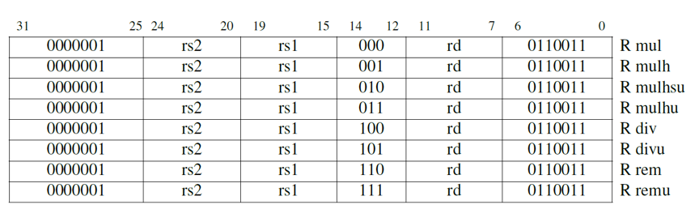

# 4. 乘法和除法指令

*若非必要，勿增实体。*

<div align=right>—— 奥卡姆的威廉（William of Occam），1320<div>

>>>奥卡姆的威廉(1452-1519)是一位英国神学家，他推广了现在所谓的“奥卡姆剃刀”原理，它意味着在科学方法中对简洁性的偏爱。
>>>
>>>

## 4.1 导言

RV32M向RV32I中添加了整数乘法和除法指令。图4.1是RV32M扩展指令集的图形表示，图4.2列出了它们的操作码。

除法是直截了当的。可以回想起如下的式子：

商 = (被除数 - 余数) $$\div$$ 除数

或者

被除数 = 除数 $$\times$$ 商 + 余数

余数 = 被除数 - (商 $$\times$$ 除数)

RV32M具有有符号和无符号整数的除法指令：divide(div)和divide unsigned(divu)，它们将商放入目标寄存器。在少数情况下，程序员需要余数而不是商，因此RV32M提供remainder(rem)和remainder unsigned(remu)，它们在目标寄存器写入余数，而不是商。

>>>srl可以做除数为2i的无符号除法。例如，如果a2=16(24)，那么srli t2,a1,4这条指令和divu t2,a1,a2得到的结果相同。


<center>图4.1：RV32M指令的图示</center>



<center>图4.2：RV32M操作码映射包含指令布局，操作码，指令格式类型和它们的名称（[Waterman and Asanovic 2017]的表19.2是此图的基础。）</center>

乘法的式子很简单：

积 = 被乘数 $$\times$$乘数

>>>sll可以做乘数为2i的无符号乘法。例如，如果a2=16(24)，那么slli t2,a1,4这条指令和mul t2,a1,a2得到的结果相同。

它比除法要更为复杂，是因为积的长度是乘数和被乘数长度的和。将两个32位数相乘得到的是64位的乘积。为了正确地得到一个有符号或无符号的64位积，RISC-V中带有四个乘法指令。要得到整数32位乘积（64位中的低32位）就用mul指令。要得到高32位，如果操作数都是有符号数，就用mulh指令；如果操作数都是无符号数，就用mulhu指令；如果一个有符号一个无符号，可以用mulhsu指令。在一条指令中完成把64位积写入两个32位寄存器的操作会使硬件设计变得复杂，所以RV32M需要两条乘法指令才能得到一个完整的64位积。

> > > 

对许多微处理器来说，整数除法是相对较慢的操作。如前述，除数为2的幂次的无符号除法可以用右移来代替。事实证明，通过乘以近似倒数再修正积的高32位的方法，可以优化除数为其它数的除法。例如，图4.3显示了3为除数的无符号除法的代码。

```assembly
# Compute unsigned division of a0 by 3 using multiplication.
   0: aaaab2b7	lui   t0,0xaaaab  # t0 = 0xaaaaaaab
   4: aab28293	addi  t0,t0,-1365 #    = ~ 2^32 / 1.5
   8: 025535b3	mulhu a1,a0,t0    # a1 = ~ (a0 / 1.5)
   c: 0015d593	srli  a1,a1,0x1   # a1 = (a0 / 3)
```

<center>图4.3：RV32M中用乘法来实现除以常数操作的代码。要证明该算法适用于任何除数需要仔细的数值分析，而对于其它除数，其中的修正步骤更为复杂。算法正确性的证明以及产生倒数和修正步骤的算法在[Granlund and Montgomery 1994]中可以找到。</center>

>>>对于几乎所有的处理器，乘法比移位和加法慢很多，除法比乘法慢很多。

**有什么不同之处？** 长期以来，ARM-32只有乘法而无除法指令。直到第一台ARM处理器诞生的大约20年后（2005年），除法指令才成为ARM的必要组成部分。MIPS-32使用特殊寄存器（HI和LO）作为乘法和除法指令的唯一目标寄存器。虽然这种设计降低了早期MIPS处理器实现的复杂性，但它需要额外的移动指令以使用乘法或除法的结果，这可能会降低性能。HI和LO寄存器也会增加架构状态，使得在任务之间切换的速度稍慢。

>>**补充说明：mulhsu对于多字有符号乘法很有用**
>>当乘数有符号且被乘数无符号时，mulhsu产生乘积的上半部分。当乘数的最高有效字（包含符号位）与被乘数的较低有效字（无符号）相乘时，它是多字有符号乘法的子步骤。该指令将多字乘法的性能提高了约15%。

>>**补充说明：检查是否除零也很简单**
>>要测试除数是否为零，只需要在除法操作之前加入一条用于测试的beqz指令。RV32I不会因为除零操作而trap，因为极少数程序需要这种行为，而且在那些软件中可以很容易地检查是否除零。当然，除以其它常数永远不需要检查。

>>**补充说明：mulh和mulhu可以检查乘法的溢出**
>>如果mulhu的结果为零，则在使用mul进行无符号乘法时不会溢出。类似地，如果mulh结果中的所有位与mul结果的符号位匹配（即当mul结果为正时mulh结果为0，mul结果为负时mulh结果为十六进制的ffffffff），则使用mul进行有符号乘法时不会溢出。

## 4.2 结束语

*最便宜，最快，并且最可靠的组件是那些没有出现的组件。*

<div align=right>—— C. Gordan Bell，著名小型计算机架构师<div>

>>>

为了为嵌入式应用提供最小的RISC-V处理器，乘法和除法被归入RISC-V的第一个可选标准扩展的一部分RV32M。许多RISC-V处理器将包括RV32M。

## 4.3 扩展阅读

T. Granlund and P. L. Montgomery. Division by invariant integers using multiplication. In *ACM SIGPLAN Notices*, volume 29, pages 61--72. ACM, 1994.

A. Waterman and K. Asanovi´c, editors. *The RISC-V Instruction Set Manual, Volume I: User-Level ISA, Version 2.2*. May 2017. URL https://riscv.org/specifications/.

## 注

[^1] http://parlab.eecs.berkeley.edu
