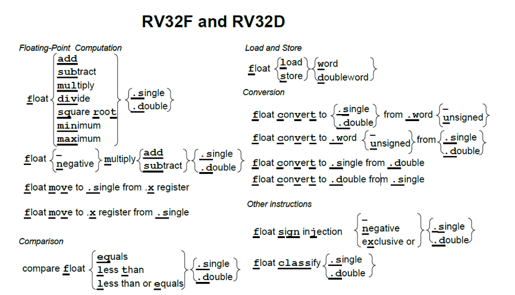
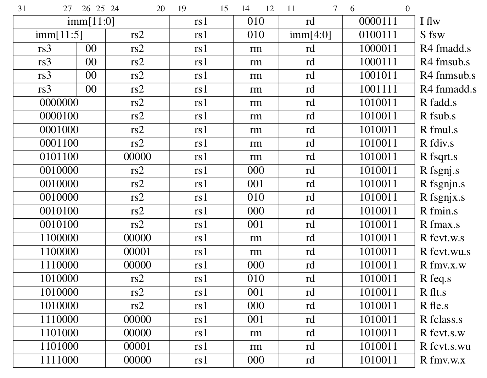
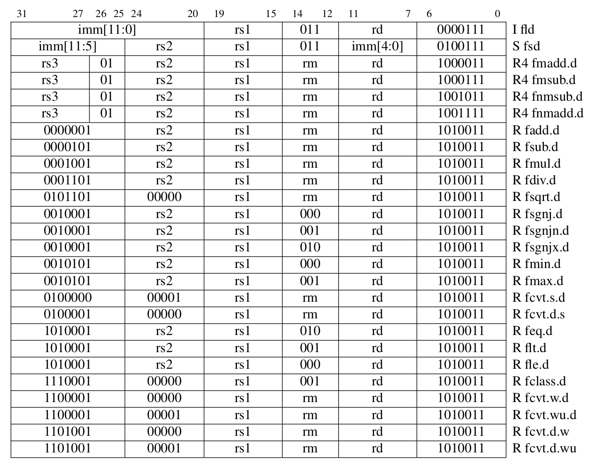
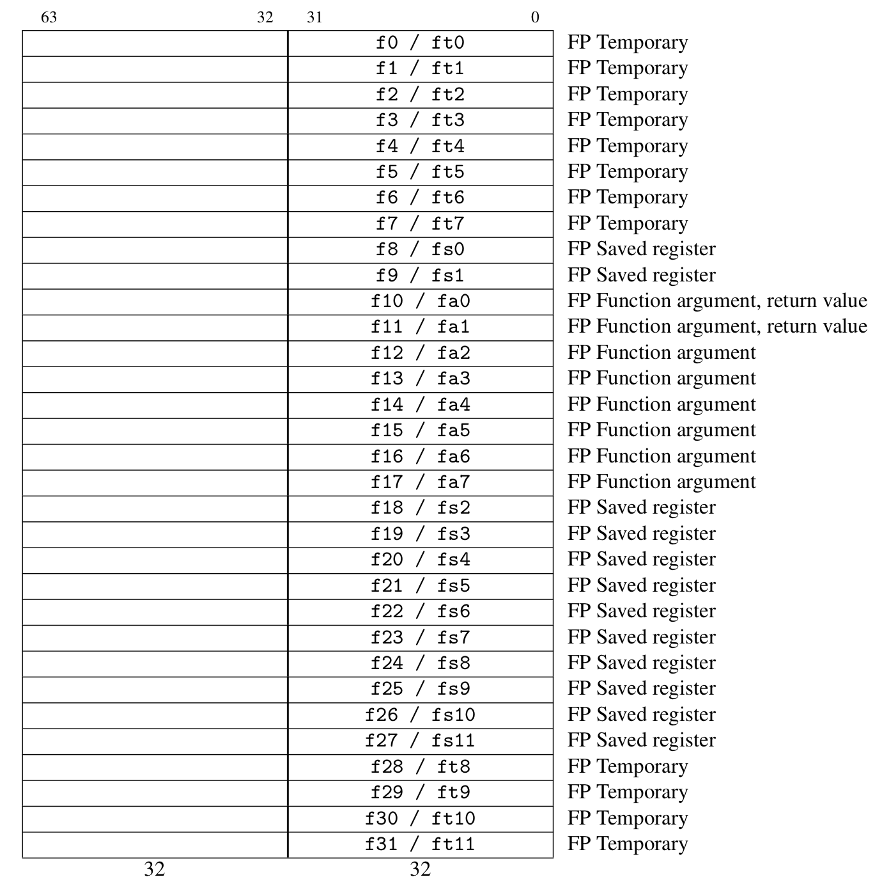
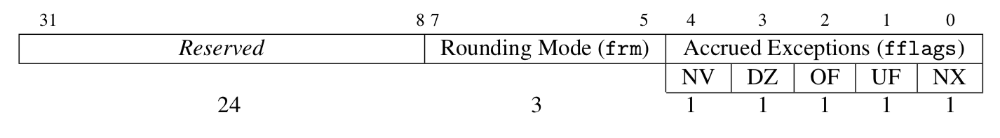
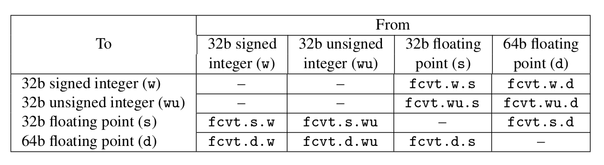

# 5. RV32F和RV32D：单精度和双精度浮点数

*只有当没有任何东西可以去除，而不是没有东西可以添加时，我们才最终达到了完美。*

<div align=right>—— Antoine de Saint Exup'ery, L'Avion, 1940<div>

>>>Antoine de Saint Exup’ery, L’Avion（1900-1944）是法国作家和飞行员，以《小王子》一书而闻名。
>>>

## 5.1 导言

尽管RV32F和RV32D是分开的，单独的可选指令集扩展，他们通常是包括在一起的。为简洁起见，我们在一章中介绍了几乎所有的单精度和双精度（32位和64位）浮点指令。图5.1是一个RV32F和RV32D扩展指令集的图形表示。图5.2列出RV32F的操作码，图5.3列出了RV32D的操作码。和几乎所有其他现代ISA一样，RISC-V服从IEEE 754-2008浮点标准\[IEEE标准委员会2008\]。

## 5.2 浮点寄存器

>>>

RV32F和RV32D使用32个独立的f寄存器而不是x寄存器。使用两组寄存器的主要原因是：处理器在不增加RISC-V指令格式中寄存器描述符所占空间的情况下使用两组寄存器来将寄存器容量和带宽是乘2，这可以提高处理器性能。使用两组寄存器对RISC-V指令集的主要影响是，必须要添加新的指令来加载和存储数据f寄存器，还需要添加新指令用于在x和f寄存器之间传递数据。图5.4列出了RV32D和RV32F寄存器及对应的由RISC-V ABI确定的寄存器名称。

如果处理器同时支持RV32F和RV32D扩展，则单精度数据仅使用f寄存器中的低32位。与RV32I中的x0不同，寄存器f0不是硬连线到常量0，而是和所有其他31个f寄存器一样，是一个可变寄存器。

IEEE 754-2008标准提供了几种浮点运算舍入的方法，这有助于确定误差范围和编写数值库。最准确且最常见的舍入模式是舍入到最近的偶数（RNE）。舍入模式可以通过浮点控制和状态寄存器fcsr进行设置。图5.5显示了fcsr并列出了舍入选项。它还包含标准所需的累积异常标志。

**有什么不同之处？**ARM-32和MIPS-32都有32个单精度浮点寄存器但都只有16个双精度寄存器。它们都将两个单精度寄存器映射到双精度寄存器的左右两半。x86-32浮点数算术没有任何寄存器，而是使用堆栈代替。堆栈条目是80位宽度提高精度，因此浮点数负载将32位或64位操作数转换为80位，对于存储指令，反之亦然。x86-32的一个后续版本增加了8个传统的64位浮点寄存器以及相关的操作指令。与RV32FD和MIPS-32不同，ARM-32和x86-32忽视了在浮点和整数寄存器之间直接移动数据的指令。唯一的解决方案是先将浮点寄存器的内容存储在内存中，然后将其从内存加载到整数寄存器，反之亦然。

> >> 根据MIPS架构师之一John Mashey的说法，只有16个双精度寄存器是MIPS的ISA设计中犯过的最痛苦的错误。


<center>图5.1：RV32F和RV32D的指令图示。</center>

>>**补充说明：RV32FD允许逐条指令设置舍入模式**
这被称为静态舍入，当你只需要更改一条指令的舍入模式时，它可以帮助提高性能。默认设置是在fcsr中使用动态舍入模式。静态舍入所选择的模式是作为指令可选的最后一个参数，如fadd.s ft0，ft1，ft2，rtz，将向零舍入，无论fcsr如何。图5.5的标题列出了不同舍入模式的名称。

## 5.3 浮点加载，存储和算术指令

对于RV32F和RV32D，RISC-V有两条加载指令（flw，fld）和两条存储指令（fsw，fsd）。他们和lw和sw拥有相同的寻址模式和指令格式。添加到标准算术运算中的指令有：（fadd.s，fadd.d，fsub.s，fsub.d，fmul.s，fmul.d，fdiv.s，fdiv.d），RV32F和RV32D还包括平方根（fsqrt.s，fsqrt.d）指令。它们也有最小值和最大值指令（fmin.s，fmin.d，fmax.s，fmax.d），这些指令在不使用分支指令进行比较的情况下，将一对源操作数中的较小值或较大值写入目的寄存器。

>>>不同于整数运算，浮点乘法的乘积大小与其操作数相同。此外，RV32F和RF32D省略了浮点余数指令。
>>>

许多浮点算法（例如矩阵乘法）在执行完乘法运算后会立即执行一条加法或减法指令。因此，RISC-V提供了指令用于先将两个操作数相乘然后将乘积加上（fmadd.s，fmadd.d）或减去（fmsub.s，fmsub.d）第三个操作数，最后再将结果写入目的寄存器。它还有在加上或减去第三个操作数之前对乘积取反的版本：fnmadd.s，fnmadd.d，fnmsub.s，fnmsub.d。这些融合的乘法 --  加法指令比单独的使用乘法及加法指令更准确，也更快，因为它们只（在加法之后）舍入过一次，而单独的乘法及加法指令则舍入了两次（先是在乘法之后，然后在加法之后）。这些指令需要一条新指令格式指定第4个寄存器，称为R4。图5.2和5.3显示了R4格式，它是R格式的一个变种。

RV32F和RV32D没有提供浮点分支指令，而是提供了浮点比较指令，这些根据两个浮点的比较结果将一个整数寄存器设置为1或0：feq.s，feq.d，flt.s，flt.d，fle.s，fle.d。这些指令允许整数分支指令根据浮点数比较指令设置的条件进行分支跳转。例如，这段代码在f1\<f2时，则分支跳转到Exit：
```
flt x5，f1，f2 		＃如果f1 < f2，则 x5 = 1；否则 x5 = 0
bne x5，x0，Exit 		＃如果x5！= 0，则跳转到Exit
```


<center>图5.2：RV32F操作码表包含了指令布局，操作码，格式类型和名称。这张表与下一张表在编码上的主要区别是：对于这张表，前两个指令第12位是0，并且对于其余指令，第25位为0，而在下一张表中，RV32D中的这两个位均为1（基于[Waterman and Asanovic 2017]的表19.2）。</center>



<center>图5.3：RV32D操作码表包含了指令布局，操作码，格式类型和名称。这两个图中的一些指令并不仅仅是数据宽度不同。只有这张表有fcvt.s.d和fcvt.d.s指令，而只有另一张表有fmv.x.w和fmv.w.x.指令（基于[Waterman and Asanovic 2017]的表19.2）。</center>



<center>图5.4：RV32F和RV32D的浮点寄存器。单精度寄存器占用了32个双精度寄存器中最右边的一半。第3章解释了RISC-V对于浮点寄存器的调用约定，阐述了FP参数寄存器（fa0-fa7），FP保存寄存器（fs0-fs11）和FP临时寄存器（ft0-ft11）背后的基本原理（基于[Waterman and Asanovic 2017]的表20.1）。</center>



<center>图5.5：浮点控制和状态寄存器。它保存舍入模式和异常标志。舍入模式包括向最近的偶数舍入（frm 中的rte，000）；向零舍入（rtz，001）；向下($$- \infty$$)舍入（rdn，010）；向上($${ + \infty}$$)舍入（rup，011）；以及向最近的最大值舍入（rmm，100）。五个累积异常标志表示自上次由软件重置字段以来在任何浮点运算指令上出现的异常条件：NV表示非法操作；DZ表示除以零；OF表示上溢；UF表示下溢；NX表示不精确（基于[Waterman and Asanovic 2017]的图8.2）。</center>



<center>图5.6：RV32F和RV32D转换指令。在列中列出了源数据类型，在行中列出转换的目标数据类型。</center>

## 5.4 浮点转换和搬运

RV32F和RV32D支持在在32位有符号整数，32位无符号整数，32位浮点和64位之间浮点进行所有组合的转换（只要这个转换是有用，有意义的）。图5.6按源数据类型以及转换后的目的数据类型，罗列了这10条指令。

RV32F还提供了将数据从f寄存器（fmv.x.w）移动到x寄存器的指令，以及反方向移动数据的指令（fmv.w.x）。

## 5.5 其他浮点指令

RV32F和RV32D提供了不寻常的指令，有助于编写数学库以及提供有用的伪指令。（IEEE 754浮点标准需要一种复制并且操作符号并对浮点数据进行分类的方式，这启发我们添加了这些指令。）

第一个是符号注入指令，它从第一个源操作数复制了除符号位之外的所有内容。符号位的取值取决于具体是什么指令：

1. 浮点符号注入（fsgnj.s，fsgnj.d）：结果的符号位是rs2的符号位。
2. 浮点符号取反注入（fsgnjn.s，fsgnjn.d）：结果的符号位与rs2的符号位相反。
3. 浮点符号异或注入（fsgnjx.s，fsgnjx.d）：结果符号位是rs1和rs2的符号位异或的结果。

>>>

除了有助于数学库中的符号操作，基于符号注入指令我们还提供了三种流行的浮点伪指令（参见图3.4）：

1. 复制浮点寄存器：
```
 fmv.s rd，rs 事实上是 fsgnj.s rd，rs，rs
 fmv.d rd，rs 事实上是 sgnj.d rd，rs，rs。
```

2. 否定：
```
 fneg.s rd，rs 映射到 fsgnjn.s rd，rs，rs
 fneg.d rd，rs 映射到 fsgnjn.d rd，rs，rs。
```
3. 绝对值（因为0⊕0= 0且1⊕1= 0）：
```
 fabs.s rd，rs变成了fsgnjx.s rd，rs，rs
 fabs.d rd，rs变成了sgnjx.d rd，rs，rs。
```

第二个不常见的浮点指令是classify分类指令（fclass.s，fclass.d）。分类指令对数学库也很有帮助。他们测试一个源操作数来看源操作数满足下列10个浮点数属性中的哪些属性（参见下表），然后将测试结果的掩码写入目的整数寄存器的低10位。十位中仅有一位被设置为1，其余为都设置为0。

| *x[rd]*位 | 含义                            |
| --------- | ------------------------------- |
| 0         | f [*rs1*]为 - $$ \infty $$。  |
| 1         | f [*rs1*]是负规格化数。         |
| 2         | f [*rs1*]是负的非规格化数。     |
| 3         | f [*rs1*]是-0。                 |
| 4         | f [*rs1*]是+0。                 |
| 5         | f [*rs1*]是正的非规格化数。     |
| 6         | f [*rs1*]是正的规格化数。       |
| 7         | f [*rs1*]为 + $$ \infty $$。  |
| 8         | f [*rs1*]是信号(signaling)NaN。 |
| 9         | f [*rs1*]是一个安静(quiet)NaN。 |

```c
void daxpy(size_t n, double a, const double x[], double y[])
{
	for (size_t i = 0; i < n; i++) {
        y[i] = a*x[i] + y[i];
	} 
}
```

<center>图5.7:用C编写的浮点运算密集型的DAXPY程序</center>

|ISA |ARM-32 |ARM Thumb-2 |MIPS-32 |microMIPS |x86-32 |RV32FD |RV32FD+RV32C |
|-|-|-|-|-|-|-|-|
|指令|10|10|12|12|16|11|11|
|每循环|6|6|7|7|6|7|7|
|字节数|40|28|48|32|50|44|28|

<center>图5.8：DAXPY在四个ISA上生成的指令数和代码大小。它列出了每个循环的指令数量以及指令总数。第7章介绍ARM Thumb-2，microMIPS和RV32C指令集。</center>

## 5.6 使用DAXPY程序比较RV32FD，ARM-32，MIPS-32和x86-32

我们现在将使用DAXPY作为我们的浮点基准对不同ISA进行比较（图5.7）。它以双精度计算$Y\  = \ a \times X + \ Y$，其中X和Y是矢量，a是标量。图5.8总结了DAXPY在四个不同的ISA下对应的指令数和字节数。他们的代码如图5.9至5.12所示。

>>>**DAXPY这个名字**来自公式本身：以双精度计算A乘上X加Y (Double-precision A times X Plus Y)。此公式的单精度版本被称做SAXPY。

与第2章中的插入排序一样，尽管RISC-V指令集强调本身的简单性，RISC-V版本的不管是指令数量还是代码大小，都接近或者优于其他ISA。在此示例中，RISC-V的比较和执行分支指令和ARM-32和x86-32中更复杂的寻址模式，以及入栈、退栈指令节省了差不多数量的指令。

>>>
>>>

## 5.7 结束语

*少即是多。*

<div align=right>—— Robert Browning, 1855，极简主义（建筑）建筑学派在20世纪80年代采用这首诗作为公理。<div>

IEEE 754-2008浮点标准\[IEEE Standards Committee 2008\]定义了浮点数据类型，计算精度和所需操作。它的广泛流行大大降低了移植浮点程序的难度，这也意味着不同ISA中的浮点数部分可能比其他章节中描述的其他部分的指令更一致。

>>**补充说明：16位，128位和十进制浮点运算**
>>修订后的IEEE浮点标准（IEEE 754-2008）除了单精度和双精度之外，还描述了几种新的浮点数格式，它们称为binary32和binary64。不出意料，修订后，新增了四倍精度，名为binary128。 RISC-V暂时计划用RV32Q扩展来支持新的浮点数格式（见第11章）。该标准还为二进制数据交换提供了两种新的数据尺寸，程序员可以会将这些浮点数以特定宽度存储在内存或存储中，但是或许不能以这种宽度进行计算计算。它们分别是半精度（binary16）和八元精度（binary256）。尽管标准对这两种新宽度的存储使用定义的，但GPU确实以半精度计算并将它们保存在内存中。 RISC-V的计划在向量指令（第8章中的RV32V）中包含半精度计算，但是前提是处理器如果支持向量半精度指令，则也必须支持半精度标量指令。令人惊讶的是，修订后标准还添加了十进制浮点数，新增的三种十进制格式分别是decimal32，decimal64和decimal128。RISC-V预留RV32L指令集扩展用于支持它（见第11章）。

## 5.8 扩展阅读

IEEE Standards Committee. 754-2008 IEEE standard for floating-point arithmetic. *IEEE* *Computer Society Std*, 2008.

A. Waterman and K. Asanovi´c, editors. *The RISC-V Instruction Set Manual, Volume I: User-Level ISA, Version 2.2*. May 2017. URL https://riscv.org/specifications/

## 注

[^1] http://parlab.eecs.berkeley.edu

```assembly
# RV32FD (7 insns in loop; 11 insns/44 bytes total; 28 bytes RVC)
# a0 is n, a1 is pointer to x[0], a2 is pointer to y[0], fa0 is a
  0: 02050463  beqz     a0,28             # if n == 0, jump to Exit
  4: 00351513  slli     a0,a0,0x3         # a0 = n*8
  8: 00a60533  add      a0,a2,a0          # a0 = address of x[n] (last element)
Loop:
  c: 0005b787  fld      fa5,0(a1)         # fa5 = x[]
 10: 00063707  fld      fa4,0(a2)         # fa4 = y[]
 14: 00860613  addi     a2,a2,8           # a2++ (increment pointer to y)
 18: 00858593  addi     a1,a1,8           # a1++ (increment pointer to x)
 1c: 72a7f7c3  fmadd.d  fa5,fa5,fa0,fa4   # fa5 = a*x[i] + y[i]
 20: fef63c27  fsd      fa5,-8(a2)        # y[i] = a*x[i] + y[i]
 24: fea614e3  bne      a2,a0,c           # if i != n, jump to Loop
Exit:
 28: 00008067           ret               # return
```
<center>图5.9：图5.7中DAXPY的RV32D代码。十六进制的地址位于机器的左侧，接下来是十六进制的语言代码，然后是汇编语言指令，最后是注释。比较和分支指令避免了ARM-32和X86-32代码中的两条比较指令。</center>

```assembly
# ARM-32 (6 insns in loop; 10 insns/40 bytes total; 28 bytes Thumb-2)
# r0 is n, d0 is a, r1 is pointer to x[0], r2 is pointer to y[0]
  0: e3500000  cmp       r0, #0                    # compare n to 0
  4: 0a000006  beq       24 <daxpy+0x24>           # if n == 0, jump to Exit
  8: e0820180  add       r0, r2, r0, lsl #3        # r0 = address of x[n] (last element)
Loop:
  c: ecb16b02  vldmia    r1!,{d6}                  # d6 = x[i], increment pointer to x
 10: ed927b00  vldr      d7,[r2]                   # d7 = y[i]
 14: ee067b00  vmla.f64  d7, d6, d0                # d7 = a*x[i] + y[i]
 18: eca27b02  vstmia    r2!, {d7}                 # y[i] = a*x[i] + y[i], incr. ptr to y
 1c: e1520000  cmp       r2, r0                    # i vs. n
 20: 1afffff9  bne       c <daxpy+0xc>             # if i != n, jump to Loop
Exit:
 24: e12fff1e  bx        lr                        # return
```
<center>图5.10：图5.7中DAXPY的ARM-32代码。与RISC-V相比，ARM-32的自动增量寻址模式可以节省两条指令。与插入排序不同，DAXPY在ARM-32上不需要压栈和出栈寄存器。</center>

```assembly
# MIPS-32 (7 insns in loop; 12 insns/48 bytes total; 32 bytes microMIPS)
# a0 is n, a1 is pointer to x[0], a2 is pointer to y[0], f12 is a
 0: 10800009  beqz     a0,28 <daxpy+0x28>     # if n == 0,jump to Exit
 4: 000420c0  sll      a0,a0,0x3              # a0 = n*8 (filled branch delay slot)
 8: 00c42021  addu     a0,a2,a0               # a0 = address of x[n] (last element)
Loop:
 c: 24c60008  addiu    a2,a2,8                # a2++ (increment pointer to y)
10: d4a00000  ldc1     $f0,0(a1)              # f0=x[i]
14: 24a50008  addiu    a1,a1,8                # a1++ (increment pointer to x) 
18: d4c2fff8  ldc1     $f2,-8(a2)             # f2 = y[i] 
1c: 4c406021  madd.d   $f0,$f2,$f12,$f0       # f0 = a*x[i]+y[i] 		
20: 14c4fffa  bne      a2,a0,c <daxpy+0xc>    # ifi != n,jump to Loop
24: f4c0fff8  sdc1     $f0,-8(a2)             # y[i] = a*x[i] + y[i] (filled delay slot)
Exit:
28: 03e00008  jr	   ra                     # return
2c: 00000000  nop                             # (unfilled branch delay slot)
```
<center>图5.11：图5.7中DAXPY的MIPS-32代码。三个分支延迟槽中的两个填充了有用的指令。检查两个寄存器之间是否相等的指令避免了ARM-32和x86-32中的两条比较指令。与整数加载不同，浮点加载没有延迟槽。</center>

```assembly
# x86-32 (6 insns in loop; 16 insns/50 bytes total)
# eax is i, n is in memory at esp+0x8, a is in memory at esp+0xc
# pointer to x[0] is in memory at esp+0x14
# pointer to y[0] is in memory at esp+0x18
 0: 53                   push ebx                           # save ebx 
 1: 8b 4c 24 08 		 mov  ecx,[esp+0x8]                 # ecx has copy of n 
 5: c5 fb 10 4c 24 0c    vmovsd  xmm1,[esp+0xc]             # xmm1 has a copy of a 	
 b: 8b 5c 24 14          mov  ebx,[esp+0x14]                # ebx points to x[0]
 f: 8b 54 24 18          mov  edx,[esp+0x18]                # edx points to y[0] 
13: 85 c9                test ecx,ecx                       # compare n to 0
15: 74 19                je   30 <daxpy+0x30>               # if n==0, jump to Exit 
17: 31 c0                xor  eax,eax                       # i = 0 (since x^x==0)
Loop:
19: c5 fb 10 04 c3       vmovsd xmm0,[ebx+eax*8]            # xmm0 = x[i]
1e: c4 e2 f1 a9 04 c2    vfmadd213sd xmm0,xmm1,[edx+eax*8]  # xmm0 = a*x[i] + y[i]
24: c5 fb 11 04 c2       vmovsd xmm0,xmm1,[edx+eax*8]       # y[i] = a*x[i] + y[i]
29: 83 c0 01             add	eax,0x1                     # i++
2c: 39 c1                cmp	ecx,eax                     # compare i vs n
2e: 75 e9                jne	19 <daxpy+0x19>             # if i != n, jump to Loop
Exit:
30: 5b                   pop	ebx                         # restore ebx
31: c3                   ret                                # return
```
<center>图5.12：图5.7中DAXPY的x86-32代码。在这个例子中，x86-32缺少寄存器的劣势在这里表现得很明显 ---- 有四个变量被分配到了内存，而在其他ISA中，这些变量是被存放在寄存器中的。它展示了x86-32中，如何将寄存器与零比较（test ecx，ecx）以及如何将一个寄存器清零（xor eax, eax）。</center>
