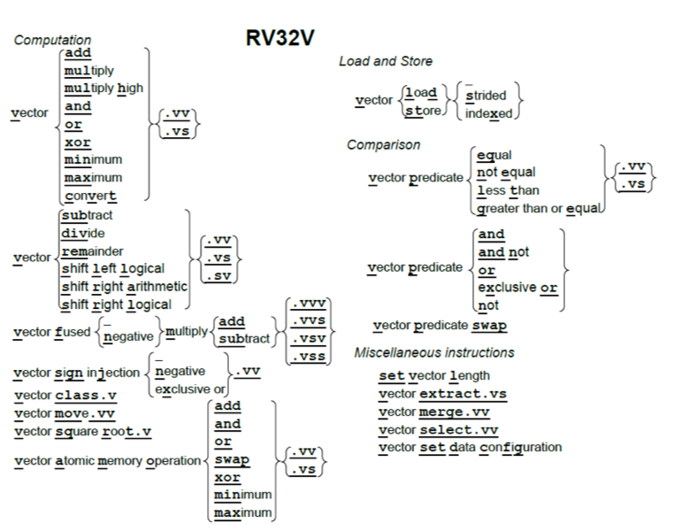
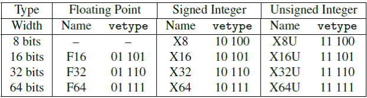

# 8. 向量

*我追求简洁。我理解不了那些复杂的东西。*

<div align=right>—— Seymour Cray<div>

>>>Seymour Cray (1925-1996)是1976年第一个采用向量架构的，并且在商业上取得成功的超级计算机Cray-1的架构师。Cray-1是一颗明珠，即使没有使用向量指令，它也是世界上最快的计算机。
>>>

## 8.1 导言

本章重点介绍数据并行，当存在大量数据可供应用程序同时计算时，我们称之为数据级并行性。数组是一个常见的例子。虽然它是科学应用的基础，但它也被多媒体程序使用。前者使用单精度和双精度浮点数据，后者通常使用8位和16位整数数据。

最著名的数据级并行架构是单指令多数据(SIMD，Single Instruction Multiple Data)。SIMD最初的流行是因为它将64位寄存器的数据分成许多个8位、16位或32位的部分，然后并行地计算它们。操作码提供了数据宽度和操作类型。数据传输只用单个（宽）SIMD寄存器的load和store进行。

>>>
>>>1997年的英特尔多媒体扩展（MMX）使SIMD流行起来。它们通过1999年的流媒体SIMD扩展（SSE, Streaming SIMD Extensions）和2010年的高级向量扩展（AVX）得到了接受和扩展。MMX的名声在英特尔的一则广告中得到了宣扬，该广告的内容是一种采用彩色干净套装的半导体产品线的光纤工作者在跳迪斯科(https://www.youtube.com/watch?v=paU16B-bZEA)。

把现有的64位寄存器进行拆分的做法由于其简单性而显得十分诱人。为了使SIMD更快，架构师随后加宽寄存器以同时计算更多部分。由于SIMD ISA属于增量设计阵营的一员，并且操作码指定了数据宽度，因此扩展SIMD寄存器也就意味着要同时扩展SIMD指令集。将SIMD寄存器宽度和SIMD指令数量翻倍的后续演进步骤都让ISA走上了复杂度逐渐提升的道路，这一后果由处理器设计者、编译器编写者和汇编语言程序员共同承担。

一个更老的，并且在我们看来更优雅的，利用数据级并行性的方案是向量架构。本章解释了我们在RISC-V中使用向量而不是SIMD的理由。

>>>
>>>

向量计算机从内存中中收集数据并将它们放入长的，顺序的向量寄存器中。在这些向量寄存器上，流水线执行单元可以高效地执行运算。然后，向量架构将结果从向量寄存器中取出，并将其并分散地存回主存。向量寄存器的大小由实现决定，而不是像SIMD中那样嵌入操作码中。我们将会看到，将向量的长度和每个时钟周期可以进行的最大操作数分离，是向量体系结构的关键所在：向量微架构可以灵活地设计数据并行硬件而不会影响到程序员，程序员可以不用重写代码就享受到长向量带来的好处。此外，向量架构比SIMD架构拥有更少的指令数量。而且，与SIMD不同，向量架构有着完善的编译器技术。



<center>图8.1：RV32V的指令图示。由于采用了动态寄存器类型，这个指令图示也可以不加改变地用于第九章的RV64V。</center>

向量架构比SIMD架构更少出现，因此知晓向量ISA的读者也更少。因此，本章会比前几章更加具有教程的风格。如果你想深入了解向量架构，请阅读\[Hennessy and Patterson 2011\]的第4章和附录G。RV32V还有一些简化了ISA的新颖功能。即使你已经熟悉了向量架构，也可能需要阅读我们的进一步解释。

>>>

## 8.2 向量计算指令

图8.1是RV32V扩展指令集的图形表示。RV32V的编码尚未最终确定，所以本版不包含通常的指令布局图。

前面章节提到的每一个整数和浮点计算指令基本都有对应的向量版本：图8.1中的指令继承了来自RV32I、RV32M、RV32F、RV32D和RV32A的操作。每个向量指令都有几种类型，具体取决于源操作数是否都是向量（.vv后缀），或者源操作数包含一个向量和一个标量（.vs后缀）。一个标量后缀意味着有一个操作数来自x或f寄存器，另一个来自向量寄存器（v）。比方说，我们的DAXPY程序（见第55页第五章图5.7）计算$$Y = a \times X + Y$$。其中$$X$$和$$Y$$是向量，$$a$$是标量。对于向量-标量操作，rs1域指定了要访问的标量寄存器。

对诸如减法和除法之类的非对称运算，他们还会使用向量指令的第三种变体。其中第一个操作数是标量，第二个是向量（.sv后缀）。像$$Y = a - X$$这样的操作就会使用这种变体。这种变体对于加法和乘法等对称运算来说是多余的，因此这些指令没有.sv的版本。融合的（fused）乘法-加法指令有三个操作数，因此它们有着最多的向量和标量选项的组合：.vvv、.vvs，.vsv和.vss。

读者可能会注意到，图8.1忽略了向量运算的数据类型和宽度。下一节解释了这么做的原因。

## 8.3 向量寄存器和动态类型

RV32V添加了32个向量寄存器，它们的名称以v开头，但每个向量寄存器的元素个数不同。该数量取决于操作的宽度和专用于向量寄存器的存储大小，而这取决于处理器的设计者。比方说，如果处理器为向量寄存器分配了4096个字节，则这足以让这些32个向量寄存器中有16个64位元素，或者32个32位元素，或者64个16位元素，或128个8位元素。

为了在向量ISA中保持元素数量的灵活性，向量处理器会计算会最大向量长度（mvl），即在给定的容量限制下，向量程序使用这个向量寄存器可以运算的最大向量长度。向量长度寄存器（vl）为特定操作设定了向量中含有的元素数量，这有助于数组维度不是mvl的整数倍时的编程。我们将在下面的小节中更详细地演示mvl，vl和8个谓词寄存器（vpi）的应用。

RV32V采用了一种新颖的方法，即将数据类型和长度与向量寄存器而不是与指令操作码相关联。程序在执行向量计算指令之前用它们的数据类型和宽度标记向量寄存器。使用动态寄存器类型会减少向量指令的数量。这一点很重要，因为每个向量指令通常有六个整数版本和三个浮点版本，如图8.1所示。我们将在第8.9节看到，当我们面对众多的SIMD指令时，使用动态寄存器类型的向量架构减少了汇编语言程序员的认知负担以及编译器生成代码的难度。

> > >

动态类型的另一个优点是程序可以禁用未使用的向量寄存器。此功能可以将所有的向量存储器分配给已启用的向量寄存器。比如，假设只启用了两个64位浮点类型的向量寄存器，处理器有1024字节的向量寄存器空间。处理器将这些空间对半分，给每个向量寄存器512字节（512/8=64个元素），因此将mvl设置位64。因此我们可以看到，mvl是动态的，但它的值由处理器设置，不能由软件直接改变。

源寄存器和目标寄存器决定了操作的类型和大小以及结果，因此动态类型隐含了转换。例如，处理器可以将双精度浮点数的向量乘以单精度标量，而无需先将操作数转换为相同的精度。这个额外的好处减少了向量指令的总数和实际执行的指令的数量。

可以用vsetdcfg指令来设置向量寄存器的类型。图8.2显示了RV32V可用的向量寄存器类型以及RV64V的更多类型（见第九章）。RV32V要求向量浮点运算也有标量版本。因此，要使用F32类型，你也必须用到RV32FV；要使用F64类型，你也必须用到RV32FDV。RV32V引入了16位浮点类型F16。如果一个实现同时支持RV32V和RV32F，则它必须支持F16和F32类型。



<center>图8.2：RV32V向量寄存器类型的编码。字段的最右边三位指示了数据的位宽，左边两位给出其类型。X64和U64仅适用于RV64V。F16和F32需要RV32F扩展，F64需要RV32F和RV32D。F16是IEEE 754-2008 16位浮点格式（binary16）。将vetype设置为00000会禁用向量寄存器。（本图基于[Waterman and Asanovic 2017]的表17.4。）</center>

>>**补充说明：RV32V可以快速切换上下文**
>>向量架构不如SIMD架构受欢迎的一个原因是：大家担心增加大型向量寄存器会延长中断时保存和恢复程序（上下文切换）的时间。动态寄存器类型对此很有帮助。程序员必须告诉处理器正在使用哪些向量寄存器，这意味着处理器需要在上下文切换中仅保存和恢复那些寄存器。RV32V约定在不使用向量指令的时候禁用所有向量寄存器，这意味着处理器既可以具有向量寄存器的性能优势，又仅会在向量指令执行过程中发生中断时才会带来额外的上下文切换开销。早期的向量架构在发生中断时，不得不忍受保存和恢复全部向量寄存器的最大的上下文切换开销。

>>>为了避免上下文切换时间过慢，英特尔尽量避免在原始MMX SIMD扩展中添加寄存器。它只是重用现有的浮点寄存器，这意味着没有额外的上下文切换，但程序无法同时出现浮点和多媒体指令。

## 8.4 向量的加载和存储操作

向量加载和存储操作的最简单情况是处理按顺序存储在内存中的一维数组。向量加载用以vld指令中地址为起始地址的顺序存储的数据来填充向量寄存器。向量寄存器的数据类型确定数据元素的大小，向量长度寄存器vl中设置了要取的元素数量。向量存储执行vld的逆操作。

>>>每个加载和存储指令都有一个7位的无符号立即数偏移量。对于加载按照目标寄存器的元素类型进行缩放，而对于存储则按源寄存器缩放。

>>>

例如，如果a0中存有1024，且v0的类型是X32，则vld v0, 0(a0)会生成地址1024，1028，1032，1036，......直到达到由vl设置的限制。

对于多维数组，某些访问不是顺序的。如果二维数组以行优先序存储，且对列元素进行顺序访问，则相邻列元素之间的地址差正好是行大小。向量架构通过跨步数据传输来支持vlds和vsts数据访问。对于vlds与vsts，虽然可以通过将步长设置为元素大小来达到与vld和vst相同的效果，但vld和vst保证了所有的访问都是顺序的，这可以提供更高的内存带宽。另一个原因是，对于常见的按单位步长访问，使用vld和vst可以缩减代码长度，并减少执行的指令数。毕竟使用vlds和vsts指令来需要指定两个源寄存器，一个给出起始地址，另一个给出以字节为单位的步长，而对于单位步长的访问，多花指令来设置第二个寄存器，无遗是一种浪费。

例如，假设a0中的起始地址是地址1024，且a1中行的长度是64字节。vlds v0, a0, a1会将这个地址序列发送到内存：$$1024 +  1088(1024 + 1 \times 64),\ 1152(1024 + 2 \times 64),\ 1216(1024 + 3 \times 64)$$，以此类推，直到向量长度寄存器vl告诉它停止。返回的数据被顺序写入目标向量寄存器的各个元素。

>>>

到目前为止，我们都假设该程序在对密集数组进行操作。为了支持稀疏数组，向量架构用vldx和vstx提供索引数据传输。这些指令的一个源寄存器是向量寄存器，另一个是标量寄存器。标量寄存器具有稀疏数组的起始地址，向量寄存器的每个元素包含稀疏数组的非零元素的字节索引。

假设a0中的起始地址是地址1024，向量寄存器v1在前四个元素中有这些字节索引：16，48，80，160。vldx v0, a0, v1会将这个地址序列发送到内存：$$1040(1024 + 16),  1072(1024 + 48), 1104(1024 + 80), 1184(1024 + 160)$$。它将返回的数据顺序写入目标向量寄存器的元素中。

> >>带索引的加载也称为收集(*gather*)；带索引的存储通常称为分散(*scatter*)。

以上我们把稀疏数组访问作为索引加载和存储操作的主要支持目标，但是还有许多其他算法通过索引表来间接访问数据。

## 8.5 向量操作期间的并行性

> > > 

虽然简单的向量处理器一次操作一个向量元素，但由于元素操作根据定义是独立的，所以理论上处理器可以同时计算所有这些元素。RV32G的数据位宽最大位64位，而如今的向量处理器通常在每个时钟周期内操作两个、四个或八个64位元素。当向量长度不是每个时钟周期执行的元素数量的倍数时，由硬件处理处理这些边缘情况。

与SIMD一样，对于较小数据的操作数量是较窄数据的位宽和较宽数据的位宽之比。因此，每个时钟周期计算4个64位操作的向量处理器通常每个时钟周期可以做8个32位，16个16位或32个8位操作。

> > >

在SIMD中，ISA架构师在设计过程中决定了每个时钟周期可以并行操作的最大数据数和每个寄存器的元素个数。相比之下，RV32V处理器设计人员无需更改ISA或编译器就可以选择它们的值，而对于SIMD，寄存器每增加一倍都会使SIMD指令的数量翻倍，并且需要修改SIMD编译器。这种隐藏的灵活性意味着相同的RV32V程序不用改变，就可以在最简单或最复杂的向量处理器上运行。

## 8.6 向量运算的条件执行

一些向量计算包括if语句。向量架构不依赖于条件分支，而是包含了一个掩码，这个掩码禁止向量操作作用于某些元素。图8.1中的谓词指令在两个向量或向量和标量之间执

> > > 

行条件测试，如果条件成立则在掩码向量的每一个元素中写入一个1，反之写入0。（掩码向量必须和向量寄存器有相同的元素个数。）任何后续的向量指令都可以使用这个掩码。第i位为1表示元素i会被向量运算更改，为0表示该元素不会由向量运算改变。

> >> 当一个程序中的绝大部分操作都是用向量指令来实现的，那么这个程序被称为可向量化。Gather，scatter，以及谓词指令让更多的程序变得可向量化了。

RV32V为掩码向量提供了8个向量谓词寄存器（vpi）。vpand，vpandn，vpor，vpxor和vpnot指令在它们之间执行逻辑运算，从而有效处理嵌套条件语句。

RV32V指定vp0或vp1作为控制向量操作的掩码。要对所有元素执行一个正常的操作，必须将这两个谓词寄存器中的一个设置为全1。RV32V中有一条vpswap指令，用于将其他六个谓词寄存器的一个快速交换到vp0或vp1。谓词寄存器也是动态启用的，禁用它们可以快速清除所有谓词寄存器中的值。

例如，假设向量寄存器v3中的所有偶数元素都是负整数，所有奇数元素都是正整数。考虑如下的代码：

```assembly
vplt.vs vp0,v3,x0 		# 将 v3 < 0的掩码位置1
add.vv,vp0 v0,v1,v2 	# 将v0的掩码为1的对应元素替换为v1+v2
```

这段代码将把vp0中所有的偶数位设为1，奇数位设为0，并且将把v0中所有的偶数元素替换为v1和v2中对应元素的和。v0中的奇数元素不会改变。

## 8.7 其他向量指令

除了之前提到过的设置向量寄存器数据类型的指令（vsetdcfg），其他指令还有setvl，它将向量长度寄存器（vl）设置为源操作数和最大向量长度（mvl）中的较小值。选择较小值的原因是，在循环中我们需要判断这些向量代码到底是可以按最大向量长度（mvl）运行，还是要以一个较小值运行，从而能处理循环尾部剩下的元素。因此，为了处理循环尾部的元素，每次循环迭代都执行setvl。

RV32V中还有三条指令可以操作向量寄存器中的元素。

向量选择（vselect）按第二个源向量（索引向量）指定的元素位置，从第一个源数据向量中取得元素，从而生成一个新的结果向量：

```assembly
# vindices存有0到mvl-1的值，它们用来从vsrc中选取元素
vselect vedst, vsrc, vindices
```

因此，如果v2的前四个元素是8、0、4、2，那么vselect v0, v1, v2将用v1的第8个元素替换v0的第0个元素；v1的第0个元素替换v0的第1个元素；v1的第4个元素替换v0的第2个元素；v1的第2个元素替换v0的第3个元素。

向量合并（vmerge）类似于向量选择，但它用向量谓词寄存器来选择源向量中要用到元素。新的结果向量由根据谓词寄存器从两个源寄存器之一取得元素产生。若谓词向量寄存器元素为0，则新元素来自vsrc1；如果为1，则来自vsrc2。

```assembly
# vp0的第i位决定vdest中新元素i来自vsrc1（若第i位是0）
# 还是vsrc2（第i位为1）
vmerge,vp0 vdest, vsrc1, vsrc2
```

因此，如果vp0的前四个元素是1、0、0、1，v1的前四个元素是1、2、3、4，v2的前四个元素是10、20、30、40，那么vmerge,vp0 v0, v1, v2将把v0的前四个元素变为10、2、3、40。

向量提取指令从一个向量的中间开始取元素，并将它们放在第二个向量寄存器的开头：

```assembly
# start是一个标量寄存器，其中存储着从vsrc中取元素的起始位置
vextract vdest, vsrc, start
```

```assembly
# a0 is n, a1 is pointer to x[0], a2 is pointer to y[0], fa0 is a
  0:  li t0, 2<<25
  4:  vsetdcfg t0			# enable 2 64b Fl.Pt. registers
loop:
  8: setvl t0, a0 			# vl=t0=min(mvl,n) 
  c: vld   v0, a1			# load vector x 
 10: slli t1, t0, 3			# t1=vl*8(inbytes) 
 14: vld  v1, a2			# load vector y
 18: add  a1, a1, t1		# increment C pointer to x by vl*8 
 1c: vfmadd v1,v0,fa0,v1	# v1 += v0*fa0(y=a*x+y) #n-=vl(t0)
 20:  sub a0, a0, t0
 24:  vst v1, a2			# store Y
 28:  add a2, a2, t1		# increment C pointer to y by vl*8 
 2c:  bnez a0, loop			# repeat if n != 0
 30:  ret					# return
```


图8.3：图5.7中DAXPY程序的RV32V代码。没有出现机器语言是因为RV32V的操作码还未定义。

例如，如果向量长度vl是64，而a0的值是32，那么vextract v0,v1,a0会把v1中的后32个元素复制到v0的前三十二个元素。

对于任意的二元结合运算符，可以利用vextract指令以递归减半的方法进行缩减运算。例如，要对向量寄存器的所有元素求和，可以用vextract将向量的后半部分复制到另一个向量寄存器的前半部分，这就将向量长度缩短了一半。接下来，将这两个向量寄存器加到一起，并将它们的和作为新一轮递归的操作数，直到向量长度减少到1。此时第零个元素中的结果就是原向量寄存器中所有元素的和。

> > >


## 8.8 例子：用RV32V写成的DAXPY程序

图8.3显示了用RV32V汇编写成的DAXPY程序（见第五章第55页图5.7），我们一次解释一个步骤。

> >> RISC-V中的V也代表向量。 RISC-V架构师在向量架构方面拥有丰富的经验，并且对SIMD在微处理器中的主导地位感到沮丧。 因此，V不仅代表这是第五个伯克利RISC项目，也意味着这个ISA会突出向量。

RV32V DAXPY程序做的第一件事是启用这个函数需要的向量寄存器。它只需要两个向量寄存器保存x和y的部分元素，这些元素一个个都是8字节宽的双精度浮点数。第一条指令生成一个常量，第二条指令将它写入配置向量寄存器的控制状态寄存器（vcfgd），从而获得两个F64类型的寄存器（见图8.2）。根据定义，硬件按数字顺序分配配置好的寄存器，这样便有了v0和v1。

假设我们的RV32V处理器由1024字节的空间专门用于向量寄存器。硬件平均地给这两个双精度浮点型（8字节）的向量寄存器分配空间。每个向量寄存器有$512/8 = 64$个元素，因此处理器将此函数的最大向量长度（mvl）设置为64。

循环中的第一条指令为接下来的向量指令设置向量长度。setvl指令把mvl和n中的小值写入vl和t0。其中的深刻原因是，如果循环的迭代次数大于n，那么这段代码最快可以一次处理64个值，所以把mvl的值写入vl。如果n比mvl小，那么我们的读写不能超出x和y的范围，所以我们应该在循环最后一次迭代中只计算最后剩下的n个元素。setvl还写入t0，用于保存vl的值，在地址为10的循环控制变量中会用到。

>>>没有setvl的向量架构具有额外的类似露天采矿（意为降低效率）的代码，用于将vl设置为循环的最后n个元素，并检查n是否为零。

地址c处的指令vld是一个向量load操作，按照标量寄存器a1中存储的变量x的地址从x中取值。它把x的vl个元素从内存传输到v0。下面的移位指令slli将向量长度乘以数据的宽度（8字节），以便稍后用于递增指向x和y的指针。

地址14处的指令（vld）将来自内存的vl个元素load到v1中，接下来的一条指令（add）将指向x的指针进行了递增。

地址1c处的指令是最重要的部分。vfmadd将x（v0）中的vl个元素乘以标量a（f0）并将每个乘积加上y（v1）中的vl个元素，最后将这vl个和存回y（v1）。

剩下的就是将结果存到内存中以及一些必须的循环开销。在地址20处的指令（sub）将n（a0）的减去vl，以记录在本次迭代中完成的操作数。接下来的一条指令（vst）将vl个结果写入内存中y数组中。地址28处的指令（add）将指向y数组的指针递增。接下来的指令判断n（a0）是否为0，若不是则继续循环，反之执行最后一条ret指令返回调用点。

>>>

向量架构的强大之处在于，这个包含10条指令的循环的每次迭代都会进行 $$3 \times 64 = 192$$ 次访存操作和 $$2 \times 64 = 128$$ 个浮点乘加（假设n至少为64）。这意味着每条指令平均有19次访存和13次运算。我们将在下一节看到，SIMD的这些数据要差一个数量级。

## 8.9 RV32V，MIPS-32 MSA SIMD和x86-32 AVX SIMD的比较

我们即将看到SIMD和向量架构执行DAXPY程序的对比。如果你换一种角度来看，也可以把SIMD视为有着短向量寄存器（8个8位"元素"）的受限向量架构，但它没有向量长度寄存器，也没有跨步或索引数据传输。

> >>**ARM-32**有一个名为NEON的SIMD扩展，但它不支持双精度浮点指令，所以它对DAXPY没有帮助。

**MIPS SIMD** 第83页的图8.5显示了DAXPY程序的MIPS SIMD架构（MSA）版本。由于MSA寄存器为128位宽，所以每个MSA SIMD指令可以操作两个双精度浮点数。

与RV32V不同，由于没有向量长度寄存器，MSA需要额外的指令来检查n的值是否有问题。当n为奇数时，计算单个浮点数的乘-加运算需要额外的代码，因为MSA必须对成对的操作数进行操作。该代码位于图8.5的地址3c到4c处。尽管概率不大，但n也有可能为0。在这种情况下，地址为10处的分支将跳过主计算循环。

> >> 这种簿记代码被认为是向量架构中露天采矿代码的一部分。如图8.5的标题所示，向量长度寄存器vl使得这样的SIMD簿记代码对于RV32V没有实际意义。传统的向量架构需要额外的代码来处理n = 0的极端情况。RV32V只是在n = 0时使向量指令像nops一样。

如果没有在循环附近执行分支跳转，则地址为18处的指令（splati.d）把a的值同时放入SIMD寄存器w2的两半中。在SIMD中，要加一个标量数据，我们需要将其复制拓宽到与SIMD寄存器等宽。

在循环内部，地址为1c处的ld.d指令将y的两个元素load到SIMD寄存器w0中，然后将指向y的指针进行递增。然后它将x的两个元素load到SIMD寄存器w1中。接下来地址28处的指令执行将指向x的指针进行递增，紧接在后面的是地址为2c处的最重要的乘加指令。

循环结束时的分支指令（带延迟槽）判断指向y的指针是否已经超出了y的范围。如果没有，循环继续。地址34处的延迟槽中的SIMD store指令将结果写入y的两个元素。

主循环终止后，代码检查n是否是奇数。若n是奇数，用第五章的标量指令执行最后一次乘加操作。最后一条指令返回到调用点。

MIPS MSA DAXPY代码核心的循环部分包含了7条指令，执行了6次双精度访存操作和4次浮点乘加。平均每个指令大约有1个访存和0.5个运算操作。

|ISA|MIPS-32 MSA|x86-32 AVX2|RV32FDV|
|-|-|-|-|
|指令数（静态）|22|29|13|
|字节数（静态）|88|92|52|
|每主循环指令数|7|6|10|
|每主循环结果数|2|4|64|
|指令数（动态，n=1000）|3511|1517|163|

<center>图8.4：向量ISA的DAXPY指令数和代码大小。他列出了指令总数（静态），代码大小，每个循环的指令数和运算结果数，以及执行的指令数（n = 1000）。带MSA的microMIPS将代码大小缩减到64字节，RV32FDCV将代码缩减到40字节。</center>

**x86 SIMD** 在84页的图8.6的代码中我们可以看到，Intel公司经历了多代SIMD扩展。SSE扩展到了128位SIMD，带来了xmm寄存器和可以使用这些寄存器的指令；AVX的一部分带来了256位SIMD，以及ymm寄存器及其指令。

地址0到25的第一组指令从内存中load变量，在256位ymm寄存器中创建a的四个副本，并在进入主循环之前进行测试，以确保n至少为4。这用到了两条SSE指令和一条AVX指令。（图8.6的标题中有更详细的解释）

主循环是DAXPY计算的核心。地址27处的AVX指令vmovapd将x的4个元素load到ymm0中。地址2c处的AVX指令vfmadd213pd将a（ymm2）乘以x（ymm0）的4个元素的4个副本，加上y的四个元素（在内存中地址为ecx+edx\*8处），并将4个和放入ymm0。接下来地址32处的AVX指令vmovapd将4个结果存储到变量y中。随后的三条指令执行计数器的递增操作并在需要的时候重复循环。

与MIPS MSA的情况一样，地址3e和57之间的"边缘"代码处理了n不是4的倍数的情况。它用到了三个SSE指令。

x86-32 AVX2 DAXPY代码中主循环的6条指令执行了12次双精度访存和8次浮点的乘法和加法操作。这样每条指令平均有约2次访存和1次运算。

> >**补充说明：Illiac IV最先显现了SIMD的编译复杂性**
> >
> >凭借64个并行的64位浮点单元（FPU），在摩尔定律发布之前，Illiac IV计划拥有超过100万个逻辑门。它的架构师最初预测它每秒可以进行10亿次浮点运算（1000MFLOPS），但它的实际最好性能只有15MFLOPS。它的成本从1966年估计的800万美元上升到了1972年的3100万美元（尽管只建造了计划的256个FPU中的64个）。该项目于1965年启动，但直到1976年（Cray-1发布的那一年）才开始发挥实际作用。它可能是最臭名昭著的超级计算机，成为了十大工程灾难之一[Falk 1976]。

## 8.10 结束语

*如果代码能向量化，最好的架构就是向量架构。*

<div align=right>—— Jim Smith于1994年在国际计算机体系结构研讨会上的主旨演讲<div>

图8.4总结了RV32IFDV，MIPS-32 MSA和x86-32 AVX2的DAXPY程序中的指令数和字节数。SIMD架构程序中用于计算的代码比用于循环控制的代码要少不少。MIPS-32 MSA和x86-32 AVX2代码中的三分之二到四分之三是SIMD开销：这些额外的代码要么是在为主SIMD循环准备数据，要么是在n不是SIMD寄存器中浮点数个数的倍数时处理那些边缘元素。

图8.3中的RV32V代码不需要这样的循环控制代码，因此它的指令数量少了一半。与SIMD不同，RV32V有一个向量长度寄存器，使得不论n为何值，向量指令都可以工作。你可能会觉得n为0时RV32V会出现问题。实际上它不会，因为RV32V中的向量指令在vl=0时不会做出任何改变。

>>>

但是，SIMD和向量处理之间的最为显著的区别不在于代码的长短。SIMD执行的指令数比RV32V多10到20倍，因为每个SIMD循环在向量模式下只操作2到4个元素，而不是RV32V的64个元素。额外的取指和译码意味着在执行相同任务时要耗费更多的能量。

> >>

将图8.4中的结果与第五章中第29页的图5.8中的DAXPY的标量版本进行比较，我们发现SIMD大概使得代码的指令数和字节数加倍，但主循环的大小相同。执行的动态指令的数量以2或4的因子减少，这取决于SIMD寄存器的宽度。然而，RV32V的向量代码大小变为原来的1.2倍（主循环1.4倍），但动态指令数是原来的1/43！

即使动态指令的数量差别很大，但在我们看来，这并不是SIMD和向量架构的最主要的差异。没有向量长度寄存器会让指令数和循环控制代码暴增。像MIPS-32和x86-32这些遵循增量主义的ISA必须每次在将SIMD寄存器宽度翻倍时，都复制所有那些为较窄的SIMD寄存器定义的指令。于是不出意外地，在许多代SIMD ISA的传承中一共创造了数百条MIPS-32和x86-32指令，而且将来还会有数以百计的新指令出现。汇编语言程序员一定因这种粗暴的ISA演变方式而承担了难以承受的认知负担。像vfmadd213pd这样的指令，谁能记住它的含义并知道什么时候要用它？

>>>
>>>
>>>

相比之下，RV32V代码不受向量寄存器的可用存储空间的大小影响。如果向量内存变大，不仅RV32V不会改变，而且你甚至不用重新编译。处理器提供了最大向量长度mvl的值，因此无论处理器将用于向量的存储空间从1024字节提升到了4096字节，还是将其降低到256字节，图8.3中的代码都不受影响。

不同于SIMD中由ISA指示所需的硬件，而且更改ISA意味着更改编译器那样，RV32V ISA允许处理器设计人员为其应用分配合适资源用于数据并行，而不必影响程序员或编译器。可以说SIMD违反了第一章中将ISA架构和实现分离开来的ISA设计原则。

>>>

我们认为RV32V的模块化向量实现对比ARM-32、MIPS-32和x86-32的增量式SIMD架构在成本-能耗-性能、复杂度和编程简易性等方面的极大优势，可能是选用RISC-V的最有说服力的论据。

## 8.11 扩展阅读

H. Falk. What went wrong V: Reaching for a gigaflop: The fate of the famed Illiac IV was shaped by both research brilliance and real-world disasters. *IEEE spectrum*, 13(10):65--70, 1976.

J. L. Hennessy and D. A. Patterson. *Computer architecture: a quantitative approach*. Elsevier, 2011.

A. Waterman and K. Asanovi´c, editors. *The RISC-V Instruction Set Manual, Volume I: User-Level ISA, Version 2.2*. May 2017. URL https://riscv.org/specifications/.

## 注

[^1] http://parlab.eecs.berkeley.edu

```assembly
# a0 is n, a2 is pointer to x[0], a3 is pointer to y[0], $w13 is a
00000000 <daxpy>:
 0: 2405fffe  li	a1,-2
 4: 00852824  and	a1,a0,a1	# a1 = floor(n/2)*2 (mask bit 0)
 8: 000540c0  sll	t0,a1,0x3	# t0 = byte address of a1
 c: 00e81821  addu	v1,a3,t0	# v1 = &y[a1]
10: 10e30009  beq	a3,v1,38	# if y==&y[a1] goto Fringe (t0==0 so n is 0 | 1)
14: 00c01025  move	v0,a2		# (delay slot) v0 = &x[0]
18: 78786899  splati.d $w2,$w13[0]	# w2 = fill SIMD register with copies of a
Loop:
1c: 78003823  ld.d	$w0,0(a3)	# w0 = 2 elements of y
20: 24e70010  addiu	a3,a3,16	# increment C pointer to y by 2 Fl.Pt. numbers 
24: 78001063  ld.d	$w1,0(v0)	# w1 = 2 elements of x
28: 24420010  addiu	v0,v0,16	# increment C pointer to x by 2 Fl.Pt. numbers 
2c: 7922081b  fmadd.d	w0,w1,w2 	# w0 = w0 + w1 * w2
30: 1467fffa  bne	v1,a3,1c	# if(end of y != ptr to y) go to Loop
34: 7bfe3827  st.d	$w0,-16(a3)	# (delay slot) store 2 elts of y
Fringe:
38: 10a40005  beq	a1,a0,50	# if (n is even) goto Done
3c: 00c83021  addu	a2,a2,t0	# (delay slot) a2 = &x[n-1]
40: d4610000  ldc1	$f1,0(v1)	# f1 = y[n-1]
44: d4c00000  ldc1	$f0,0(a2)	# f0 = x[n-1]
48: 4c206b61  madd.d	$f13,$f1,$f13,$f0  # f13 = f1 + f0 * f13 (muladd if n is odd)
4c: f46d0000  sdc1	$f13,0(v1)  # y[n-1] = f13 (store odd result)
Done:
50: 03e00008  jr	ra          # return
54: 00000000  nop				# (delay slot)
```

<center>图8.5：图5.7中DAXPY的MIPS-32 MSA代码。将此代码与图8.3中的RV32V代码进行比较时，SIMD的循环控制开销显而易见。MIPS MSA代码的第一部分（地址0到18）复制了SIMD寄存器中的标量变量a，并在进入主循环之前执行确保n至少为2的检查。当n不是2的倍数时，MIPS MSA代码的第三部分（地址38到4c）处理了这种边界情况情况。在RV32V中不需要这样的代码，因为向量长度寄存器vl和setvl指令使得该循环的代码适用于n的所有值，不论是奇数还是偶数。</center>

```assembly
# eax is i, n is esi, a is xmm1, pointer to x[0] is ebx, pointer to y[0] is ecx
00000000 <daxpy>:
0: 56					push   esi
1: 53					push   ebx
2: 8b 74 24 0c			mov    esi,[esp+0xc]   # esi = n
6: 8b 5c 24 18			mov    ebx,[esp+0x18]  # ebx = x
a: c5 fb 10 4c 24 10  	vmovsd xmm1,[esp+0x10] # xmm1 = a
10: 8b 4c 24 1c			mov    ecx,[esp+0x1c]  # ecx = y
14: c5 fb 12 d1			vmovddup xmm2,xmm1     # xmm2 = {a,a}
18: 89 f0				mov    eax,esi
1a: 83 e0 fc			and    eax,0xfffffffc  # eax = floor(n/4)*4
1d: c4 e3 6d 18 d2 01  	vinsertf128 ymm2,ymm2,xmm2,0x1 # ymm2 = {a,a,a,a}
23: 74 19				je 3e 					#if n<4 goto Fringe 
25: 31 d2				xor edx,edx 			# edx = 0
Loop:
27: c5 fd 28 04 d3		vmovddup ymm0,[ebx+edx*8]	# load 4 elements of x
2c: c4 e2 ed a8 04 d1  	vfmadd213pd ymm0,ymm2,[ecx+edx*8] # 4 mul adds
32: c5 fd 29 04 d1		vmovapd [ecx+edx*8],ymm0 # store into 4 elements of y
37: 83 c2 04			add    edx,0x4
3a: 39 c2				cmp	   edx,eax			# compare to n
3c: 72 e9				jb     27				# repeat loop if < n
Fringe:
3e: 39 c6				cmp    esi,eax			# any fringe elements?
40: 76 17				jbe	   59				# if (n mod 4) == 0 goto Done
FringeLoop:
42: c5 fb 10 04 c3		vmovsd xmm0,[ecx+edx*8]	# load element of x
47: c4 e2 f1 a9 04 c1	vfmadd213sd xmm0,xmm1,[ecx+eax*8] # 1 mul add
4d: c5 fb 11 04 c1		vmovsd [ecx+eax*8],xmm0 # store into element of y
52: 83 c0 01			add    eax,0x1          # increment Fringe count
55: 39 c6				cmp    esi,eax          # compare Loop and Fringe counts
57: 75 e9				jne    42 <daxpy+0x42>  # repeat FringeLoop if != 0
Done: 
59: 5b					pop    ebx              # function epilogue
5a: 5e 					pop    esi
5b: c3					ret
```

<center>图8.6：图5.7中DAXPY的x86-32 AVX2代码。地址a处的SSE指令vmovsd把a load到128位xmm1寄存器的一半。地址14处的SSE指令vmovddup将a复制到xmm1的全部两半，以用于接下来的SIMD计算。地址1d处的AVX指令vinsertf128从xmm1中的a的两个副本，在ymm2中生成a的四个副本。地址42到4d的三个AVX指令（vmovsd，vfmadd213sd，vmovsd）处理 $$mod(n,4) \ne 0$$ 的情况。它们以一次一个元素的方式执行DAXPY操作，循环在这个函数正好进行了n次乘-加操作的时候停止。再提一次，RV32V不需要这样的代码，因为向量长度寄存器vl和setvl指令使得那些循环代码适用于n为任意值的情况。</center>
